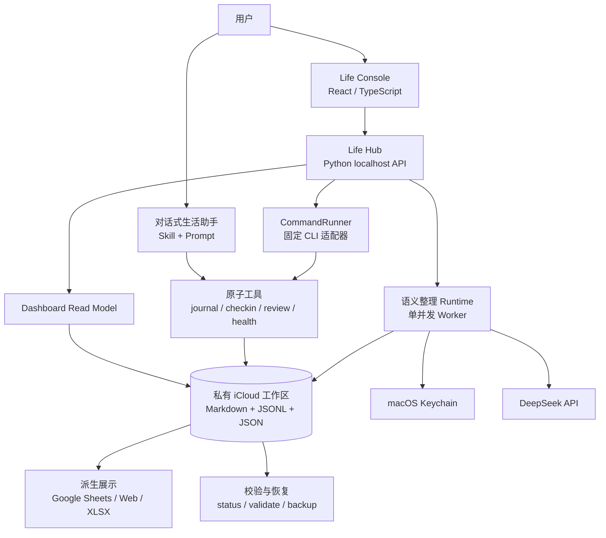
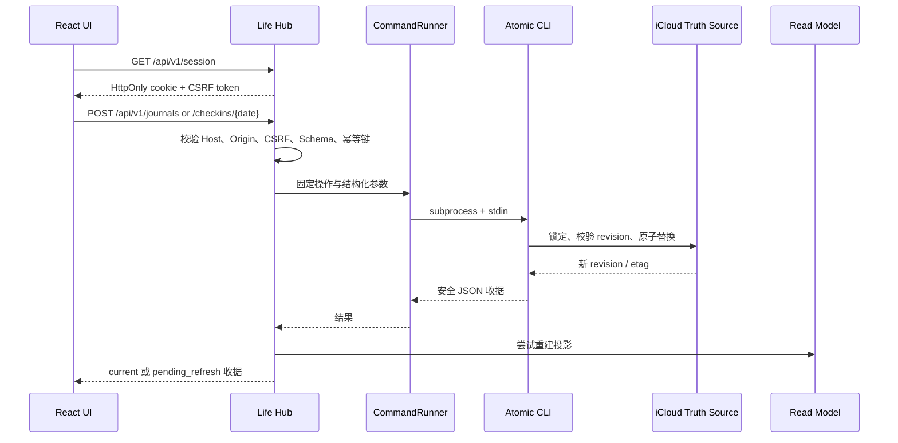
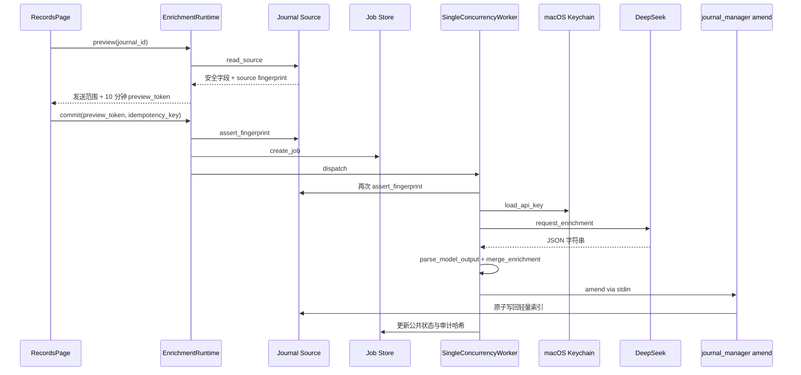
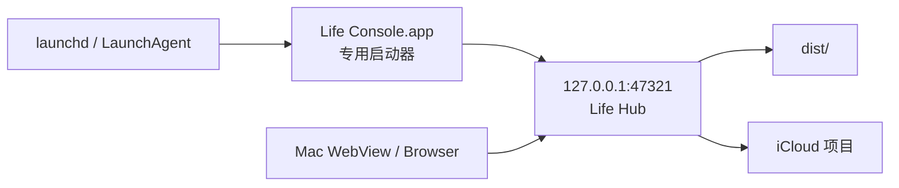

# 整体架构

## 系统边界

项目采用本地优先的模块化单体架构。规则、持久化工具、HTTP Hub 和 UI 分开维护，但共享同一个私有项目目录。外部服务只能接收经过授权的最小派生数据，不能成为个人数据真相源。

图中的写入依赖保持单向：交互入口调用 Hub 或原子工具，原子工具修改 iCloud 真相源，展示与状态模块只读取并派生结果。Life Hub 不引入第二套业务数据库。

## 分层职责

| 层 | 主要路径 | 职责 | 明确不负责 |
|---|---|---|---|
| 规则层 | `AGENTS.md`、`skills/improve-daily-life/` | 意图路由、生活领域方法、审批与隐私边界 | 直接持久化数据 |
| 交互层 | `apps/life-console/src/` | 四页桌面 UI、表单、冲突提示、语义整理交互 | 直接访问私有文件 |
| 契约层 | `apps/life-console/contracts/` | 定义 localhost API、Schema、错误模型 | 业务实现 |
| 服务层 | `apps/life-console/hub/` | 会话、安全策略、只读投影、命令编排 | 绕过原子工具写文件 |
| 领域工具层 | `tools/` | 校验、锁、revision/etag、原子写入、删除与回顾 | UI 和远程访问 |
| 真相源层 | 私有 `journal/`、`records/` 等 | 保存个人原始记录和权威状态 | 对外发布 |
| 派生层 | `web/`、Google/XLSX 工具 | 多端只读展示、状态快照 | 反向覆盖真相源 |
| 运维层 | 校验、隐私、备份工具 | 检查结构、隐私、完整性和恢复能力 | 自动修复未知损坏 |

## 普通写入链路

关键性质：

- 浏览器生成每次请求的幂等键；Hub 将请求体指纹与幂等键绑定。
- `CommandRunner` 只允许预先定义的工具和子命令，不接受任意命令。
- 敏感正文通过 stdin 传给工具，避免进入命令行参数和进程列表。
- 原子工具在锁内重新读取当前字节，通过 revision、etag 或来源哈希发现并发漂移。
- 写入成功但投影刷新失败时返回 `pending_refresh`，不回滚已经落盘的真相源。

## 永久删除链路

删除采用 `purge-plan` 与 `purge-confirmations` 两阶段协议。第一阶段只读冻结目标 revision、etag、范围和历史副本提示；第二阶段要求用户回传精确确认文本并承认聊天、旧 ZIP、iCloud/设备历史不在删除范围内。Hub 在执行前重新生成计划并比较哈希，来源变化时返回冲突。

各领域工具还会执行自己的约束。例如日记必须先逻辑撤回；日记删除会冻结原文块、索引与受管回顾的哈希，并在中断后依靠操作文件恢复。

## 语义整理链路

语义整理的安全约束由多个模块共同实现：

- `preview` 离线运行；没有授权版本时仍可展示发送范围，但 `commit` 拒绝联网。
- API Key 只由 `security` 命令从 macOS Keychain 读取。
- 模型只能补充 `title`、`summary`、`facts`、`feelings`、`people`、`places`、`themes`、`tags`。
- 来源在预览、提交、Worker 发送前和写回前均受指纹或 revision 校验。
- Worker 单并发运行；Hub 重启后恢复可重试作业。
- 审计只保存作业状态、哈希和通用错误码，不保存原文或完整模型响应。

## 只读投影

`hub/read_model/dashboard.py` 从白名单源构建 Dashboard：

- 今日焦点与生活锚点；
- 阶段和自然周进展；
- 最近轻量日记摘要及语义整理状态；
- Hub、iCloud、自动化、备份和外部展示状态；
- 每个源的 revision/etag。

解析器拒绝未知字段、非法 JSONL、非普通文件和不符合 Schema 的记录。投影失败不会尝试猜测或修复私有内容。

## 运行拓扑

Hub 强制绑定回环地址，生产静态资源来自 `dist/`。专用 `.app` 使 launchd 启动的 Python 进程继承用户授予的受保护文件访问权限。生成的 plist、`.command`、日志和绝对路径属于机器本地运行态，不进入 Git。

## 外部展示

Google 表格、移动 Web 和 XLSX 都是单向派生层：

- Google 同步载荷由完整本地源确定性生成，写入后读回验证，再保存源哈希收据。
- `web/life-dashboard/` 的发布状态由源码指纹与 `PUBLICATION_STATE.json` 区分“本地已改”与“线上已发布”。
- XLSX 保留为迁移快照或手工备选，不作为日常真相源。

外部失败不影响本地写入成功。任何发布或共享都受单独授权边界约束。

## 隐私与安全架构（事实）

> 本段为源码级事实，不做架构性解读。完整评级、复现脚本与漏洞分级见
> [隐私体检报告](../privacy-review-2026-08-10.json)（结论 B）。

### 凭据与密钥

- **DeepSeek API Key**：仅通过 [keychain.py](../../apps/life-console/hub/semantic/keychain.py#L20-L54) 的 `load_api_key()`
  从 macOS Keychain 读取（`subprocess.run([security,...], shell=False, capture_output=True)`）。
  `.env`、命令行参数、配置文件和日志均不作为回退来源。
- **Google Sheets 凭据**：源码不持有；写入通过外部 Google Drive/Sheets 连接器或插件完成。
  配置 `integrations/google-sheets.json` 仅保存 URL 正则匹配、生命周期与同步节奏，属于 iCloud 私有文件且被 `.gitignore` 排除。

### 外发端点白名单

- 唯一主动 HTTPS 外发：[deepseek_client.py](../../apps/life-console/hub/semantic/deepseek_client.py#L23-L116)
  `ALLOWED_ENDPOINT = "https://api.deepseek.com/chat/completions"`。
  - `_assert_allowed(url != ALLOWED_ENDPOINT)` 直接拒绝。
  - `http_request.type != "https"` 直接拒绝。
  - 429/5xx 与 HTTPError body 不读取、不落地、不写日志。
- [google_sheets_payload.mjs](../../tools/google_sheets_payload.mjs) 只生成本地载荷，不含任何 `fetch` / `axios` 调用。

### 原始内容日志与审计输出

- `journal_integrity.py` / `journal_manager.py` / `daily_checkin.py` / `weekly_review.py`
  / `phase_review.py` / `life_assistant_status.py` 等工具只输出计数、状态码、revision、etag、哈希。
  失败关闭（fail closed）时错误信息不含原文、自由文本、路径正文或敏感字段。
- 等效 SAST 扫描：对所有 `print/console.*(raw|entry|content|body)` 做代码级搜索，生产路径 0 命中。

### Git 双层隐私防线

- 索引层（提交前，pre-commit hook 自动执行）：[check_git_privacy.sh](../../tools/check_git_privacy.sh)
  - 阻止私有路径：`USER.md`、`MEMORY.md`、`GOALS.md`、`journal/`、`records/`、`outputs/`、`backups/`、`automations/*.prompt.txt` 等。
  - 阻止凭据字面量：高置信 sk-、AKIA、PRIVATE KEY、ghp_、Bearer、xox、AIza 等模式。
  - 阻止机器绝对路径：`/Users/<user>`、`/home/<user>`、`C:\Users\<user>`。
- 历史层（推送/合入前、CI 自动执行）：`tools/check_git_privacy.sh --history origin/main..HEAD`，
  对 PR 新增或修改过的路径与 blob 做同样检查。
- 单测覆盖：[test_git_privacy.py](../../tools/test_git_privacy.py#L16-L203)，共 10 项，本轮全部通过。

### localhost API 安全边界

- `ThreadingHTTPServer` 只绑定 `127.0.0.1:47321`；[policy.py: require_loopback_bind](../../apps/life-console/hub/security/policy.py)
  拒绝任何非回环 bind。
- 写请求强制：同端口 Origin + `life_console_session` HttpOnly cookie + `X-Life-CSRF` 头。
- 响应头设置 CSP、`X-Content-Type-Options: nosniff`、`Referrer-Policy: no-referrer`、`Cache-Control: no-store`。
- 错误体统一走 `ErrorResponse`，通用错误码只暴露 `INVALID_REQUEST / NOT_FOUND / REVISION_CONFLICT / PREVIEW_EXPIRED / SOURCE_INVALID / TOOL_TIMEOUT`。
