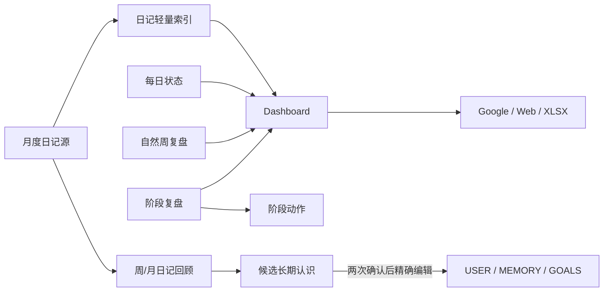

# 接口与数据

## API 契约

`apps/life-console/contracts/life-console.openapi.yaml` 是 `/api/v1` 的规范来源。`openapi-typescript` 生成 `src/contracts/life-console.ts`，契约测试验证 Schema、合成 Fixture 和 localhost 边界。

### 会话与读取

| 方法 | 路径 | 操作 | 认证 | 说明 |
|---|---|---|---|---|
| GET | `/api/v1/health` | `getHealth` | 无 | 只返回 Hub 就绪状态，不读个人数据 |
| GET | `/api/v1/session` | `createSession` | 无 | 创建 30 分钟同源 session，返回 CSRF token |
| GET | `/api/v1/dashboard` | `getDashboard` | 本地 session | 返回白名单 Dashboard 投影 |
| GET | `/api/v1/confirmations` | `getConfirmations` | 本地 session | 返回待确认冲突和动作 |

### 记录与删除

| 方法 | 路径 | 操作 | 说明 |
|---|---|---|---|
| POST | `/api/v1/journals` | `createJournal` | 新增一篇结构化日记 |
| POST | `/api/v1/checkins/{date}` | `upsertCheckin` | 按日期合并每日状态 |
| POST | `/api/v1/capture/preview` | `previewCapture` | 当前返回对话入口转交，不保存 |
| POST | `/api/v1/capture/commit` | `commitCapture` | 预留两阶段保存接口；无有效预览时拒绝 |
| POST | `/api/v1/purge-plans` | `createPurgePlan` | 冻结删除范围和版本 |
| POST | `/api/v1/purge-confirmations` | `confirmPurge` | 精确确认后执行删除 |
| POST | `/api/v1/journals/{journal_id}/delete` | `deleteJournal` | 日记卡片的一步确认删除适配 |

### 语义整理

| 方法 | 路径 | 操作 | 说明 |
|---|---|---|---|
| POST | `/api/v1/journal-enrichments/preview` | `previewJournalEnrichment` | 离线显示外发范围与短时 token |
| POST | `/api/v1/journal-enrichments/commit` | `commitJournalEnrichment` | 授权后创建异步作业 |
| GET | `/api/v1/journal-enrichments/{job_id}` | `getJournalEnrichment` | 查询公共作业状态 |
| POST | `/api/v1/journal-enrichments/{job_id}/retry` | `retryJournalEnrichment` | 重试 failed 作业 |
| POST | `/api/v1/journal-enrichments/enrich` | `enrichJournalNow` | 保存后或手动触发一步整理 |
| GET | `/api/v1/journal-enrichments/by-journal/{journal_id}` | `getJournalEnrichmentByJournal` | 查询单篇最近状态 |

## 通用 HTTP 约束

- Server 仅监听回环地址，默认端口为 `47321`。
- 所有个人数据读取都需要 `life_console_session` HttpOnly cookie。
- POST 还需要同端口 Origin 和 `X-Life-CSRF`。
- 请求体必须包含 `schema_version: 1`，并通过严格字段集合校验。
- 写请求使用 16 至 100 字符幂等键；同一键绑定不同请求体时返回冲突。
- 响应使用 `Cache-Control: no-store`。
- 错误体是结构化 `ErrorResponse`，业务层只暴露通用错误码和安全消息。

主要错误码：

| 错误码 | 典型状态 | 含义 |
|---|---:|---|
| `INVALID_REQUEST` | 400/403 | 字段、会话、Origin、CSRF 或授权不满足 |
| `NOT_FOUND` | 404 | 作业或目标不存在 |
| `REVISION_CONFLICT` | 409 | 来源版本已变化 |
| `PREVIEW_EXPIRED` | 400 | 预览 token 不存在或过期 |
| `SOURCE_INVALID` | 503 | 本地来源损坏、漂移或暂不可读 |
| `TOOL_TIMEOUT` | 503 | 原子工具未在限定时间内完成 |

## Dashboard 数据模型

Dashboard 是前端唯一的聚合读取模型，包含：

| 区域 | 内容 |
|---|---|
| `today` | 日期、焦点、锚点、建议动作、待确认项 |
| `progress` | 自然周路径、阶段、睡眠与四项主观评分 |
| `records` | 最近轻量日记及 `enrichment_state` |
| `system` | Hub、iCloud、自动化、备份、Google、移动端状态 |
| `source_revisions` | 各投影源的 etag，用于刷新与上下文绑定 |

Dashboard 不返回日记原文、健康明细、Prompt、凭据或外部服务秘密。

## 私有真相源

以下路径描述运行时合同；真实文件只存在于私有项目实例。

| 路径 | 格式 | 所有者 | 说明 |
|---|---|---|---|
| `journal/YYYY-MM.md` | Markdown | `journal_manager.py` | 月度原文与审计更正 |
| `journal/index.jsonl` | JSONL | `journal_manager.py` | 严格轻量机器索引 |
| `journal/INDEX.md` | Markdown | `journal_manager.py` | 可读索引 |
| `journal/reviews/` | Markdown | `journal_manager.py` | 受管周/月回顾 |
| `journal/enrichment-jobs/` | JSON | semantic jobs | 语义整理作业状态 |
| `records/daily-checkins.jsonl` | JSONL | `daily_checkin.py` | 每日唯一状态 |
| `records/weekly-reviews.jsonl` | JSONL | `weekly_review.py` | 自然周复盘 |
| `records/phase-reviews.jsonl` | JSONL | `phase_review.py` | 阶段回答 |
| `records/phase-actions.jsonl` | JSONL | `phase_actions.py` | 待确认外部动作 |
| `records/journal-insights.jsonl` | JSONL | `journal_insights.py` | 候选长期认识状态机 |
| `records/apple-health-history.jsonl` | JSONL | `apple_health_history.py` | 最小客观健康历史 |

## 数据依赖关系



依赖是单向派生。周复盘不自动改目标；阶段复盘不直接执行动作；候选认识不因重复出现自动进入长期文件。

## 一致性模型

### 稳定键

- 日记使用内容规范化后生成的稳定 entry ID。
- 每日记录按日期唯一。
- 周复盘按 ISO 周一唯一。
- 阶段复盘按发起复盘日期唯一。
- 阶段动作由来源复盘与动作种类生成稳定 ID。
- 语义整理 Job ID 由幂等键哈希生成。

### revision 与 etag

`revision` 表示同一稳定键的逻辑版本；`record_etag` 或来源指纹绑定记录的规范化内容。调用者传入预期版本，工具在锁内再次比较。版本不匹配时不做部分写入。

### 文件锁与原子替换

Python 台账工具通常采用：

1. 打开受控 lock 文件并获取 `fcntl` 排他锁。
2. 读取并严格解析当前字节。
3. 验证路径类型、权限、Schema、重复键和历史状态。
4. 根据当前 revision 合并或拒绝。
5. 写入同目录临时文件，设置权限并 `fsync`。
6. 使用 `os.replace` 原子替换。

安全敏感工具还比较 inode、设备号、链接数和读取前后元数据，用于检测 symlink、hardlink 和 ABA 路径替换。

### 幂等

- 完全相同的 upsert 不增加 revision，也不改变文件字节。
- Hub 缓存幂等键对应的请求指纹和收据。
- purge 操作可在中断后恢复，但不会扩大冻结范围。
- 语义整理使用稳定 Job ID，并将非 failed 状态的重试视为安全查询。

### 失败关闭

以下情况默认拒绝写入：

- 未知字段、重复 JSON key、NaN 或非法时间；
- 非普通文件、符号链接、硬链接或权限过宽；
- 索引与源文件双向不一致；
- 来源 revision、etag、指纹或 inode 漂移；
- 删除确认文本、范围或历史副本确认不匹配；
- 外部语义整理未授权或 Keychain 密钥不可用。

## 日记索引字段

日记语义整理允许补充的字段限定为：

```text
title
summary
facts
feelings
people
places
themes
tags
```

`raw`、稳定 ID、来源路径、审计历史和隐私状态不由模型修改。列表字段按规范化值去重合并；模型不得删除用户已明确提供的列表项。

## 派生与同步收据

Google 同步状态将配置绑定、源文件存在性和 SHA-256 保存为收据。只有外部写入和读回验证都成功，且源未漂移时，`mark-success` 才更新收据。

Web 发布状态以固定文件集合的源码指纹为依据。`local_changes_unpublished` 表示本地源码有效但尚未证明托管版本同步；本地 build 通过不能单独转换为 `published_current`。

备份包含 manifest 和归档 SHA-256。恢复工具要求归档成员集合与 manifest 精确相等，并在解压前完成所有验证。
