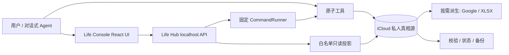

# 技术方案 - 生活助手 - Life Console - 1.0.0

> 状态：当前实现技术基线
>
> 规范接口：[`apps/life-console/contracts/life-console.openapi.yaml`](../../../apps/life-console/contracts/life-console.openapi.yaml)
>
> 生命周期：[`docs/operations/product-surfaces.json`](../../operations/product-surfaces.json)

## 1. 技术目标与边界

系统采用本地优先的模块化单体：规则、原子数据工具、localhost Life Hub 和 React UI 分层维护，共享一个 iCloud 私有项目。GitHub 只保存通用代码、合成 Fixture 与去敏方案；真实用户资料、日记、状态、健康摘要、服务绑定、运行日志、导出和备份不进入 Git。

1.0.0 不引入中心数据库、远程个人数据 API 或移动端运行时。Google 表格和 XLSX 是按需派生物；归档 Life Dashboard 不属于活动应用，也不再参与构建、校验或发布。

## 2. 总体架构

写入方向固定为入口 → Hub/原子工具 → iCloud 真相源。Life Hub 不维护第二套业务数据；只读投影和派生展示失败不能反向修改源记录。

## 3. 前端方案

- 代码入口：`apps/life-console/src/`。
- 技术栈：React、TypeScript、Vite；契约类型由 OpenAPI 生成。
- 页面：工作台、记录、进展、系统，对齐当前四页交互稿。
- API 客户端先获取短时本地会话；写请求携带同源 Origin、CSRF 与幂等键。
- 不把日记正文写入 URL、浏览器持久化、分析事件或客户端日志。
- 合成数据可用于开发和测试；真实实例只通过本机 Hub 读取白名单投影。

## 4. 后端与本机运行

- `apps/life-console/hub/server.py` 使用 Python 标准库 `ThreadingHTTPServer`，只允许回环地址，默认端口 `47321`。
- `hub/read_model/` 从允许的本地来源生成 Dashboard；损坏、未知字段或不安全路径均失败关闭。
- `hub/command_runner/` 只映射固定工具和子命令，不接受任意 shell；敏感正文通过 stdin 传递。
- 原子工具在文件锁内重新读取当前字节，以 revision、etag、来源集合哈希和原子替换防止丢失更新。
- macOS `.app` 启动器与 LaunchAgent 生成器只生成机器本地运行物，不自动安装；绝对路径、日志和 plist 不进入 Git。

## 5. API 契约

OpenAPI 3.1 文件是 `/api/v1` 的唯一接口事实源，生成的 `src/contracts/life-console.ts` 不手工编辑。

| 能力 | 接口 |
|---|---|
| 健康与会话 | `GET /health`、`GET /session` |
| 只读投影 | `GET /dashboard`、`GET /confirmations` |
| 日记与状态 | `POST /journals`、`POST /checkins/{date}` |
| 通用捕获 | `POST /capture/preview`、`POST /capture/commit` |
| 永久删除 | `POST /purge-plans`、`POST /purge-confirmations`、`POST /journals/{id}/delete` |
| 日记语义整理 | preview、commit、状态查询、retry、立即整理与按日记查询接口 |

所有个人数据读取需要本地 session；POST 还需要同端口 Origin 与 `X-Life-CSRF`。请求按 Schema 严格校验，响应使用 `Cache-Control: no-store`，错误只返回通用错误码。接口和底层日记/状态数据结构在本次整理中保持不变。

## 6. 数据存储与一致性

| 数据层 | 格式 | 权威性 |
|---|---|---|
| 用户、记忆、目标 | Markdown | iCloud 私人真相源 |
| 日记原文与回顾 | Markdown + JSONL 索引 | iCloud 私人真相源 |
| 每日、每周、阶段、动作台账 | 严格 JSONL | iCloud 私人真相源 |
| Apple Health 最小摘要 | 私有文本 / JSONL | 客观来源，不补主观字段 |
| Life Console Dashboard | 内存中的白名单投影 | 可重建，不是源 |
| Google 表格、XLSX | 确定性派生 | 按需刷新，不反向写回 |

同一稳定键的更新在锁内合并；显式清空和永久删除需要当前 revision/etag。永久删除先生成只读计划并冻结范围，来源漂移时拒绝继续。写入成功而投影刷新失败时返回安全收据，不重放写操作。

## 7. 隐私与外部能力

- Git pre-commit/pre-push、CI 和 `tools/check_git_privacy.sh` 同时检查禁止路径、高置信凭据与机器绝对路径；合入前还扫描分支历史。
- Hub 只绑定回环地址，并校验会话、同源、CSRF 与严格 Schema。
- 语义整理默认受可迁移授权配置门控；密钥只从 macOS Keychain 读取，外发端点有固定 allowlist，预览与写回之间持续检查来源指纹。
- Google 连接器只接收确定性载荷允许的轻量视图；日记原文、Apple Health、Prompt、凭据和聊天原文不进入载荷。
- 所有外部共享、发布、外发和删除仍需要相应的当次授权；仓库私有不能替代数据最小化。

## 8. 部署、恢复与可观测性

Life Console 前端构建产物由本机 Hub 提供，生产运行只服务于本机回环。运行状态由 `life_assistant_status.py` 聚合，结构由 `validate_project.py` 校验，迁移依赖由 `portability_doctor.py` 检查；三者只输出状态、计数和安全错误，不输出个人正文。

`node_modules`、`dist`、缓存、LaunchAgent、日志与本机 `.app` 都是可重建运行物。换机时以 iCloud 项目、锁定依赖和 `PORTABILITY.md` 为准，不依赖旧机器绝对路径或缓存。Life Dashboard 的旧源码仅从 Git 历史恢复，本版本不得把恢复解释为允许重新部署。

## 9. 维护规则

- 修改 OpenAPI：重新生成 TypeScript 类型并运行契约、Hub、UI 与 E2E 测试。
- 修改数据格式：提供显式迁移、幂等重试、旧版本拒绝和回滚边界。
- 修改写入或删除：覆盖并发、来源漂移、中断恢复和输出隐私测试。
- 修改展示生命周期：更新唯一生命周期清单，并同步状态、doctor、验证器和知识库。
- 不把固定提交号、测试数量或某日审计评级当作长期技术事实；用可重复命令重新验证当前树。
