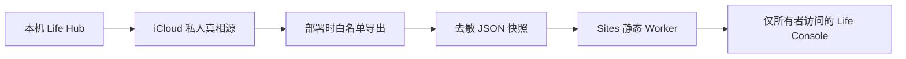

# 技术方案 - 生活助手 - Life Console - 1.1.0

## 1. 总体架构

## 2. 前端

Vite 的 `sites` 构建模式加载 `/life-console-snapshot.json` 并以 `sites-readonly` 模式渲染现有 React 应用。本机默认构建和 `/api/v1/*` 客户端保持不变。只读模式隐藏写操作并改写系统边界文案；页面代码不分叉复制。

## 3. 快照与隐私

导出器调用既有 Dashboard read model，再执行 Sites 专用脱敏：清空 `records.recent_journals`、移除源指纹并把运行状态改成快照语义。生成文件与 `.openai/hosting.json` 都被 Git ignore 和隐私检查双重阻断，只存在于私有 iCloud/临时部署目录和获授权的私人 Sites 版本。

## 4. 托管

非 vinext 的 Vite SPA 生成 `dist/client` 静态资产与 `dist/server/index.js` Workers 入口。Worker 仅接受 GET/HEAD，未知路由回退到 SPA，并添加 no-store、no-referrer、nosniff 和 deny-frame 响应头。部署复用既有 Sites project id 和 owner-only 访问策略。

## 5. 同步与恢复

线上数据按用户明确请求重新生成和发布，不自动轮询 iCloud。失败不回滚或修改本地真相源。每个 Sites 版本可从托管版本历史回退；通用代码通过 GitHub PR 维护，个人快照不进入 GitHub。
