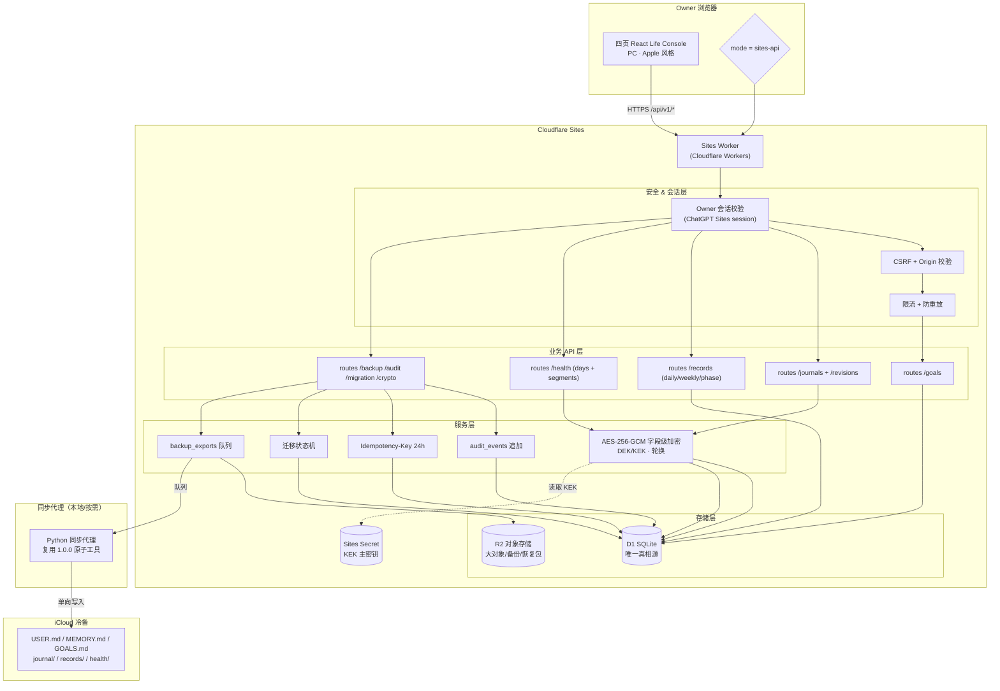
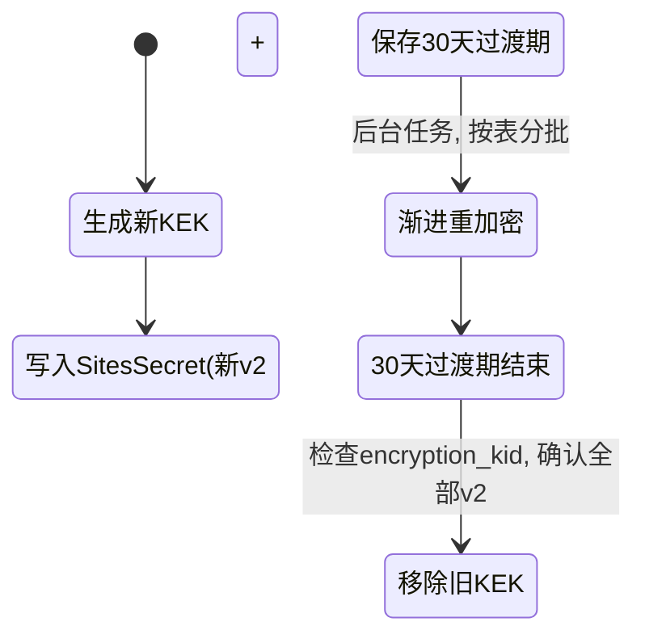
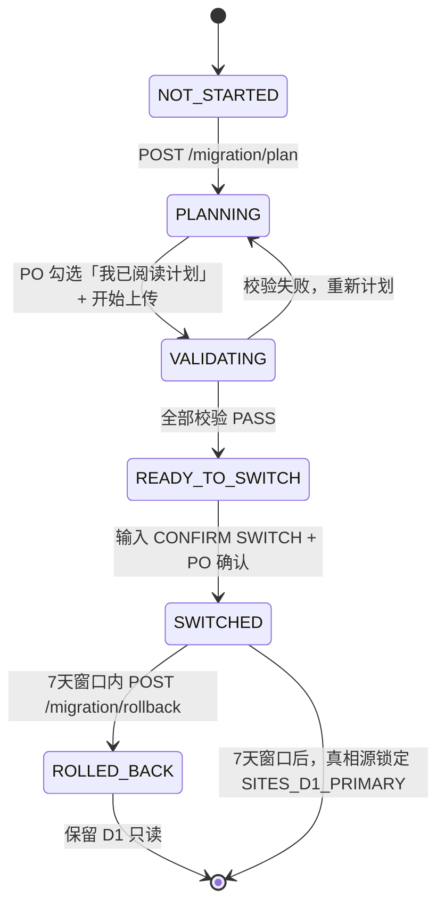

# 技术方案 - 生活助手 - Life Console - 2.0.0

> 状态：已评审通过 / Gate 2 已确认
>
> 前置参考：
> - 1.0.0 技术方案（iCloud 真相源 + 本机 Life Hub 架构）
> - 1.1.0 技术方案（Sites 只读快照 + 静态 Worker）
>
> 2.0.0 相对前述变化最大点：Worker 升级为完整 API 层 + D1 唯一真相源 + R2 + 字段级加密 + 单向迁移状态机。

## 1. 总体架构



## 2. 技术选型决策

| 决策点 | 选型 | 理由 | 替代方案 |
|---|---|---|---|
| 运行时 | Cloudflare Workers | 与 ChatGPT Sites 同平台；天然 Owner-only；零运维 | Vercel / 自建 Node |
| 主存 | Cloudflare D1 | 关系型（SQLite 方言）；事务支持；与 Worker 零延迟 | Cloudflare KV（KV 不适合关系模型）|
| 对象存储 | Cloudflare R2 | 零出口费；与 Worker 签名 URL 配合好 | S3 兼容 |
| 加密算法 | AES-256-GCM (Web Crypto) | Worker 端原生；带认证；DEK/KEK 分层 | ChaCha20-Poly1305 |
| 前端构建 | Vite (继承 1.1.0 `sites` 模式) | 已验收；Worker 入口 + SPA 静态资源 | Next.js (Sites 不原生支持) |
| 同步代理 | Python 版本化冷备代理 | D1 owner-only payload 单向写入 iCloud 冷备树；每个 revision 独立、原子落盘、权限 0600，不改写 1.0.0 活动台账 | Worker 定时触发器 |
| 密钥管理主存 | Sites Secret + 离线恢复包 | 运行时从 Secret 读；恢复包作为极端备份 | 外部 KMS（成本+复杂度高，单用户无必要）|

## 3. D1 数据模型（12 张表）

所有表统一字段：
- `id TEXT PRIMARY KEY`：UUID v4
- `revision INTEGER NOT NULL`：单调递增，每次更新 +1
- `created_at TEXT NOT NULL`：ISO-8601 UTC
- `updated_at TEXT NOT NULL`：ISO-8601 UTC
- `deleted_at TEXT`：NULL=存在；值=软删除时间
- `encryption_version TEXT`：NULL=无加密；值=加密版本 & kid
- `origin TEXT NOT NULL DEFAULT 'migration-001'`：`migration-001`=从 iCloud 1.0.0 迁移；`direct-sites`=2.0.0 新写入
- `migration_batch TEXT`：迁移批次 ID（迁移写入时填）

### 3.1 goals

| 字段 | 类型 | 加密 | 说明 |
|---|---|---|---|
| id / revision / 统一字段 | — | — | — |
| title TEXT | | 明文 | 目标名称 |
| description_encrypted TEXT | | AES | 详细描述（可选）|
| status TEXT | | 明文 | `focus / secondary / candidate / paused / completed` |
| priority_order INTEGER | | 明文 | 排序（1=N 主项）|
| started_at / ended_at TEXT | | 明文 | 开始和结束 |
| tags TEXT | | 明文 | 逗号分隔 |

### 3.2 journals

| 字段 | 类型 | 加密 | 说明 |
|---|---|---|---|
| id / revision / 统一字段 | — | — | — |
| date TEXT NOT NULL | | 明文 | `YYYY-MM-DD` |
| title TEXT | | 明文 | 标题（索引用）|
| title_prefix TEXT | | 明文 | 前 16 字符，搜索用 |
| mood TEXT | | 明文 | 情绪枚举 |
| tags TEXT | | 明文 | 逗号分隔 |
| content_encrypted TEXT NOT NULL | | AES | 原文密文 |
| encryption_kid TEXT NOT NULL | | — | 加密域：`journal-v1` / `journal-v2` |
| content_digest TEXT | | 明文 | 原文 SHA-256（迁移校验用，不用于阅读）|
| deletion_plan_until TEXT | | 明文 | 软删除 → 硬删除截止日期 |
| **约束** | | | `UNIQUE(date, title_prefix, mood)` 弱幂等 |

### 3.3 journal_revisions

| 字段 | 类型 | 说明 |
|---|---|---|
| id (PK) / journal_id (FK) / revision / created_at / origin | — | — |
| title / tags / mood / content_encrypted / encryption_kid / content_digest | 同 journals | 每次 journals 更新追加一条，保留 90 天 |

### 3.4 daily_checkins

| 字段 | 类型 | 加密 | 说明 |
|---|---|---|---|
| id / revision / 统一字段 | — | — | — |
| date TEXT NOT NULL UNIQUE | | 明文 | `YYYY-MM-DD` |
| sleep_quality / energy / mood / real_life_score TEXT | | 明文 | 主观评分（枚举）|
| anchors_encrypted TEXT | | AES | 生活锚点原文（私密）|
| action_items TEXT | | 明文 | JSON 数组（不含隐私细节版）|
| notes_encrypted TEXT | | AES | 备注原文 |
| health_day_id TEXT FK | | — | 关联 health_days |

### 3.5 weekly_reviews

| 字段 | 类型 | 加密 | 说明 |
|---|---|---|---|
| id / revision / 统一字段 | — | — | — |
| week_start TEXT NOT NULL UNIQUE | | 明文 | 周一日期 |
| summary_encrypted TEXT | | AES | 正文 |
| goals_hit_rate TEXT | | 明文 | 命中率 JSON |
| action_items TEXT | | 明文 | 公开 JSON |

### 3.6 phase_reviews

| 字段 | 类型 | 加密 | 说明 |
|---|---|---|---|
| id / revision / 统一字段 | — | — | — |
| phase_name TEXT NOT NULL | | 明文 | e.g. "恢复期-第一阶段" |
| started_at / ended_at TEXT | | 明文 | 日期范围 |
| body_encrypted TEXT | | AES | 正文 |
| goals_before / goals_after TEXT | | 明文 | JSON 快照 |
| actions TEXT | | 明文 | JSON |

### 3.7 health_days

| 字段 | 类型 | 加密 | 说明 |
|---|---|---|---|
| id / revision / 统一字段 | — | — | — |
| date TEXT NOT NULL UNIQUE | | 明文 | `YYYY-MM-DD` |
| sleep_start / sleep_end TEXT | | 明文 | ISO 时间（趋势索引用）|
| sleep_duration_min INTEGER | | 明文 | 分钟 |
| steps / active_energy_kcal INTEGER | | 明文 | |
| sleep_quality_device TEXT | | 明文 | 设备给出的质量等级（可选）|
| raw_payload_encrypted TEXT NOT NULL | | AES | 原始导出 payload JSON |
| source_device_encrypted TEXT | | AES | 来源设备信息 |
| encryption_kid TEXT NOT NULL | | — | `health-v1` / `health-v2` |

### 3.8 health_segments

| 字段 | 类型 | 加密 | 说明 |
|---|---|---|---|
| id / revision / 统一字段 | — | — | — |
| health_day_id FK | | — | 关联 health_days |
| segment_type TEXT NOT NULL | | 明文 | `sleep_awake / sleep_core / sleep_deep / sleep_rem / workout / hr_range` |
| started_at TEXT NOT NULL | | 明文 | 区间索引用 |
| duration_min INTEGER NOT NULL | | 明文 | |
| value_1_encrypted / value_2_encrypted TEXT | | AES | 心率上下 / 卡路里 / 等明细 |
| source_encrypted TEXT | | AES | 来源 |

### 3.9 idempotency_keys

| 字段 | 类型 | 说明 |
|---|---|---|
| key_hash TEXT PK | | SHA-256(Header Idempotency-Key) |
| route TEXT NOT NULL | | e.g. "POST /journals" |
| owner_hash TEXT NOT NULL | | 会话 identity hash |
| created_at TEXT NOT NULL | | 24h 后可清理 |
| expires_at TEXT NOT NULL | | `created_at + 24h` |
| cached_response_json TEXT NOT NULL | | 首次响应的 JSON 副本（不含敏感正文部分的通用结构，正文响应由客户端缓存）|

### 3.10 audit_events

| 字段 | 类型 | 说明 |
|---|---|---|
| id / created_at | | PK + 时间 |
| owner_hash TEXT NOT NULL | | 操作者 identity hash |
| resource_type TEXT NOT NULL | | `journal / daily / goal / migration / backup / crypto / audit / system` |
| resource_id TEXT | | 资源 ID（非必填，如 SEARCH 操作没有）|
| action TEXT NOT NULL | | `CREATE / UPDATE / DELETE / PURGE / SOURCE_SWITCH / KEY_ROTATE / RESTORE_PACK / SEARCH / LOGIN` |
| result TEXT NOT NULL | | `SUCCESS / FAIL / CONFLICT / ROLLED_BACK / SKIP` |
| ip_hash TEXT | | 客户端 IP 的 SHA-256（非原 IP）|
| user_agent_hash TEXT | | UA hash（非原 UA）|
| **注意** | | 绝对不包含：更新前后值、正文字段、密文片段、URL 查询参数 |

### 3.11 backup_exports（D1 → iCloud 冷备队列）

| 字段 | 类型 | 说明 |
|---|---|---|
| id / created_at | | PK |
| resource_type / resource_id | | 目标资源 |
| revision INTEGER | | 要同步的 revision |
| status TEXT NOT NULL | | `PENDING / SUCCESS / FAILED / RETRYING / SKIPPED` |
| attempts INTEGER DEFAULT 0 | | 尝试次数 |
| next_attempt_at TEXT | | 退避重试时间 |
| last_error TEXT | | 失败原因（截断 512 字符，不含敏感正文）|
| completed_at TEXT | | SUCCESS 时间 |
| sync_agent TEXT | | 执行同步代理标识 |

### 3.12 migration_state（全局单行）

| 字段 | 类型 | 说明 |
|---|---|---|
| singleton_id INTEGER PK CHECK 1 | | 确保仅 1 行 |
| phase TEXT NOT NULL | | `NOT_STARTED / PLANNING / VALIDATING / READY-TO-SWITCH / SWITCHED / ROLLED-BACK` |
| source_truth TEXT | | `ICLOUD_PRIMARY / SITES_D1_PRIMARY` |
| batch_id TEXT | | 当前迁移批次 |
| rollback_window_until TEXT | | SWITCHED + 7 天 |
| plan_json TEXT | | 迁移计划 JSON（数量估算）|
| validation_report_json TEXT | | VALIDATING 结果报告 |
| switched_at / rolled_back_at TEXT | | — |
| 回滚增量导出 | | 回滚窗口内新写入导出为 R2 加密增量包 `rolled-back-pending/batch-<id>.json.enc`，附 manifest、revision、幂等键与内容哈希 |

## 4. 字段级加密方案（AES-256-GCM + DEK/KEK）

```mermaid
flowchart LR
    P[原文 Plaintext] -->|AES-GCM(DEK)| C[密文 Ciphertext + Tag]
    DEK[数据密钥 DEK<br/>256bit, 每条数据一个] -->|AES-GCM(KEK)| WDEK[Wrapped DEK]
    C --> S[存储]
    WDEK --> S
    S -->|读出| C2 & WDEK2
    KEK[主密钥 KEK<br/>存 Sites Secret & 恢复包] -->|解包| DEK2
    WDEK2 --> DEK2
    DEK2 -->|解密| P2[原文]
```

### 4.1 密钥层级

| 层级 | 名称 | 存储位置 | 生命周期 | 加密对象 |
|---|---|---|---|---|
| L0 | 主密钥 KEK-journal-v1 | Sites Secret `KEK_JOURNAL_V1` + 恢复包 | 长期（轮换时有 v2）| DEK-journal |
| L0 | 主密钥 KEK-health-v1 | Sites Secret `KEK_HEALTH_V1` + 恢复包 | 长期 | DEK-health |
| L1 | 数据密钥 DEK-journal | 与数据同存，wrapped 格式 | 与数据同生共死 | journal.content / journal_revisions / daily.anchors / 等 |
| L1 | 数据密钥 DEK-health | 与数据同存，wrapped 格式 | 与数据同生共死 | health_days.raw_payload / health_segments.* |

### 4.2 存储格式

所有 `*_encrypted` 字段使用 URL-safe Base64 编码的 JSON：

```json
{
  "v": 1,
  "alg": "AES-256-GCM",
  "kid": "journal-v1",
  "dek": "base64-wrapped-dek", // KEK 加密后的 DEK
  "iv": "base64-12bytes-iv",
  "tag": "base64-16bytes-tag",
  "ct": "base64-ciphertext"
}
```

### 4.3 密钥轮换流程



### 4.4 恢复包格式

- R2 对象名：`recovery-packs/recovery_<uuid>.zip.enc`
- 先生成无压缩 ZIP，再使用 AES-256-GCM 外层加密（用户口令 + PBKDF2-SHA256 1,000,000 迭代）
- ZIP 内：
  - `manifest.json`：版本、创建日期、KEK 数量、SHA-256
  - `kek-journal-v1.key`：明文 KEK（ZIP 已加密）
  - `kek-health-v1.key`：明文 KEK
  - `verify-sample.json`：示例加密原文 + 对应密文 + 明文摘要，用于验证解密

## 5. Worker API 设计（`/api/v1/*`）

统一响应头：`no-store / no-referrer / nosniff / deny-frame / SameSite=Strict`

### 5.1 会话 & 健康

| 方法 | 路径 | 权限 | 说明 |
|---|---|---|---|
| GET | `/api/v1/auth/me` | owner | 返回 owner identity hash、真相源阶段、当前加密版本 |
| GET | `/api/v1/system/status` | owner | 系统页分区 1-3 全量状态（不含审计）|
| POST | `/api/v1/auth/csrf` | owner | 刷新 CSRF Token（写操作 Header `X-CSRF-Token` 必带）|

### 5.2 Goals

| 方法 | 路径 | Idempotency | if-match | 说明 |
|---|---|---|---|---|
| GET | `/api/v1/goals` | — | — | 列表（按 priority_order 排序）|
| POST | `/api/v1/goals` | Required | — | 创建 |
| PATCH | `/api/v1/goals/:id` | — | Required revision | 更新；409=冲突 |
| DELETE | `/api/v1/goals/:id` | — | Required revision | 软删除（无 7 天计划，立即软删）|

### 5.3 Journals

| 方法 | 路径 | Idempotency | if-match | 说明 |
|---|---|---|---|---|
| GET | `/api/v1/journals?date_from=&date_to=&tags=&mood=&q=title_prefix&page=&size=` | — | — | 列表；服务端仅明文字段搜索 |
| GET | `/api/v1/journals/:id` | — | — | 单条；Worker 端解密 content_encrypted 返回原文给前端 |
| POST | `/api/v1/journals` | Required | — | 创建（Worker 端加密原文 → 入库）|
| PATCH | `/api/v1/journals/:id` | — | Required revision | 更新；同时追加 journal_revisions |
| POST | `/api/v1/journals/:id/delete-plan` | — | Required revision | 启动 7 天删除计划；返回 deletion_plan_until |
| POST | `/api/v1/journals/:id/delete-plan/cancel` | — | Required revision | 取消删除计划 |
| DELETE | `/api/v1/journals/:id/purge` | — | Required revision | 硬删除（必须 deletion_plan_until ≤ now）|

### 5.4 Records (daily / weekly / phase)

| 方法 | 路径 | Idempotency | if-match | 说明 |
|---|---|---|---|---|
| GET / POST / PATCH / DELETE | `/api/v1/daily-checkins` | | | 类似 journals，无 revision 历史表 |
| GET / POST / PATCH / DELETE | `/api/v1/weekly-reviews` | | | |
| GET / POST / PATCH / DELETE | `/api/v1/phase-reviews` | | | |

### 5.5 Health

| 方法 | 路径 | Idempotency | if-match | 说明 |
|---|---|---|---|---|
| GET | `/api/v1/health/days?date_from=&date_to=` | — | — | 列表（明文趋势字段）|
| GET | `/api/v1/health/days/:id` | — | — | 单条；Worker 端解密 raw_payload 返回 |
| POST | `/api/v1/health/import` | Required | — | 批量导入（接受 1.0.0 工具兼容的 JSON 格式）|
| PATCH | `/api/v1/health/days/:id` | — | Required revision | 调整明文字段 |
| GET | `/api/v1/health/days/:id/segments` | — | — | 明细片段列表 |

### 5.6 备份 & 同步

| 方法 | 路径 | 说明 |
|---|---|---|
| GET | `/api/v1/backup/queue` | 查看 backup_exports 最近 50 条（系统页分区 3）|
| POST | `/api/v1/backup/trigger` | 手动生成 D1 完整加密备份并写入 R2，返回对象键与 SHA-256 |
| GET | `/api/v1/backup/queue/:id/payload` | 同步代理读取 owner-only 解密载荷；仅用于 D1 → iCloud 冷备 |
| POST | `/api/v1/backup/queue/:id/report` | 同步代理回报 SUCCESS / RETRYING / FAILED / SKIPPED |
| GET | `/api/v1/backup/exports/:batch_id` | 从 R2 下载完整加密备份 ZIP（签名 URL，5min）|

### 5.7 迁移

| 方法 | 路径 | 说明 |
|---|---|---|
| POST | `/api/v1/migration/plan` | 阶段：PLANNING；返回预计迁移数量与风险报告 |
| POST | `/api/v1/migration/validate` | 阶段：VALIDATING；上传 iCloud 数据（API 流式），执行 ID×revision×哈希校验 |
| POST | `/api/v1/migration/switch` | 阶段：SWITCHED；必须 VALIDATING 全通过；修改 migration_state |
| POST | `/api/v1/migration/rollback` | 阶段：ROLLED-BACK；仅回滚窗口内可用；D1 新写入导出到 R2 |
| GET | `/api/v1/migration/status` | 获取 migration_state 单行 |

### 5.8 加密 & 恢复

| 方法 | 路径 | 说明 |
|---|---|---|
| POST | `/api/v1/crypto/rotate-keks` | 要求 v2 KEK 已由阶段 C 运维流程写入 Sites Secret；Worker 只执行渐进重加密，不持有 Secret 管理权限 |
| POST | `/api/v1/crypto/recovery-pack` | 生成 ZIP 后使用口令加密并写入 R2，返回对象键与 SHA-256；阶段 C 再接 5 分钟签名下载 |
| POST | `/api/v1/crypto/verify-recovery-pack` | 通过 R2 对象键或上传密文 + 口令解密验证样本 |

### 5.9 审计

| 方法 | 路径 | 说明 |
|---|---|---|
| GET | `/api/v1/audit/events?resource_type=&action=&page=1&size=20` | 最近 20 条摘要（系统页分区 5）|

## 6. 前端接入改造（相对 1.1.0）

1.1.0 当前：`mode === "sites"` → 从 `/life-console-snapshot.json` 加载只读快照 + `sites-readonly` 模式渲染。

2.0.0 改造：

```ts
// apps/life-console/src/main.tsx
const mode = detectMode(); // 'local-hub' | 'sites-api' | 'sites-readonly' (兼容1.1.0遗留)

if (mode === 'sites-api') {
  const apiClient = createSitesApiClient({
    baseUrl: '/api/v1',
    sessionProvider: () => fetch('/api/v1/auth/me').then(r => r.json()),
    csrfProvider: () => fetch('/api/v1/auth/csrf', {method:'POST'}).then(r => r.headers.get('X-CSRF-Token'))
  });
  render(<App mode="sites-api" api={apiClient} />);
}
```

**写交互四态**：Sites 新增表单统一使用 `useWritableForm()` Hook，内置：
- localStorage 草稿自动保存；内容使用会话级 AES-GCM 密钥加密，密钥只存在 sessionStorage
- 生成 revision / 幂等 Key
- loading / success / conflict(409) / failed 状态渲染
- 冲突差异卡片展示

## 7. 单向迁移实现



**VALIDATING 阶段校验项（每项必须 PASS）：**

| 校验项 | 算法 | 失败处理 |
|---|---|---|
| 表数量一致 | `count(iCloud 源) vs count(D1 导入后)` | 报告差异 ID 列表，返回 PLANNING |
| ID 全集一致 | `set(iCloud IDs) == set(D1 IDs)` | 同上 |
| revision 单调 | 按 created_at 排序后 revision 连续递增 | 同上 |
| 加密原文哈希一致 | `SHA-256(iCloud 原文) == D1 content_digest` | 报告差异数量，重新上传失败批次 |
| KEK 可解密示例 | 随机抽 5% 数据，D1 解密后与 iCloud 原文对比 | 立即中止，检查 KEK 配置 |

## 8. 同步代理（D1 → iCloud 单向冷备）

```python
# tools/sites_backup_sync_agent.py
"""
从 Sites GET /api/v1/backup/queue?status=PENDING 拉取队列
对每条：
  1. GET /api/v1/backup/queue/<id>/payload 获取完整解密 JSON
  2. 原子写入 <cold-backup>/<resource_type>/<resource_id>/revision-XXXXXXXX.json
     - 目录权限 0700，文件权限 0600
     - 同 revision 已存在但内容不同时失败关闭
     - 不修改 1.0.0 活动台账，不产生 iCloud → D1 反向同步
  3. POST /api/v1/backup/queue/<id>/report {status, error}
重试退避：10s / 30s / 2min / 10min / 1h / 6h / 24h
24h 仍失败标记为 FAILED_PERMANENT，系统页红色告警
"""
```

运行方式：
- 用户手动触发（推荐，减少 Cloudflare Worker 定时复杂度）
- 或本地 `cron` 每 10 分钟轮询（机器路径不在 Git 中记录）

## 9. 部署与托管（ChatGPT Sites）

- 复用现有 Sites project id（`life-compass-cn-2026`），原位替换旧 Life Dashboard。
- `apps/life-console/package.json` 新增 `build:sites-200` 脚本：
  - `vite build` → 生成静态 SPA
  - `wrangler pages deploy dist/client --project-id=...`
  - `wrangler d1 migrations apply life-console-200` 执行 D1 Schema
  - `wrangler secret put KEK_JOURNAL_V1` / `KEK_HEALTH_V1` 配置主密钥
  - `wrangler r2 bucket create life-console-200-backups`
- Worker 入口：`apps/life-console/worker/sites-200.js`（从 1.1.0 `sites.js` 提炼，增加 API 路由层）

## 10. 测试策略（详见工程评审文档，此处仅架构级）

| 层级 | 方法 | 覆盖 |
|---|---|---|
| 单元测试 | Node `node:test` + TypeScript 类型 | Worker 加密模块、路由参数校验、revision 校验、幂等判定 |
| 合成数据集成 | Miniflare 本地 D1 模拟 + 合成夹具 | 完整 CRUD + 409 + 7 天删除 + 密钥轮换 + 迁移状态机 |
| 前端合成 | Vitest + React Testing Library + Mock Worker API | 写交互四态 + 冲突卡片 UI + 系统页状态卡片 |
| 合成 E2E | Playwright 本地预览端口 | 4 页导航 + 新建→编辑→冲突→删除计划→取消→再删完整链路 |
| 真实迁移（阶段 D/E）| 私有验收台账 | 与 iCloud 1.0.0 源逐项对账，记录在私有 research/ 不进 Git |

## 11. 失败回退策略（架构级）

| 失败场景 | 自动回退 | 手动操作 |
|---|---|---|
| 部署后 Worker API 全 5xx | Sites 版本历史回滚到上一稳定版本 | 系统页在回滚版本中显示「维护模式」|
| D1 数据损坏（备份可恢复）| 不自动 | 从 R2 最近完整备份 ZIP 恢复；恢复流程文档在 `docs/operations/` |
| KEK 丢失但恢复包存在 | 不自动 | 离线用恢复包解密 → 生成新 KEK → 渐进重加密 |
| KEK + 恢复包全部丢失 | 数据不可恢复（只能从 iCloud 冷备重建明文）| 进入灾难恢复模式，按灾难手册 |
| 迁移后 7 天内回滚 | 需 PO 手动点击 | `/migration/rollback` → 真相源切回 ICLOUD_PRIMARY；D1 新写入导出 JSON |
| Cloudflare 区域故障 | 不自动 | 启用 iCloud 应急追加队列：仅追加带幂等键和 `base_revision` 的离线事件，不覆盖既有记录；恢复后冻结相关资源，受控导入 D1，冲突人工处理 |

## 12. 技术评审决策（Q1-Q4）

PO 于 2026-08-11 完成以下技术开放项决策，并明确要求“完成评审，开始代码实现”。技术方案 Gate 2 已通过。

| 编号 | PO 决策 | 实现约束 |
|---|---|---|
| Q1 | **允许受信任密码管理器生成和自动填充恢复包口令** | 口令至少 16 位；允许长密码短语，不强制字符组合；输入框使用标准密码字段并允许密码管理器识别；仍需二次确认与弱口令拦截。 |
| Q2 | **回滚增量保存为 R2 加密增量包** | 路径采用 `rolled-back-pending/batch-<id>.json.enc` 或等价加密对象；只包含 `SWITCHED` 后的增量，并附 manifest、资源 ID、revision、幂等键和内容哈希；回滚后只供人工审阅与受控合并。 |
| Q3 | **使用聚合启动接口控制首屏性能** | 新增 `/api/v1/bootstrap`，仅返回首屏必要最小数据；其余分区懒加载。以合成数据压测验证 P95 首屏 ≤ 2 秒，不依赖未经验证的 D1 缓存参数。 |
| Q4 | **Cloudflare 故障期间启用 iCloud 应急追加队列** | iCloud 不成为临时真相源；仅追加离线事件，禁止更新、删除或覆盖既有记录。每条事件携带幂等键、`base_revision`、时间戳和资源类型。云端恢复后先冻结相关资源，再受控导入 D1；revision 冲突必须人工处理，导入成功后 iCloud 恢复为单向冷备。 |

### 12.1 Q4 单一真相源不变量

- D1 始终是唯一权威真相源；应急队列只是待处理事件载体。
- 应急事件不得被普通 iCloud 同步流程解释为已生效业务记录。
- D1 恢复后不得自动静默合并；先校验幂等键与 `base_revision`，冲突进入人工确认。
- 应急队列实现进入阶段 A 通用代码范围；真实启用仍需部署与数据门禁。

### 12.2 Gate 2 确认记录

- 结论：通过。
- 确认日期：2026-08-11。
- 修改意见：无；按 Q1-Q4 决策实施。
- 授权边界：允许开始通用代码、D1 Schema、Worker API 与合成测试；真实密钥、正式部署、真实数据迁移和切源仍按阶段 C-E 单独确认。
