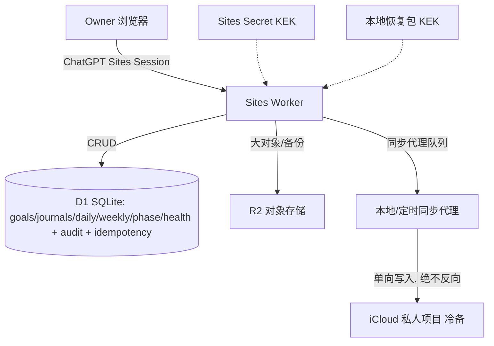

# 生活助手 - Life Console - 2.0.0 产品需求文档

> 文档类型：PRD / 云端真相源版本
>
> 状态：草稿 / 待需求评审
>
> 项目阶段：待需求评审
>
> 子状态：进行中
>
> 产品负责人（PO）：用户
>
> 起草与维护：Agent / PMO
>
> 版本：2.0.0
>
> 前置版本：
> - 1.0.0：iCloud 私有真相源 + 本机 Life Console，已上线（历史基线）
> - 1.1.0：Sites 只读快照原位部署草稿（PR #35 Draft），作为 2.0.0 前端视觉基底，不独立上线
>
> 前置确认：PO 于 2026-08-11 会话中连续确认：云端写入、云端唯一真相源、范围（日记+Apple Health 全量）、字段级加密、D1/R2/Worker 架构、数据模型与迁移边界、安全/API/交付流程与失败回退策略。本 PRD 将以上口头确认整理为书面化基线；PO 仍需在需求评审报告中书面确认后方可推进实现。

## 1. 产品定位

生活助手是一套以降低认知负担、改善现实生活质量为目标的长期 Agent 系统。

**2.0.0 核心变化：** 将个人生活数据的唯一真相源从「iCloud 私有项目 + 本机优先」升级为「Cloudflare Sites Worker / D1 / R2 云端唯一真相源 + iCloud 单向冷备」。Life Console 从 Mac 本机客户端扩展为 **PC 端 Owner-only 云端工作台**，站点直接承担写入、冲突保护与审计职责，不再依赖本机回环 Hub；iCloud 在每次云端变更后单向同步备份，不再双向同步。

本版本保持 **单用户、仅所有者可访问、PC 端优先**，不开放多用户、公开访问或移动端。

## 2. 用户问题（2.0.0 相对 1.0.0 的新增问题）

1. **本机部署依赖**：本机 `127.0.0.1:47321` 服务丢失后，没有可用的写入入口，生活记录出现断层。
2. **换机与多设备切换成本高**：Life Hub 绑定单机，换机或外出时需要重新部署和恢复，无法直接访问当前状态。
3. **iCloud 双向同步复杂**：本机写入 → iCloud 多设备合并，存在冲突与漂移隐患，冲突解决缺乏强制审计。
4. **删除与恢复缺乏统一审计链**：删除、更正、撤回等操作分散在本地工具和对话中，完整审计链需要跨文件拼装。
5. **Apple Health 明细长期只在本机归档**：跨设备核对和长期趋势索引困难，且敏感明细缺少字段级加密。

## 3. 产品目标

### 3.1 核心目标

- 让用户通过任何可访问 ChatGPT Sites 的浏览器，即可完成日记、状态、目标、复盘与健康数据的查看与写入，不再依赖本机 Life Hub。
- 建立 **单一** 真相源（Sites Worker + D1 + R2），所有写入统一走 Worker API 的 revision 冲突保护、幂等、审计与加密控制。
- iCloud 从「源」降级为「单向冷备」：每次云端变更后由 Worker 触发或受控代理执行同步写入 iCloud，不接受反向写入。
- 日记原文与 Apple Health 明细采用字段级加密存储；服务端仅保留趋势、标签、必要索引等最小明文字段。
- 保留 1.0.0 已验收的 Life Console 四页 PC 视觉设计与交互骨架，只替换后端接入层，不重新做 UI 设计稿。

### 3.2 成功标准

- 云端 Sites URL（`https://life-compass-cn-2026.ycy19821817850.chatgpt.site/`）可在 owner 登录后看到与本地预览一致的四页工作台，并能真实写入。
- 所有写入（日记 / 每日 / 周 / 阶段 / 健康 / 目标）必须携带 revision；冲突返回 409，不得静默覆盖。
- 所有写入、更新、删除、迁移切源、密钥轮换等操作均有追加式 `audit_events` 记录（不含正文），可审计。
- 一次性单向迁移完成后：D1 中记录数量、ID、revision、加密原文哈希与 iCloud 源完全一致，才允许切换真相源；失败保留 iCloud 为源，不切。
- 字段级加密：D1/R2 中无法通过导出数据直接阅读日记原文或 Apple Health 明细；主密钥仅保存在 Sites Secret 与受控恢复包中，不进 Git / DB / 日志。

## 4. 目标用户与使用场景

### 4.1 目标用户

同 1.0.0：单用户、重视隐私、低负担生活协助；新增要求：能接受通过 ChatGPT Sites owner-only 会话登录、愿意使用云端作为主入口。

### 4.2 核心场景

- **外出写入**：在任意 PC 浏览器打开 Sites 登录 owner，记录今日日记、动作锚点或每日状态，无需本机 Hub。
- **目标与进展管理**：在进展页调整目标优先级、查看自然周与阶段复盘，直接保存。
- **健康核对**：查看经过字段级加密存储的 Apple Health 明细，服务端仅对趋势与标签做明文索引。
- **删除与审计**：对日记或状态执行计划删除 → 精确确认 → 清除，每一步都有审计记录。
- **迁移与回退**：首次部署时从 iCloud 单向迁移到 D1；如迁移异常可回退到 iCloud 真相源模式。
- **iCloud 冷备**：云端变更后，按配置自动或手动触发同步代理，将 D1 变更单向写入 iCloud 对应目录作为冷备。

## 5. 产品原则

继承 1.0.0 全部产品原则（降低认知负担、对话优先表单兜底、用户控制、未知保持未知、隐私最小化、可恢复与可审计），新增或替换以下：

1. **云端真相源、iCloud 单向冷备**：Sites D1/R2 是唯一真相源；iCloud 仅做单向同步备份，不反向写入。
2. **字段级加密优先**：日记原文、Apple Health 明细必须字段级加密；明文仅保留搜索、排序、分组必要的最小字段。
3. **Owner-only 强身份**：所有写入与敏感读取必须通过 Sites owner-only ChatGPT 会话校验；Worker 侧必须再次校验会话有效性，不能只靠前端路由。
4. **Revision 与审计不可绕过**：任何数据变更必须携带 revision、产生审计事件；批量操作逐条审计。
5. **迁移不可逆转为双向**：从 iCloud 迁移到 D1 是一次性单向过程；切源后不得重新允许 iCloud 写入回 D1。

## 6. 功能需求

### FR-01 真相源与迁移控制

- 支持从 iCloud 1.0.0 结构一次性单向迁移到 D1：goals、daily_checkins、weekly_reviews、phase_reviews、journals（含 revision）、health_days、health_segments。
- 迁移分阶段：`PLANNING → VALIDATING → READY-TO-SWITCH → SWITCHED → ROLLED-BACK`。
- 迁移过程中必须校验：总数、ID 全集、revision 单调、加密原文哈希与源一致。任何一项失败不进入 SWITCHED。
- 提供 ROLLED-BACK 路径：切源后 7 天内可一键回滚到 iCloud 真相源模式（不删除 D1 数据，仅禁用写入）。
- 切源后 `product-surfaces.json` 中 Life Console 的真相源标识从 `ICLOUD_PRIMARY` 变更为 `SITES_D1_PRIMARY`。

### FR-02 Owner-only 身份与会话

- 复用 ChatGPT Sites 已有 owner-only 访问控制；站点前端所有数据页默认 owner-only。
- Worker 侧对所有 `/api/*` 请求校验会话有效性、CSRF Token、Origin；非 owner 返回 401/403。
- 敏感操作（删除、迁移、密钥轮换）需要二次确认会话有效期，最短 60 秒内最多一次同类操作。
- 会话层面提供 15 分钟无操作自动登出（Worker 端判定，不依赖前端计时器）。

### FR-03 目标、日记与状态云端写入

- 提供 goals / journals / daily_checkins / weekly_reviews / phase_reviews 的完整 CRUD API。
- 所有更新/删除必须携带 `if-match: <revision>`；服务端 revision 不匹配返回 409 Conflict。
- 所有创建必须携带 `Idempotency-Key`；相同 Key 在 24 小时内重复调用返回首次结果。
- 日记：`title`, `tags`, `mood`, `date` 为明文字段（用于索引）；`content_encrypted` + `encryption_kid` 为字段级密文；revision、created_at、updated_at、soft-delete 统一。
- 日记 revision 历史：每次更新追加 `journal_revisions` 表，保留旧密文版本 90 天。
- 每日 / 周 / 阶段台账：主观评分、动作锚点、行动项等结构化字段分明文与加密两层；原文备注与隐私描述进加密字段。

### FR-04 Apple Health 字段级加密存储

- `health_days`：按天聚合的 `sleep_start`, `sleep_end`, `sleep_duration_minutes`, `steps`, `active_energy_kcal` 等 **趋势/指标字段** 为明文索引；`raw_payload_encrypted` + `source_device_encrypted` 为字段级加密明细。
- `health_segments`：睡眠阶段 / 运动片段 / 心率区间等明细存入密文；`segment_type`, `started_at`, `duration_minutes` 为明文索引。
- 提供导入 API，接受与 1.0.0 `apple_health_*` 工具兼容的结构化输入，入库前自动分离明文字段与加密字段。
- 健康导入也遵循幂等 Key + revision 保护，不允许重复覆盖。

### FR-05 字段级加密与密钥管理

- 使用 AES-256-GCM，每条数据单独生成数据密钥（DEK）；DEK 由主密钥（KEK）加密后与数据同存。
- 日记与健康使用不同 KEK 域，通过不同 `encryption_kid` 区分。
- 主 KEK 存储于：
  1. Sites Secret（运行时解密用）；
  2. 受控恢复包（加密 ZIP + 用户口令，下载到本地备份，不进 Git）。
- 支持密钥轮换：新版本 `encryption_kid` 渐进重加密；旧 kid 保留 30 天过渡期后强制迁移到新 kid。
- 所有加密操作在 Sites Worker 端完成；前端只发送原文，不保存或缓存 DEK/KEK。

### FR-06 冲突、幂等、删除与审计

- **冲突**：所有写操作比较 `if-match` revision；失败返回最新 revision 与冲突原因，前端展示差异。
- **幂等**：`Idempotency-Key` 24 小时有效；记录于 `idempotency_keys` 表。
- **删除**：软删除 → 7 天计划期 → 确认后硬删除。硬删除只执行一次，并写入 `audit_events` 的 `PURGE` 事件。
- **审计**：`audit_events` 追加记录：`actor`（owner identity hash）、`resource_type`、`resource_id`、`action`、`result`、`ip_hash`、`occurred_at`；**不得记录正文字段、更新前后值或密文片段**。

### FR-07 Life Console 四页前端接入 Sites API

- 工作台 / 记录 / 进展 / 系统四页 **UI 视觉与交互保持 1.0.0 验收稿一致**（44px 半透明顶栏、胶囊导航、Apple 浅色风格）。
- 前端模式从 `local-hub` 改为 `sites-api`：所有 CRUD 走 `/api/v1/*`（Worker 端），不再连接 `127.0.0.1`。
- 写交互：草稿预览 → 提交 → 保存中（loading）→ 成功（显示 revision + 同步 iCloud 状态）/ 冲突（展示 409 差异）/ 失败（重试）。
- 系统页增加：Sites 运行模式、真相源状态（SITES_D1_PRIMARY / ICLOUD_PRIMARY）、iCloud 冷备最近一次同步时间、加密版本、审计事件最近 20 条摘要。

### FR-08 iCloud 单向冷备

- 每次 D1 写入成功后，Worker 将变更事件写入 `backup_exports` 队列。
- 同步代理（受控本地脚本或按需 Worker 任务）从队列取出事件，调用 1.0.0 既有原子工具，单向写入 iCloud。
- 同步状态：`PENDING → SUCCESS → FAILED → RETRYING`；失败不影响 D1 主链路，系统页告警。
- 切源后 iCloud **绝不允许反向写入回 D1**；任何尝试反向覆盖请求返回 405，并记入审计。

### FR-09 R2 对象存储

- 大对象（完整加密备份包、恢复包、密钥轮换审计日志）存入 R2，D1 中仅存 R2 object key、checksum、size、encryption_kid。
- R2 bucket 为私有的，通过 Worker 签名 URL 访问，有效期最长 5 分钟。
- 至少保留 3 份最近完整备份 + 每月归档备份。

### FR-10 搜索与索引（最小明文）

- 服务端搜索仅基于明文字段：date、tags、mood、title_prefix、action_items_count、sleep_range。
- 不基于密文内容做搜索、不做密文全文索引；如需全文搜索，在前端下载解密后本地执行。
- 搜索操作也记入 audit_events 的 `SEARCH` 事件。

### FR-11 隐私、迁移与恢复

- GitHub 继续只保存通用代码、测试、模板与方案；不包含站点 URL、密钥、真实数据或恢复包下载链接。
- 迁移过程必须在 owner-only 会话中展示完整计划与影响范围，经二次确认后才执行。
- 提供「站点自我销毁」紧急流程：仅 owner 可触发，软删除全部数据后等待 30 天硬删除，全程审计。
- 恢复包必须与代码分离存储；恢复流程不依赖特定浏览器或 ChatGPT 会话。

### FR-12 项目治理与多 Agent 协作

- 2.0.0 遵循与 1.0.0 相同的治理规范、知识库六类文档、Git 分支/Worktree/Draft PR 流程。
- 真实数据迁移、密钥生成、恢复包下载、Sites 部署凭证操作必须在 PO 当次明确确认下执行，不得在 CI 中自动化或记录日志。

## 7. 非功能需求

### 7.1 安全与隐私

- 所有 API：HTTPS-only、Samesite=Strict Cookie、CORS 只允许 Sites 自身 Origin、HSTS、no-referrer、nosniff、deny-frame。
- 日志：不得记录请求体、查询参数或任何用户数据；只记录 HTTP 方法、路径、状态码、耗时与 owner identity hash。
- 限流：每个 owner identity 100 请求/分钟；创建/更新/删除操作 20 请求/分钟；删除相关操作 5 请求/小时。
- 防重放：Idempotency-Key + CSRF Token + 时间窗口（±5 分钟）三重防护。

### 7.2 正确性与一致性

- revision 单调递增；任何数据更新不得回退 revision。
- 所有写操作 DB 事务提交前校验 revision；同一资源的并发写保证先到者胜，后续返回 409。
- 合成数据测试必须覆盖：正常、冲突、幂等、软删除、硬删除、7 天计划过期、密钥轮换、搜索、审计完整链路。

### 7.3 性能与容量（单用户规模）

- 四页首屏加载 ≤ 2s（含 API 往返）。
- 单表预期最大行数：journals ~10k / revisions ~50k / health_days ~3650 / audit_events ~500k。
- D1 单库容量远大于上述；R2 单对象 ≤ 500MB（完整加密备份）。

### 7.4 可维护性

- Worker 端模块化：`auth`、`crypto`、`repos`、`routes`、`audit`、`migration`、`backup` 分离。
- 所有 DB Schema 变更使用 D1 迁移脚本，版本化应用。
- 前端保留 1.1.0 的 `sites` 构建模式，但改为接入 Worker API 而非只读快照。

## 8. 当前信息架构（2.0.0 相对 1.0.0 的变化）

- **真相源层**（变更最大）：
  - 旧：iCloud 私人台账 → Life Hub 白名单 → Life Console
  - 新：ChatGPT Sites Owner Session → **Sites Worker API** → **D1 关系库（唯一真相源）** + **R2 对象存储** → 同步代理 → iCloud 单向冷备
- **前端层**：四页 Life Console PC UI 保持不变，后端 API 从 `127.0.0.1:47xxx/api/v1/*` 改为 `<Sites>/api/v1/*`
- **加密层**（新增）：AES-GCM 字段级加密 + DEK/KEK + 恢复包
- **审计层**（新增）：`audit_events` 追加式统一审计
- **迁移控制层**（新增）：一次性单向迁移状态机 + 回滚窗口

## 9. 与 1.0.0 / 1.1.0 的关系

| 版本 | 定位 | 是否上线 | 对 2.0.0 的作用 |
|---|---|---|---|
| 1.0.0 | iCloud 唯一真相源 + 本机 Life Console | 已上线（历史基线） | 2.0.0 的迁移数据源；UI 与功能需求的历史基线 |
| 1.1.0 Draft (PR #35) | Sites 原位部署 + 只读快照 | 不独立上线 | 2.0.0 的前端视觉基底 + `sites` 构建脚本 + Worker 基础骨架 |

**处置结论：** 1.1.0 Draft 代码（`agent/life-console-sites` 分支）中的前端 `sites` 构建模式、静态 Worker 头、只读快照脚本需要**手动提炼**迁到 2.0.0，而不是直接合并 PR #35。1.1.0 「只读」定位与 2.0.0 「云端写入+真相源」定位矛盾，因此不独立上线。

## 10. 2.0.0 非目标

- 不开放多用户、分享、公开访问或协作功能；始终单用户 Owner-only。
- 不做移动端适配或 PWA；当前 PC 端优先。
- 不做第三方登录、不支持其他 SSO；只使用 ChatGPT Sites Owner 会话。
- 不把 AI 语义增强服务端化（仍保留本地/按需调用模式）。
- 不做 iCloud → D1 的双向同步；切源后仅 D1 → iCloud 单向冷备。
- 不自动根据健康数据做医学结论或自动改变目标。
- 不修改 1.0.0 已上线规则、不删除 iCloud 源数据（迁移成功后保留只读副本）。

## 11. 验收标准（交付分阶段）

### 阶段 A：合成数据联调（不涉及真实数据）

1. D1 迁移脚本可在本地 D1 模拟环境完整建表、外键与索引。
2. Worker API 能以合成夹具完整执行：goals/journals/daily/weekly/phase/health 的 CRUD、revision 冲突、幂等、软删除→计划→硬删除、审计事件追加。
3. 前端四页能在 `sites-api` 模式下通过合成夹具渲染与交互，视觉与 1.0.0 一致。
4. 字段级加密能使用合成 KEK 正确 round-trip；导出合成 D1 DB 后密文无法直接阅读原文。
5. 所有相关 Node / Worker / Python 单元测试与治理检查通过。

### 阶段 B：候选不可写预览（绑定 Sites，只读）

1. 使用合成数据部署到 Sites 临时项目或绑定子路径。
2. Owner 可登录访问，所有写控件显示「只读预览模式」并可点击触发错误提示流程。
3. 系统页展示：当前模式=CANDIDATE_PREVIEW、加密版本、API 连通性、合成数据标识。

### 阶段 C：Owner-only / 绑定 / 密钥 / 备份校验

1. 部署到正式 Sites URL。
2. 验证 Owner-only：非 owner 账号无法访问 `/api/*`（返回 403）。
3. 生成 KEK 并写入 Sites Secret；下载恢复包（加密 ZIP + 用户口令）到本地。
4. 验证恢复包可在离线环境正确解密示例数据。
5. 配置 R2 Bucket、CORS 与签名 URL 规则。

### 阶段 D：真实迁移计划展示 + 迁移前确认

1. 在系统页以表格形式展示迁移计划：预计迁移数量（分表）、迁移耗时估计、回滚窗口、切源后 iCloud 冷备行为。
2. 二次勾选：「我已阅读迁移计划并理解 7 天回滚窗口与单向切源规则」→ 必须勾选才能启动。
3. 执行 `PLANNING → VALIDATING` 阶段校验，在页面逐项展示 PASS/FAIL。

### 阶段 E：上传校验 + 切换真相源

1. 上传迁移批：`VALIDATING` 全量校验通过后进入 `READY-TO-SWITCH`。
2. 再次点击「切换真相源」按钮（需二次确认对话框）→ 进入 `SWITCHED`。
3. 系统页展示：真相源=`SITES_D1_PRIMARY`、iCloud 冷备=`PENDING(首次同步)`、迁移批次 ID。
4. 首次写入验证：创建一条测试日记 → revision+1 → audit_events 新增 → backup_exports 队列新增 → 同步代理首次执行 SUCCESS。

### 阶段 F：覆盖现有 Sites URL + 旧展示关闭

1. 旧 Life Dashboard 单页移动看板不在本次部署；同 URL 原位替换为 Life Console 2.0.0。
2. 系统页确认：旧 Dashboard 源码不再构建，Sites Worker 入口为 2.0.0。

## 12. 风险与技术债

- **1.1.0 基础代码复用**：1.1.0 Draft 的 sites 构建模式需要人工提炼，与 2.0.0 的 Worker API 层合并存在潜在冲突。
- **Worker/D1/R2 选型风险**：Cloudflare 无服务器平台有运行时限制（CPU 时间、D1 并发、R2 一致性模型），需在合成数据阶段压测边界。
- **密钥管理用户操作**：KEK 恢复包的下载和口令设置必须由用户参与，不能完全自动化。
- **真实迁移不可逆**：一旦过了 7 天回滚窗口并启用 D1 → iCloud 冷备一段时间后，再回滚的成本极高。
- **浏览器缓存与冲突**：409 冲突处理的 UX 必须清晰，避免用户因反复重试造成误操作。

## 13. PO 确认结果（已确认）

PO 于 2026-08-11 在会话中明确确认以下五项，并授权本 PRD 与需求评审报告作为 2.0.0 产品基线：

1. **同意 2.0.0 将唯一真相源从 iCloud 升级为 Sites Worker / D1 / R2**，iCloud 变更为单向冷备（D1 → iCloud），不再允许 iCloud 反向写入。
2. **同意 2.0.0 范围覆盖日记原文 + Apple Health 全量**，并采用字段级加密（AES-256-GCM + DEK/KEK 分层）；趋势、标签、必要索引保留最小明文。
3. **同意采用一次性单向迁移 + 7 天回滚窗口策略**；VALIDATING 阶段五项（数量/ID/revision/哈希/KEK round-trip）全通过后才允许 SWITCHED；切源后不再允许 iCloud 反向写入回 D1。
4. **同意 1.1.0 Draft 不独立上线**，其 sites 构建模式、静态 Worker 基础作为 2.0.0 前端视觉与构建基底，由实现阶段人工提炼（IMPL-A1），不直接合并 Draft PR #35。
5. **同意交付按 A→F 六阶段推进**（合成联调 → 候选预览 → Owner-only/KEK/R2 校验 → 迁移计划+确认 → 上传校验+切源 → 覆盖 URL+冷备跑通）；阶段 D（真实迁移计划确认）与阶段 E（切源操作）必须由 PO 当次明确确认后执行。

本确认范围只覆盖上述 2.0.0 产品基线与治理口径；**不自动批准具体实现代码、密钥生成、恢复包下载、Sites 部署或真实迁移执行**；以上操作必须在通过设计方案评审 & 技术方案评审（gate 2）后，再按阶段门禁逐项确认。

## 14. 变更记录

| 日期 | 版本 | 变更 | 状态 |
|---|---|---|---|
| 2026-08-11 | 2.0.0-draft.1 | Agent 根据 PO 在会话中连续确认的架构与边界，起草首份 PRD 基线 | 待需求评审 |
| 2026-08-11 | 2.0.0-draft.2 | PO 书面签署需求评审报告 §7，确认 Gate 1 通过；同步更新 §13 五项为已确认 | **需求评审已完成**
