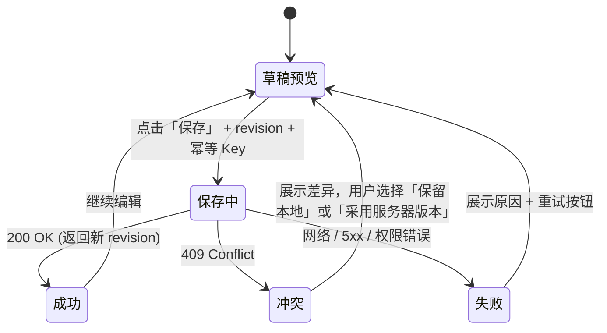

# 设计方案 - 生活助手 - Life Console - 2.0.0

> 状态：草稿 / 待设计方案评审
>
> 适用范围：Life Console 2.0.0 PC 端四页 UI 与新增写入交互流；视觉系统继承 1.0.0，无设计稿重制。

## 1. 设计原则（继承 1.0.0，仅补充 2.0.0 新增）

继承 1.0.0 Apple 风格设计系统：
- 44px 半透明顶栏 + 胶囊导航 + 浅色科技感
- 紧凑布局，表格与卡片信息密度高
- 主色：蓝 #0A84FF，辅色：绿 #30D158 / 橙 #FF9F0A / 红 #FF453A

**2.0.0 新增设计原则：**

1. **真相源状态显性化**：系统页 / 页面 footer 必须展示当前真相源标识（SITES_D1_PRIMARY 或 ICLOUD_PRIMARY 或 MIGRATING），用不同颜色区分。
2. **加密与安全状态可感知但不焦虑**：用小锁图标 + tooltip 说明字段级加密，不展示密钥细节或加密算法名称。
3. **写入状态流的四态一致**：所有表单提交都要展示「草稿预览 → 保存中 → 成功/冲突/失败」四个状态。
4. **迁移操作可解释**：迁移每一步要展示进度、预期耗时、风险提示和取消按钮；禁止无进度的长阻塞操作。

## 2. 信息架构与四页范围

继承 1.0.0 四页结构：**工作台 / 记录 / 进展 / 系统**。本文件只记录 2.0.0 相对 1.0.0 的新增与变更。

### 2.1 工作台（Today Page）新增

- 顶部右侧新增真相源状态胶囊：
  - 🟢 `SITES_D1_PRIMARY`：云端主模式，冷备最近同步时间
  - 🟡 `MIGRATING`：迁移中，显示阶段与进度
  - 🔵 `ICLOUD_PRIMARY`：回退模式或切源前（仅阶段 D/E 出现）
- 日记快捷记录入口从「调用 Life Hub」改为「提交至 Sites API」，提交按钮增加 revision 显示。
- 新增「草稿自动保存」指示器：每 3 秒本地 localStorage 保存，不产生 API 请求。

### 2.2 记录（Records Page）新增

- 日记列表支持「删除计划」状态：橙黄色边 + 剩余天数显示；7 天内可取消删除。
- 点击日记进入编辑页：
  - 页面展示当前 revision 号
  - 编辑时本地草稿自动保存（localStorage，仅保留最近 1 份）
  - 保存按钮下方展示「已编辑 · 未保存的变更 x 处」
  - 保存后展示「已保存 · revision #X · 同步 iCloud 中…」→ 几秒后变「已保存 · revision #X · iCloud 已同步」

### 2.3 进展（Progress Page）新增

- 目标优先级调整后，立即展示 revision 更新。
- 周复盘 / 阶段复盘卡片展示：「revision · 最近更新 · 同步状态」。

### 2.4 系统（System Page）大改动

**这是 2.0.0 新增信息量最大的页面，拆为 6 个分区，按从上到下顺序：**

#### 分区 1：运行模式与真相源

| 项目 | 展示 |
|---|---|
| 版本 | `Life Console 2.0.0` |
| 运行模式 | `Sites API / Owner-only` |
| 真相源状态 | 彩色胶囊（见工作台说明）+ 详细文本 |
| 迁移阶段 | `NOT_STARTED / PLANNING / VALIDATING / READY-TO-SWITCH / SWITCHED / ROLLED-BACK` 七态 |
| 回滚窗口 | 如在 7 天内，显示倒计时 |
| 操作按钮 | 迁移向导入口（仅阶段 ≤ READY-TO-SWITCH 时可点）、回滚（仅 SWITCHED 且窗口内可点） |

#### 分区 2：加密与密钥

| 项目 | 展示 |
|---|---|
| 加密方式 | `AES-256-GCM 字段级加密`（小锁图标 + tooltip） |
| 密钥版本 | `encryption_kid: journal-v1 · health-v1` |
| 最近密钥轮换 | `从未 / 2026-MM-DD` |
| 恢复包状态 | `已创建 · 最近下载 2026-08-11` 或 `未创建 · 请立即创建`（红色警告） |
| 操作按钮 | 下载恢复包（二次确认口令）、密钥轮换（高级操作） |

#### 分区 3：iCloud 冷备同步

| 项目 | 展示 |
|---|---|
| 同步模式 | `D1 → iCloud 单向` |
| 最近同步 | `2026-08-11 14:23:01 · 成功 128 条 / 失败 0 条` |
| 待同步队列 | `3 条待处理（1 journal, 2 daily_checkins）` |
| 最近失败 | 如存在，红色展示 + 重试按钮 |
| 操作按钮 | 手动触发同步、查看同步日志（最近 20 条） |

#### 分区 4：迁移向导（嵌入分区 1 或单独页）

仅在 `NOT_STARTED → SWITCHED` 阶段展示。步骤：

1. **步骤 1：生成迁移计划** → 表格展示 7 张表预计行数 + 预计耗时 + 影响说明
2. **步骤 2：前置检查** → 逐项打勾：Sites 连通性 ✓、KEK 配置 ✓、R2 可写 ✓、iCloud 可读 ✓
3. **步骤 3：执行 VALIDATING** → 进度条 + 分项校验结果（ID 全集 / revision 单调 / 哈希一致）
4. **步骤 4：READY-TO-SWITCH 确认** → 最终警告 + 输入 `CONFIRM SWITCH` 文字 + 勾选
5. **步骤 5：SWITCHED** → 完成，展示系统当前状态

#### 分区 5：审计事件摘要（最近 20 条）

表格展示：

| 时间 | 操作者 | 资源 | 动作 | 结果 | IP 哈希 |
|---|---|---|---|---|---|
| 2026-08-11 14:23 | owner (hash) | journals/id-xxx | UPDATE | SUCCESS | xxx |
| 2026-08-11 14:21 | owner (hash) | migration/batch-001 | SWITCH | SUCCESS | xxx |

点击可展开单条详情（不包含正文或密文）。

#### 分区 6：系统信息（继承 1.0.0 现有内容）

- 数据边界说明、隐私说明、GitHub 仓库链接、产品版本知识库入口。

## 3. 写交互状态流（所有写入表单统一）

所有支持写操作的界面（日记编辑、每日状态、目标调整、周复盘、阶段复盘）统一遵循以下 4 态状态机：



**UI 细节：**

| 状态 | 顶部 Banner | 保存按钮 | 底部提示 |
|---|---|---|---|
| 草稿预览 | 无 / 或「本地有未保存草稿 · 3 秒前自动保存」（浅蓝） | 蓝色「保存」 | `草稿 · 本地自动保存中 · 未上传到云端` |
| 保存中 | 旋转图标「正在保存到云端…」（浅蓝） | 灰色禁用 + 旋转图标 | `revision #X → #X+1 · 请勿关闭页面` |
| 成功 | ✅ 绿色「已保存到云端」+ 3 秒后消失 | 蓝色「保存」（可再次编辑） | `已保存 · revision #X · iCloud 同步中… → 同步完成` |
| 冲突 | ⚠️ 橙红「数据冲突，服务器已更新」+ 差异卡片 | 两个按钮：「保留我的版本」「使用服务器版本」 | `服务器 revision #Y · 你当前修改基于 #X · 必须解决冲突` |
| 失败 | ❌ 红色「保存失败」+ 具体原因（超时/权限/网络） | 蓝色「重试」按钮 | `错误代码：ECONNRESET / 401 / 500 · 已保留本地草稿` |

## 4. 409 冲突差异卡片

冲突时在表单下方插入可折叠卡片：

```
┌─ ⚠️ 冲突：服务器已更新 revision #Y（当前修改基于 #X） ───────────┐
│                                                                   │
│  服务器最新内容（revision #Y, 2026-08-11 14:20）                  │
│  title: "..."    mood: "良好"    tags: ["工作", "健身"]           │
│                                                                   │
│  你本地未提交的修改                                                │
│  title: "..."    mood: "一般"    tags: ["工作", "阅读"]           │
│                                                                   │
│  [✕ 使用服务器版本，丢弃本地修改]   [✓ 保留本地修改（覆写为 #Y+1）] │
└───────────────────────────────────────────────────────────────────┘
```

## 5. 删除与两步确认 UI

删除按钮分为三个阶段：

| 阶段 | UI |
|---|---|
| 触发删除计划 | 点击「删除」→ 弹出对话框：`将在 7 天后永久删除 XXX。此期间可取消。` → 确认 → 进入计划状态（橙色） |
| 计划中（7 天） | 卡片显示「删除倒计时 D-6 · 23:59:12」+ 取消删除按钮（绿色） |
| 计划期结束前 24h | 系统通知条警告「明天将永久删除 XXX，确认要继续吗？」 → 可立即执行或取消 |
| 执行硬删除 | 点击「立即删除」→ 二次确认对话框：`输入 DELETE 确认永久删除，此操作不可撤销` → 输入 DELETE → 执行 → 审计记录 |

## 6. 恢复包下载流程 UI

1. 点击系统页分区 2「下载恢复包」。
2. 弹出对话框：
   - 请输入恢复包保护口令（**不允许浏览器自动填充，使用手动输入框**）
   - 请再次输入保护口令
   - 勾选「我理解恢复包口令丢失将无法解密数据，KEK 必须由我本人保管」
3. 点击生成 → 生成 AES-256-GCM 加密 ZIP（在 Worker 端生成，不经过 Git / 日志）。
4. 下载完成 → 校验 SHA-256 展示给用户（建议用户记录到安全位置）。
5. 下一步「立即验证恢复包」→ 选择刚下载的 ZIP，输入口令 → 解密示例数据 → 验证成功显示绿色 ✓。

## 7. 视觉规范变更点（相对 1.0.0）

| 项 | 1.0.0 | 2.0.0 |
|---|---|---|
| 顶栏胶囊导航 | 4 项 | 4 项（不变）|
| 顶栏右侧 | 无状态 | 新增真相源状态胶囊（绿/黄/蓝 24px）|
| 系统页 | 2 个分区 | 6 个分区（新增迁移/加密/同步/审计 4 块）|
| 颜色 | 主色蓝 #0A84FF | 不变；新增迁移橙 #FF9F0A、删除计划橙、成功绿、冲突红 |
| 底部 footer | 无同步状态 | 新增「revision · iCloud 冷备同步状态」小字 |

## 8. 开放项（等待设计评审时 PO 决策）

- **O1**：系统页 6 个分区信息密度是否过高？是否将「迁移向导」拆为独立子页 `/system/migration`？
- **O2**：删除计划 7 天倒计时是否放在记录页每条记录右侧（紧凑）还是点击进入详情再展示？
- **O3**：恢复包口令复杂度要求？（建议：至少 12 位，含大小写 + 数字 + 符号）
- **O4**：审计事件是否支持导出 CSV（通用字段，不含正文）？
