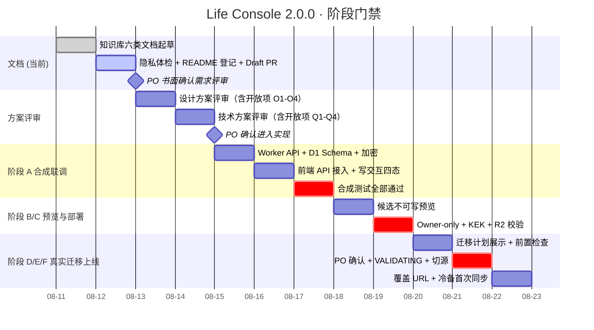

# 项目管理 - 生活助手 - Life Console - 2.0.0

> PMO 负责人：Agent
>
> 产品阶段：待联调
>
> 最后更新：2026-08-11
>
> 关联分支：`agent/life-console-200`
>
> 关联 worktree：`.worktrees/life-console-200`
>
> 当前 PR：#36 Ready for review

## 1. 当前目标（2026-08-11 首轮）

### 唯一主项
Gate 2 已通过；进入阶段 A 合成数据联调，按每个工作块不超过 4 小时的约束实现 Sites 构建骨架、D1 Schema、Worker API、加密与前端接入。

### 次项
- 从 1.1.0 Draft（agent/life-console-sites / PR #35）提炼可复用的 `sites` 构建模式与前端骨架，列出 2.0.0 实现阶段的第一个子任务清单。
- 完成隐私体检，保证所有通用文档不泄露真实路径、凭据与数据。
- 更新 `docs/knowledge-base/README.md` 登记 2.0.0 并说明 1.1.0 处置。

### 明确不做（当前阶段 A）
- 不操作真实数据、不生成真实恢复包、不部署到 Sites
- 不合并或删除 1.1.0 Draft 分支（PR #35），保持为引用底稿
- 不修改 main 分支

## 2. PO 已确认的前置决策（来自会话，须在需求评审报告中书面化）

| # | 决策 | 影响范围 |
|---|---|---|
| 1 | Sites 支持真实写入，新增云端身份/存储/冲突/审计 | 产品定位变更 |
| 2 | 在线版本为唯一写入端；iCloud 每次变更后单向同步备份 | 真相源架构变化 |
| 3 | 范围包括日记和 Apple Health 在内的全部生活数据 | 数据边界扩展 |
| 4 | 日记原文和 Apple Health 明细字段级加密；趋势/标签/必要索引明文 | 加密模型 |
| 5 | 方案 1：Sites 原生 D1 + R2，版本 Life Console 2.0.0，重新设计 | 技术选型 |
| 6 | D1 数据模型与单向迁移边界按建议执行 | 数据模型 + 迁移 |
| 7 | 安全与 API、交付流程、失败回退策略按建议执行 | 全链路 |

以上已口头确认；**PO 已于 2026-08-11 书面签署《需求评审报告 §7 PO 确认记录》**（结论=通过、授权=允许进入设计方案评审 & 技术方案起草），Gate 1 正式通过。

## 3. 交付物状态

| 交付物 | 状态 | 说明 |
|---|---|---|
| 2.0.0 目录 README.md | ✅ 已完成 | 七类文档索引 |
| PRD：生活助手-LifeConsole-2.0.0.md | ✅ 已完成（Gate 1 已确认，draft.2） | 14 节；§13 五项 PO 确认已书面化；§14 变更记录增加 2.0.0-draft.2 |
| 需求评审报告 | ✅ 已完成（Gate 1 已签字通过） | 7 节；§7 已填写结论=通过 / 日期=2026-08-11 / 修改意见=无 / 授权=允许进入设计 & 技术评审 |
| 设计方案 | ✅ Gate 2 已通过 | 迁移独立子页；删除列表摘要+详情操作；恢复口令至少 16 位；首版不导出审计 CSV |
| 技术方案 | ✅ Gate 2 已通过 | 允许密码管理器；R2 加密回滚增量包；聚合 `/bootstrap`；iCloud 应急追加队列 |
| 工程评审与验收 | ✅ 已完成（草稿） | 6 节；六阶段交付验收清单 + 回退验收 + 隐私扫描 |
| PMO（本文件）| ✅ 进行中 | 进度、风险、决策日志、开放项 |
| 知识库 README.md 登记 | ✅ 已完成 | 已增加 2.0.0 行并说明 1.1.0 处置 |
| 隐私体检 | ✅ 已完成 | 治理、索引与历史隐私检查通过；工具测试通过 |
| PR #36 | ✅ Ready for review | Gate 1 与 Gate 2 均已确认；当前工作树包含待提交的评审与首批实现变更 |
| IMPL-A1 - A12 | ✅ 阶段 A 通用开发已完成 | Sites 双模式、D1 12 表、Worker API、安全/加密、CRUD、迁移状态机、R2 备份/恢复包/轮换、iCloud 冷备代理、加密草稿与系统/写入 UI 已实现；不含正式绑定、部署和真实迁移 |

## 4. 当前事实入口

| 领域 | 唯一当前说明 | 直接证据 |
|---|---|---|
| 产品范围 | [产品需求文档](生活助手-LifeConsole-2.0.0.md) §1-§12 | 本 PRD + 会话历史决策 |
| 需求评审门禁 | [需求评审报告](需求评审报告-生活助手-LifeConsole-2.0.0.md) §7 | Gate 1 已通过 |
| 设计 | [设计方案](设计方案-生活助手-LifeConsole-2.0.0.md) | Gate 2 已通过；§8 为 O1-O4 决策 |
| 技术 | [技术方案](技术方案-生活助手-LifeConsole-2.0.0.md) | Gate 2 已通过；§12 为 Q1-Q4 决策 |
| 工程验收 | [工程评审与验收](工程评审与验收-生活助手-LifeConsole-2.0.0.md) | §3 阶段 A-F 验收清单 |
| 展示生命周期 | `docs/operations/product-surfaces.json` | 2.0.0 交付阶段 E/F 更新 |
| Git 协作 | `GIT_WORKFLOW.md` | 分支 agent/life-console-200 + worktree |
| 1.0.0 历史基线 | `docs/knowledge-base/生活助手-LifeConsole-1.0.0/` | 1.0.0 迁移数据源与 UI 视觉基线 |
| 1.1.0 Draft 底稿 | `.worktrees/life-console-sites/` + PR #35 | sites 构建模式 + Worker 基础骨架（人工提炼，不直接合并）|

## 5. 阶段进度与 PO 门禁

**每一个 milestone gate 都是 PO 门禁，未明确确认前不得进入下一阶段。**

## 6. 当前卡点与风险

| # | 卡点 / 风险 | 严重度 | 缓解策略 |
|---|---|---|---|
| 1 | 阶段 A 通用代码已完成，但尚未接入正式 D1/R2/Owner 会话 | **高（阻塞阶段 C）** | 当前仅使用合成 KEK、Node SQLite D1 适配器和 R2 mock；正式绑定、密钥与部署继续等待阶段 C 当次确认 |
| 2 | 1.1.0 Draft 代码与 2.0.0 Worker API 有定位矛盾（只读 vs 写入）| **中** | 明确禁止直接合并 PR #35；实现阶段首个子任务是人工提炼清单 |
| 3 | 密码管理器自动填充与恢复包二次确认的浏览器兼容性 | **中** | Gate 2 后先做合成浏览器兼容测试，不保存口令到应用状态或日志 |
| 4 | iCloud 应急追加队列仍有被误用为业务记录的风险 | **中** | 独立目录与事件 Schema；仅追加；携带幂等键和 `base_revision`；恢复后受控导入，冲突人工处理 |
| 5 | 文档中引用 `docs/operations/product-surfaces.json` 变更需要实现阶段 F 同步完成 | **低** | PMO 阶段 F 显式列检查项 |
| 6 | Cloudflare Worker/D1/R2 配额变更 | **低（单用户规模）** | 阶段 C 记录当前套餐；超出时及时升级 |

## 7. 实现阶段子任务拆分（预估，每个子任务 ≤ 4 小时）

进入实现前必须先通过 gate1 + gate2。以下为预拆分，实际执行时建独立子分支：

| 子任务 ID | 子任务名 | 预计工时 | 产物 |
|---|---|---|---|
| IMPL-A1 | 从 PR #35 提炼 sites 构建模式与前端骨架 | 1h | `apps/life-console/scripts/build-sites-200.mjs` + worker 入口占位 |
| IMPL-A2 | D1 12 表迁移脚本（versioned）| 2h | `apps/life-console/d1/migrations/0001_init.sql` |
| IMPL-A3 | Worker AES-GCM 加密模块 + DEK/KEK 单元测试 | 2h | `apps/life-console/worker/lib/crypto.js` + `test/` |
| IMPL-A4 | Worker 路由框架（auth/csrf/rate/idempotency/audit 中间件）| 3h | `apps/life-console/worker/sites-200.js` middleware 层 |
| IMPL-A5 | Goals/Journals CRUD + revision 409 + journal_revisions 追加 | 3h | `apps/life-console/worker/routes/*.js` |
| IMPL-A6 | Records (daily/weekly/phase) CRUD | 2h | |
| IMPL-A7 | Health days/segments CRUD + 批量导入 API | 3h | |
| IMPL-A8 | 迁移状态机 API (6 阶段 + VALIDATING 五项校验) | 3h | |
| IMPL-A9 | 备份队列 + 同步代理 Python 脚本 | 2h | `tools/sites_backup_sync_agent.py` |
| IMPL-A10 | 前端 useWritableForm Hook + 写交互四态 UI + 409 差异卡片 | 3h | |
| IMPL-A11 | 前端模式改造 local-hub / sites-api 双模式 | 2h | `main.tsx` + `api-client-sites.ts` |
| IMPL-A12 | 系统页 6 分区新卡片（真相源/加密/同步/迁移/审计）| 3h | `SystemPage.tsx` 分区组件 |
| IMPL-A13 | Miniflare 合成集成测试 | 3h | 合成夹具 + 链路测试 |
| IMPL-A14 | Playwright 合成 E2E（写交互完整链路）| 2h | |
| IMPL-B/C1 | 候选预览 + Owner-only + KEK + R2 部署脚本 | 3h | `deploy-sites-200.sh`（私有，不进 Git 模板）|
| IMPL-D/E1 | 真实迁移执行 + 同步代理首次跑通 | 3h | |

合计：约 43 h → 拆成 11+ 个独立 worktree 工作块（每个 ≤ 4 h）。

## 8. 决策日志

| 日期 | 决策 | 决策者 | 状态 |
|---|---|---|---|
| 2026-08-11 | 立项 2.0.0，真相源升级为 Sites Worker / D1 / R2 唯一 + iCloud 单向冷备 | PO | ✅ Gate 1 书面化完成（需求评审 §7）|
| 2026-08-11 | 范围覆盖日记 + Apple Health 全量；字段级加密（A方案） | PO | ✅ Gate 1 书面化完成（PRD §13 第 2 项）|
| 2026-08-11 | 技术选型：Sites 原生 D1 + R2（方案1），废弃自建数据库 | PO | ✅ Gate 1 书面化完成（PRD §13 第 1 项 + 加密选型）|
| 2026-08-11 | D1 数据模型、加密、迁移状态机、API、交付 A→F、失败回退按建议执行 | PO | ✅ Gate 1 书面化完成（PRD §13 第 3-5 项）|
| 2026-08-11 | 1.1.0 Draft（PR #35）不独立上线，作为 2.0.0 前端视觉底稿人工提炼 | PMO + 架构决策（本轮一致无矛盾）| ✅ Gate 1 书面化完成（PRD §9 + §13 第 4 项）|
| 2026-08-11 | 新建分支 agent/life-console-200 + worktree `.worktrees/life-console-200` + 知识库六类文档起草 + Draft PR #36 创建 | PMO | ✅ 已执行 |
| 2026-08-11 | Gate 1 通过：需求评审报告 §7 签字 → 授权进入设计方案评审 & 技术方案起草；实现代码必须等 Gate 2 通过；同时将 PR #36 从 Draft 转为 Ready | PO + PMO | ✅ 已执行 |
| 2026-08-11 | 设计开放项 O1-O4 完成决策：迁移独立子页、删除列表摘要+详情、口令至少 16 位、首版不导出审计 CSV | PO | ✅ 已写回设计方案并随 Gate 2 确认 |
| 2026-08-11 | 技术开放项 Q1-Q4 完成决策：允许密码管理器、R2 加密增量包、聚合启动接口、iCloud 应急追加队列 | PO | ✅ 已写回技术方案并随 Gate 2 确认 |
| 2026-08-11 | Gate 2 通过：设计方案与技术方案完成评审，授权开始通用代码与合成测试实现 | PO + PMO | ✅ 已执行；真实密钥、部署、迁移与切源仍需后续门禁 |
| 2026-08-11 | 阶段 A 首个工作块完成：Sites 构建骨架 + API 默认关闭 Worker + D1 12 表 Schema + 结构测试 | Agent | ✅ Worker 3/3、D1 6/6、Vitest 62/62、Hub 75/75、打包 7/7、E2E 1/1；默认构建与 Sites 构建通过 |
| 2026-08-11 | 阶段 A 通用开发收口：完整 Worker API、字段级加密、revision/幂等/审计、迁移与回滚、R2 完整备份、加密 ZIP 恢复包、预配置 v2 KEK 轮换、版本化 iCloud 冷备代理、Sites 写入 UI 与加密草稿 | Agent | ✅ Vitest 85/85、Hub 75/75、打包 7/7、既有合成 E2E 1/1、Sites 工具 5/5；默认与 Sites 构建通过。真实绑定、部署、迁移和切源未执行 |
| 2026-08-11 | PO 确认阶段 A 通用开发签字，并要求 PR #36 转为 Ready | PO + PMO | ✅ 签字已写入工程验收 §7；授权提交并推送已验证变更到 PR #36。PR Ready 不等于合并、部署、真实迁移或切源授权 |

## 9. 下一步（按优先级）

1. ✅ **已完成（本轮第 1 批）**：知识库 README 登记 2.0.0 + 隐私体检 + 创建 Draft PR #36
2. ✅ **已完成（本轮第 2 批）**：PO 签署需求评审报告 §7 → Gate 1 书面通过 → 本文档同步更新 → PR #36 转 Ready
3. ✅ **已完成（本轮第 3 批）**：PO 完成设计开放项 O1-O4 与技术开放项 Q1-Q4 决策；结论已写回设计/技术方案 draft.2。
4. ✅ **已完成（Gate 2）**：PO 明确完成设计与技术评审，并授权开始代码实现。
5. ✅ **首个实现工作块完成**：IMPL-A1/A2（Sites 构建骨架 + D1 12 表 Schema + 结构测试）已通过完整验证。
6. ✅ **阶段 A 通用开发完成**：IMPL-A3-A12 已实现并通过合成验证；Miniflare/正式 R2 与浏览器级 Sites E2E 留到阶段 B/C 候选环境执行。
7. ✅ **PO 阶段 A 签字完成**：授权提交并推送通用开发变更，PR #36 保持 Ready for review。
8. **下一门禁**：阶段 B 候选不可写预览需要 PO 当次确认；阶段 C 正式 Owner-only、D1/R2、KEK 和 Sites 部署需再次单独确认。
9. **可延后/合并**：
   - 1.1.0 Draft 代码人工提炼报告（IMPL-A1 的前置）：可延后到 Gate 2 通过后与 IMPL-A1 子任务合并，不提前做
   - 恢复包演练与灾难恢复手册：可延后到交付阶段 C（Owner-only/KEK 校验）之前完成
   - `docs/operations/product-surfaces.json` 更新：阶段 E（切源后）同步写入，当前阶段无需提前操作
