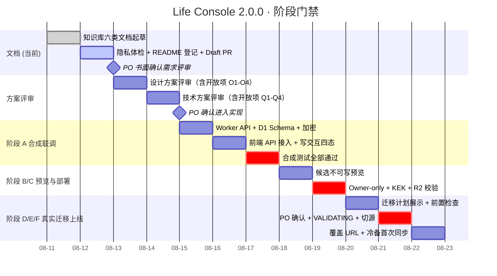

# 项目管理 - 生活助手 - Life Console - 2.0.0

> PMO 负责人：Agent
>
> 产品阶段：待需求评审
>
> 最后更新：2026-08-11
>
> 关联分支：`agent/life-console-200`
>
> 关联 worktree：`.worktrees/life-console-200`
>
> 目标 Draft PR：待创建（文档齐全后立即创建）

## 1. 当前目标（2026-08-11 首轮）

### 唯一主项
完成 Life Console 2.0.0 的知识库六类文档起草、隐私体检、版本登记与 Draft PR 创建，等待 PO 书面确认需求评审结论后进入实现阶段。

### 次项
- 从 1.1.0 Draft（agent/life-console-sites / PR #35）提炼可复用的 `sites` 构建模式与前端骨架，列出 2.0.0 实现阶段的第一个子任务清单。
- 完成隐私体检，保证所有通用文档不泄露真实路径、凭据与数据。
- 更新 `docs/knowledge-base/README.md` 登记 2.0.0 并说明 1.1.0 处置。

### 明确不做（本轮）
- 不写实现代码（Worker API / D1 Schema / 加密模块 / 前端接入 / 同步代理 / 迁移工具）
- 不操作真实数据、不生成真实恢复包、不部署到 Sites
- 不合并或删除 1.1.0 Draft 分支（PR #35），保持为引用底稿
- 不修改 main 分支

## 2. PO 已确认的前置决策（来自会话，须在需求评审报告中书面化）

| # | 决策 | 影响范围 |
|---|---|---|
| 1 | Sites 支持真实写入，新增云端身份/存储/冲突/审计 | 产品定位变更 |
| 2 | 在线版本为唯一写入端；iCloud 每次变更后单向同步备份 | 真相源架构变化 |
| 3 | 范围包括日记和 Apple Health 在内的全部生活数据 | 数据边界扩展 |
| 4 | 日记原文和 Apple Health 明细字段级加密；趋势/标签/必要索引明文 | 加密模型 |
| 5 | 方案 1：Sites 原生 D1 + R2，版本 Life Console 2.0.0，重新设计 | 技术选型 |
| 6 | D1 数据模型与单向迁移边界按建议执行 | 数据模型 + 迁移 |
| 7 | 安全与 API、交付流程、失败回退策略按建议执行 | 全链路 |

以上已口头确认；**PO 已于 2026-08-11 书面签署《需求评审报告 §7 PO 确认记录》**（结论=通过、授权=允许进入设计方案评审 & 技术方案起草），Gate 1 正式通过。

## 3. 交付物状态

| 交付物 | 状态 | 说明 |
|---|---|---|
| 2.0.0 目录 README.md | ✅ 已完成 | 七类文档索引 |
| PRD：生活助手-LifeConsole-2.0.0.md | ✅ 已完成（Gate 1 已确认，draft.2） | 14 节；§13 五项 PO 确认已书面化；§14 变更记录增加 2.0.0-draft.2 |
| 需求评审报告 | ✅ 已完成（Gate 1 已签字通过） | 7 节；§7 已填写结论=通过 / 日期=2026-08-11 / 修改意见=无 / 授权=允许进入设计 & 技术评审 |
| 设计方案 | ✅ 已完成（草稿） | 8 节；系统页 6 分区 + 写交互四态 + 409 卡片 + 删除流程 + 恢复包流程 |
| 技术方案 | ✅ 已完成（草稿） | 12 节；D1 12 表 / AES-GCM / API 路由 / 迁移状态机 / 同步代理 / 部署 / 测试 |
| 工程评审与验收 | ✅ 已完成（草稿） | 6 节；六阶段交付验收清单 + 回退验收 + 隐私扫描 |
| PMO（本文件）| ✅ 进行中 | 进度、风险、决策日志、开放项 |
| 知识库 README.md 登记 | ⏳ 待执行 | 增加 2.0.0 行，说明 1.1.0 处置 |
| 隐私体检 | ⏳ 待执行 | 治理 + validate_project + 隐私脚本 |
| Draft PR 创建 | ⏳ 待执行 | PR 标题：`[2.0.0 KB] Life Console 云端真相源 · 知识库六类文档` |
| 1.1.0 Draft 提炼报告 | 📝 待开始 | 列出从 PR #35 可复用的文件与代码片段（实现阶段第一个子任务）|

## 4. 当前事实入口

| 领域 | 唯一当前说明 | 直接证据 |
|---|---|---|
| 产品范围 | [产品需求文档](生活助手-LifeConsole-2.0.0.md) §1-§12 | 本 PRD + 会话历史决策 |
| 需求评审门禁 | [需求评审报告](需求评审报告-生活助手-LifeConsole-2.0.0.md) §7 | 等待 PO 签字 |
| 设计 | [设计方案](设计方案-生活助手-LifeConsole-2.0.0.md) | §2-§7 |
| 技术 | [技术方案](技术方案-生活助手-LifeConsole-2.0.0.md) | §3 D1 12 表 + §4 加密 + §5 API |
| 工程验收 | [工程评审与验收](工程评审与验收-生活助手-LifeConsole-2.0.0.md) | §3 阶段 A-F 验收清单 |
| 展示生命周期 | `docs/operations/product-surfaces.json` | 2.0.0 交付阶段 E/F 更新 |
| Git 协作 | `GIT_WORKFLOW.md` | 分支 agent/life-console-200 + worktree |
| 1.0.0 历史基线 | `docs/knowledge-base/生活助手-LifeConsole-1.0.0/` | 1.0.0 迁移数据源与 UI 视觉基线 |
| 1.1.0 Draft 底稿 | `.worktrees/life-console-sites/` + PR #35 | sites 构建模式 + Worker 基础骨架（人工提炼，不直接合并）|

## 5. 阶段进度与 PO 门禁

**每一个 milestone gate 都是 PO 门禁，未明确确认前不得进入下一阶段。**

## 6. 当前卡点与风险

| # | 卡点 / 风险 | 严重度 | 缓解策略 |
|---|---|---|---|
| 1 | PO 尚未书面签署需求评审报告 §7 | **高（阻塞进入下一阶段）** | 本轮交付后主动提醒 PO；书面签字前不启动实现代码 |
| 2 | 1.1.0 Draft 代码与 2.0.0 Worker API 有定位矛盾（只读 vs 写入）| **中** | 明确禁止直接合并 PR #35；实现阶段首个子任务是人工提炼清单 |
| 3 | 恢复包口令策略 O3 + 恢复 UI 细节未评审 | **中** | 设计方案评审 PO 决策后再写代码实现 |
| 4 | 回滚窗口内新写入导出机制 Q2 未最终确认 | **中** | 技术方案评审确认；未确认前先保留 R2 JSON 导出占位实现 |
| 5 | 文档中引用 `docs/operations/product-surfaces.json` 变更需要实现阶段 F 同步完成 | **低** | PMO 阶段 F 显式列检查项 |
| 6 | Cloudflare Worker/D1/R2 配额变更 | **低（单用户规模）** | 阶段 C 记录当前套餐；超出时及时升级 |

## 7. 实现阶段子任务拆分（预估，每个子任务 ≤ 4 小时）

进入实现前必须先通过 gate1 + gate2。以下为预拆分，实际执行时建独立子分支：

| 子任务 ID | 子任务名 | 预计工时 | 产物 |
|---|---|---|---|
| IMPL-A1 | 从 PR #35 提炼 sites 构建模式与前端骨架 | 1h | `apps/life-console/scripts/build-sites-200.mjs` + worker 入口占位 |
| IMPL-A2 | D1 12 表迁移脚本（versioned）| 2h | `apps/life-console/d1/migrations/0001_init.sql` |
| IMPL-A3 | Worker AES-GCM 加密模块 + DEK/KEK 单元测试 | 2h | `apps/life-console/worker/lib/crypto.js` + `test/` |
| IMPL-A4 | Worker 路由框架（auth/csrf/rate/idempotency/audit 中间件）| 3h | `apps/life-console/worker/sites-200.js` middleware 层 |
| IMPL-A5 | Goals/Journals CRUD + revision 409 + journal_revisions 追加 | 3h | `apps/life-console/worker/routes/*.js` |
| IMPL-A6 | Records (daily/weekly/phase) CRUD | 2h | |
| IMPL-A7 | Health days/segments CRUD + 批量导入 API | 3h | |
| IMPL-A8 | 迁移状态机 API (6 阶段 + VALIDATING 五项校验) | 3h | |
| IMPL-A9 | 备份队列 + 同步代理 Python 脚本 | 2h | `tools/sites_backup_sync_agent.py` |
| IMPL-A10 | 前端 useWritableForm Hook + 写交互四态 UI + 409 差异卡片 | 3h | |
| IMPL-A11 | 前端模式改造 local-hub / sites-api 双模式 | 2h | `main.tsx` + `api-client-sites.ts` |
| IMPL-A12 | 系统页 6 分区新卡片（真相源/加密/同步/迁移/审计）| 3h | `SystemPage.tsx` 分区组件 |
| IMPL-A13 | Miniflare 合成集成测试 | 3h | 合成夹具 + 链路测试 |
| IMPL-A14 | Playwright 合成 E2E（写交互完整链路）| 2h | |
| IMPL-B/C1 | 候选预览 + Owner-only + KEK + R2 部署脚本 | 3h | `deploy-sites-200.sh`（私有，不进 Git 模板）|
| IMPL-D/E1 | 真实迁移执行 + 同步代理首次跑通 | 3h | |

合计：约 43 h → 拆成 11+ 个独立 worktree 工作块（每个 ≤ 4 h）。

## 8. 决策日志

| 日期 | 决策 | 决策者 | 状态 |
|---|---|---|---|
| 2026-08-11 | 立项 2.0.0，真相源升级为 Sites Worker / D1 / R2 唯一 + iCloud 单向冷备 | PO | ✅ Gate 1 书面化完成（需求评审 §7）|
| 2026-08-11 | 范围覆盖日记 + Apple Health 全量；字段级加密（A方案） | PO | ✅ Gate 1 书面化完成（PRD §13 第 2 项）|
| 2026-08-11 | 技术选型：Sites 原生 D1 + R2（方案1），废弃自建数据库 | PO | ✅ Gate 1 书面化完成（PRD §13 第 1 项 + 加密选型）|
| 2026-08-11 | D1 数据模型、加密、迁移状态机、API、交付 A→F、失败回退按建议执行 | PO | ✅ Gate 1 书面化完成（PRD §13 第 3-5 项）|
| 2026-08-11 | 1.1.0 Draft（PR #35）不独立上线，作为 2.0.0 前端视觉底稿人工提炼 | PMO + 架构决策（本轮一致无矛盾）| ✅ Gate 1 书面化完成（PRD §9 + §13 第 4 项）|
| 2026-08-11 | 新建分支 agent/life-console-200 + worktree `.worktrees/life-console-200` + 知识库六类文档起草 + Draft PR #36 创建 | PMO | ✅ 已执行 |
| 2026-08-11 | Gate 1 通过：需求评审报告 §7 签字 → 授权进入设计方案评审 & 技术方案起草；实现代码必须等 Gate 2 通过；同时将 PR #36 从 Draft 转为 Ready | PO + PMO | ✅ 已执行 |

## 9. 下一步（按优先级）

1. ✅ **已完成（本轮第 1 批）**：知识库 README 登记 2.0.0 + 隐私体检 + 创建 Draft PR #36
2. ✅ **已完成（本轮第 2 批）**：PO 签署需求评审报告 §7 → Gate 1 书面通过 → 本文档同步更新 → PR #36 转 Ready
3. **下一批（Gate 1 已解锁，可以立即启动）**：
   - **并行启动两个独立子 worktree**：
     a. `agent/lc200-design-review`：整理设计方案开放项 O1（信息密度/拆页）、O2（删除展示位置）、O3（恢复包口令复杂度）、O4（审计 CSV 导出）四选一题卡 → 发给 PO 勾选 → 形成《设计方案评审结论》+ 设计方案 draft.2 版本
     b. `agent/lc200-tech-review`：整理技术方案开放项 Q1（禁止自动填充 ✅ 草稿结论已写入 / Q2 回滚导出 / Q3 D1 冷启动 P95 目标 / Q4 Cloudflare 故障降级）→ 形成《技术方案评审结论》+ 技术方案 draft.2 版本
   - 以上两项完成后，**设计+技术两份报告签字 = Gate 2 通过**，再启动 IMPL-A1~A14 实现子任务
4. **可延后/合并**：
   - 1.1.0 Draft 代码人工提炼报告（IMPL-A1 的前置）：可延后到 Gate 2 通过后与 IMPL-A1 子任务合并，不提前做
   - 恢复包演练与灾难恢复手册：可延后到交付阶段 C（Owner-only/KEK 校验）之前完成
   - `docs/operations/product-surfaces.json` 更新：阶段 E（切源后）同步写入，当前阶段无需提前操作
