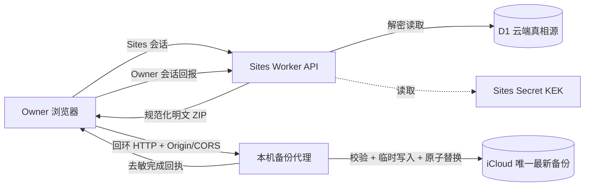

# 技术方案 - 生活助手 - Life Console - 2.1.0

> 状态：Gate 2B 已确认 / 阶段 2B-1 去敏回执本地实现完成
>
> 基线：复用 2.0.0 Owner-only Sites Worker、D1、字段级 AES/KEK、CRUD、revision、幂等、删除计划和最小审计
>
> 重构范围：恢复包、R2 完整备份、逐资源冷备队列、系统页审计读取与本机备份代理

## 1. 架构结论

采用“**Owner 浏览器桥接云端导出与本机代理**”架构：Owner 浏览器继续使用 Sites 会话读取完整导出，本机代理只接收浏览器传来的版本化备份并原子写入 iCloud。代理不保存、不复制、不模拟 ChatGPT Owner Token。



关键边界：

- D1 继续承载云端数据；真实切源前仍保持既有真相源状态，不在本轮静默修改。
- 日记与健康等敏感字段在 D1 内继续使用 AES-256-GCM 信封加密。
- iCloud 最新备份为规范化可读数据，不依赖 KEK 或当前 Sites 项目存在。
- R2 不在 2.1.0 最新备份主链路中；现有 Bucket 和对象只保留，不删除、不清空。
- 浏览器只在内存中桥接导出；不得写入 localStorage、日志、监控或 Git。

## 2. 为什么不让本机代理直接访问 Sites

现有 `tools/sites_backup_sync_agent.py` 通过 Bearer Token 调用 Sites API，但正式 Owner 身份由 Sites 浏览器会话注入，当前 Worker 身份校验不接受该 CLI Token。继续复制浏览器 Cookie 或要求用户长期保存 Owner Token，会扩大凭据面并违背低认知负担目标。

因此 2.1.0：

1. Owner 浏览器负责所有云端请求和 CSRF。
2. 本机代理只监听回环地址并接收导出包，不访问云端 API。
3. 本机完成回执由浏览器使用 Owner 会话回报云端。
4. 页面关闭导致回报中断时，代理只保存不含正文的待回执摘要；下次桌面打开系统页时补报。

## 3. 浏览器与回环接口可行性边界

- 回环地址 `http://127.0.0.1` / `http://localhost` 通常被视为潜在可信来源，但跨 Origin 请求仍受 CORS 和浏览器本地网络访问控制。
- Chromium 正在推进 Local Network Access 权限模型；正式实现必须在当前 ChatGPT in-app Browser 和 Chrome 上做 POC，不能只依赖旧 PNA 假设。
- Safari 对 HTTPS 页面访问明文 localhost 的行为可能不同，2.1.0 首版不将 Safari 列为备份执行环境。

参考：

- [MDN Secure Contexts](https://developer.mozilla.org/en-US/docs/Web/Security/Defenses/Secure_Contexts)
- [Chrome Local Network Access](https://developer.chrome.com/blog/local-network-access)
- [MDN Local Network Access](https://developer.mozilla.org/en-US/docs/Web/Security/Defenses/Local_network_access)

PO Gate 2 通过后，第一项实现工作必须是最小 POC：网页只调用本机 `/health` 和合成 `/backups`，验证权限、预检、Origin 和失败关闭；POC 不读取 D1 或 iCloud。

### 3.1 Gate 2B：扩展不可用后的方案比较（PO 已确认）

Chrome 扩展只让 Agent 取得用户 Chrome 的自动化控制权，不参与候选页自身的 `fetch`、CORS、LNA 或 Worker 容量执行。因此“扩展无法安装”不等于“Owner 浏览器桥接架构不可行”。

| 方案 | 结论 | 优点 | 代价与风险 |
|---|---|---|---|
| A. 普通 Chrome 人工 POC + 去敏回执 | **推荐** | 不改产品架构、不需要扩展、不引入新凭据；现有候选页已有三个合成测试入口 | 需要 Owner 手工点击一次；结果需通过去敏回执交给 Agent 核验 |
| B. 浏览器下载 ZIP，再由本机工具导入 | 二级降级，暂不采用 | 完全移除 HTTPS → localhost 回环依赖 | 多一步人工导入；下载目录出现短暂明文副本；网页无法直接确认 iCloud 原子写入成功 |
| C. 本机代理直接拉取云端导出 | 拒绝 | 本机可独立执行 | 需要复制 Owner Cookie/Token 或新增设备授权，扩大凭据面并违背 Q1 |
| D. 新建候选或绕过 Cloudflare | 不在范围 | 可能换一个访问入口 | 重复项目、改变外部资源或绕过安全策略；现有授权不允许 |

推荐方案 A 的验收回执格式为 `life-console-poc-receipt/1`。回执由页面内存中的合成结果生成，可由用户主动复制或下载；页面不得自动上传到第三方。固定字段如下：

```json
{
  "format_version": "life-console-poc-receipt/1",
  "synthetic": true,
  "browser_mode": "manual-chrome",
  "loopback": "passed-or-failed",
  "transfer": "passed-or-failed",
  "capacity": [],
  "generated_at": "UTC timestamp"
}
```

`capacity` 仅保留档位、输入字节、归档字节与耗时；不得写入完整 UA、IP、主机名、机器路径、Sites/资源标识、Cookie、Token、错误堆栈或个人数据。Agent 只能依据回执和用户对可见页面的确认记录验收，不得把“用户打开过页面”推断为测试通过。

方案 A 若失败，恢复条件不是继续尝试安装扩展，而是记录普通 Chrome 的精确失败阶段并回到 Gate 2B：候选入口被拦截则处理测试环境；回环/LNA 失败则再评审方案 B。未经新门禁不修改正式 Sites 或产品数据链路。

### 3.2 Vercel 合成静态预览（PO 已授权）

PO 于 2026-08-12 直接授权将网站部署到 Vercel，并要求交付可访问 URL。该授权按以下最小数据边界落地：

- Vercel 只承载 `candidate-preview` 静态构建与内置合成投影，不承载 Sites Worker、Owner 会话、D1、R2、KEK、iCloud 或真实生活数据。
- Vercel 预览允许无登录访问，因此页面不得声称 Owner-only；必须明确标记“合成候选预览”和“不可写”。
- `candidate-preview` 不显示依赖 Worker 的阶段 A POC 控件；`stage-a-candidate` 继续保留 POC，两个构建目标不得混用。
- Vercel 发布不改变正式 Sites、当前真相源、迁移门禁或阶段 A 结论，也不构成真实数据上线。
- 若后续需要登录、数据库或后端 API，按 PO 指定统一使用 Supabase，并重新完成数据模型、Auth、RLS、备份、迁移与测试方案评审；本轮不创建 Supabase 项目或资源，也不自动迁移现有 D1 数据。

## 4. 云端数据模型调整

### 4.1 继续保留

- `goals`
- `journals` / `journal_revisions`
- `daily_checkins`
- `weekly_reviews`
- `phase_reviews`
- `health_days` / `health_segments`
- `idempotency_keys`
- `audit_events`（最小后端事件）
- `migration_state`

### 4.2 新增 `backup_runs`

使用版本化 D1 migration 新增一张运行元数据表，不保存备份正文：

| 字段 | 类型 | 说明 |
|---|---|---|
| `id` | TEXT PK | 随机运行标识 |
| `status` | TEXT | `CREATED / EXPORTING / TRANSFERRING / VERIFYING / SUCCESS / FAILED / ABANDONED` |
| `format_version` | TEXT | `life-console-backup/1` |
| `source_schema_version` | TEXT | 创建时云端 schema 版本 |
| `created_at / updated_at` | TEXT | UTC 时间 |
| `completed_at` | TEXT NULL | 完成时间 |
| `archive_sha256` | TEXT NULL | 本机读回校验后的归档摘要 |
| `counts_json` | TEXT | 各个人数据资源数量，不含正文 |
| `error_code` | TEXT NULL | 固定枚举，不保存底层异常正文 |
| `client_kind` | TEXT | `desktop-loopback` |

约束：只保留最近有限数量的运行元数据用于状态与排障；这不是历史备份列表。保留周期在实现阶段固定为短周期并通过测试，不影响 iCloud 中只有一个最新备份文件。

### 4.3 旧 `backup_exports`

- 2.1.0 不继续生成逐资源冷备队列。
- 初版 migration 只停止新写入并保留旧表，避免未盘点数据被删除。
- 删除或重命名旧表属于上线后资源清理门禁，不在本轮执行。

## 5. 备份数据格式

稳定文件名与相对位置由本机私有配置决定；知识库只定义归档内容。稳定状态只保留一个 ZIP。

```text
life-console-latest.zip
├── manifest.json
├── data/goals.ndjson
├── data/journals.ndjson
├── data/journal_revisions.ndjson
├── data/daily_checkins.ndjson
├── data/weekly_reviews.ndjson
├── data/phase_reviews.ndjson
├── data/health_days.ndjson
└── data/health_segments.ndjson
```

`manifest.json` 必需字段：

```json
{
  "format_version": "life-console-backup/1",
  "source_product_version": "2.1.0",
  "source_schema_version": "versioned-value",
  "export_id": "random-id",
  "exported_at": "UTC timestamp",
  "resources": {
    "journals": {
      "path": "data/journals.ndjson",
      "count": 0,
      "sha256": "hex-digest"
    }
  },
  "archive_content_sha256": "canonical-content-digest"
}
```

规则：

- 数据文件使用 UTF-8、每行一个规范化 JSON 对象、字段名排序、LF 结尾。
- 包含当前有效记录、软删除状态、删除计划、revision 和恢复所需关联 ID。
- 云端密文字段导出为经 Worker 解密后的规范化字段；不导出 wrapped DEK、KEK、Sites Secret 或 R2 标识。
- 不包含 `audit_events`、`idempotency_keys`、`backup_runs`、限流状态、会话、IP/UA hash。
- ZIP 不额外设置恢复口令；本地文件依赖 iCloud 账户安全与操作系统文件权限。

## 6. 一致性与原子替换

### 6.1 云端一致导出

单用户规模下，首版采用短时导出锁：

1. 创建 `backup_runs`，状态 `CREATED`。
2. 进入 `EXPORTING` 后设置带 TTL 的全局导出锁。
3. 导出期间写 API 返回可重试的 `423 backup_in_progress`，前端保留草稿；读取不阻塞。
4. 在一次受控导出操作中读取全部个人数据、解密、生成 NDJSON、摘要和 ZIP。
5. 成功返回后立即释放锁；异常或超时由 TTL 自动释放并记录固定错误码。

Gate 2 后 POC 必须测量合成数据 2 倍预估规模的内存和耗时。若超出 Worker 限制，不得直接实现；改为版本化分块导出并重新评审一致性策略。

### 6.2 本机原子替换

本机代理：

1. 在目标目录创建权限 `0600` 的临时文件。
2. 流式写入并 `fsync`。
3. 安全打开 ZIP，拒绝绝对路径、`..`、符号链接、重复路径和超限解压。
4. 校验 manifest、每个数据文件数量与 SHA-256。
5. 关闭后重新读回并再次校验归档摘要。
6. 通过 `os.replace` 原子替换唯一最新备份。
7. 任一步失败都删除临时文件并保留旧备份。

## 7. API 变化

### 7.1 保留

- `/api/v1/auth/*`
- `/api/v1/bootstrap`、`/dashboard`、`/system/status`
- goals / journals / records / health CRUD
- migration 状态、计划、校验、切源和回滚接口继续受后续门禁约束
- `/api/v1/crypto/rotate-keks` 作为受控运维接口

### 7.2 新备份接口

| 方法 | 路径 | 权限 | 说明 |
|---|---|---|---|
| GET | `/api/v1/backup/status` | Owner | 最近成功和当前运行的去敏状态 |
| POST | `/api/v1/backup/runs` | Owner + CSRF | 创建手动备份运行；要求桌面代理已由前端探测 |
| GET | `/api/v1/backup/runs/:id/archive` | Owner | 返回 `application/zip`；`Cache-Control: no-store` |
| POST | `/api/v1/backup/runs/:id/complete` | Owner + CSRF | 回报本机校验与原子写入成功摘要 |
| POST | `/api/v1/backup/runs/:id/fail` | Owner + CSRF | 回报固定失败码，不上传异常正文 |

所有接口继续执行 Owner、同源、CSRF、revision/幂等和限流策略。完整导出响应必须带 `Content-Disposition: attachment`、`X-Content-Type-Options: nosniff` 与 `no-store`。

### 7.3 移除或停止暴露

- `POST /api/v1/crypto/recovery-pack`
- `GET /api/v1/crypto/recovery-pack/download`
- `POST /api/v1/crypto/verify-recovery-pack`
- R2 完整备份与签名下载接口
- `GET /api/v1/audit/events` 的前端调用；建议从公开应用路由移除，只保留 D1 最小事件写入
- 逐资源 `/backup/queue*` 接口

## 8. 本机代理接口

代理只监听 `127.0.0.1`，默认不对局域网地址绑定。

| 方法 | 路径 | 说明 |
|---|---|---|
| GET | `/v1/health` | 仅返回版本、ready 与协议版本 |
| OPTIONS | `/v1/backups` | 严格 CORS 预检，只允许配置的正式 Sites Origin |
| POST | `/v1/backups` | 接收 ZIP，校验并原子替换；返回去敏回执 |
| GET | `/v1/receipts` | 返回待由 Owner 浏览器补报的去敏完成回执 |
| DELETE | `/v1/receipts/:id` | 浏览器完成云端回报后删除本地回执 |

安全要求：

- 严格匹配 `Origin`，禁止 `*`；只接受 `Content-Type: application/zip` 和自定义意图 Header，使跨站请求必须预检。
- 限制包大小、请求速率、并发为 1；不支持重定向。
- 不提供目录浏览、备份下载、任意路径、任意文件写入或命令执行接口。
- 日志只记录运行 ID、阶段和固定错误码，不记录正文、ZIP、摘要全值或机器路径。
- 正式 Origin 变化必须更新私有配置并重新配对，不硬编码个人 Sites URL到通用仓库。

## 9. 前端改造

- `SitesLifeConsoleClient` 删除恢复包与审计读取方法，新增备份运行接口。
- `SystemPage` 删除恢复包表单、下载校验、审计列表和 R2 完整备份卡片，替换为一个 `ICloudBackupCard`。
- 新增 `LocalBackupBridge`：仅封装回环健康探测、CORS、ZIP 转发和回执，不读取本地文件。
- 备份 ZIP 与个人数据只保存在函数作用域；结束后主动释放 Blob 引用，不进入 Redux、localStorage、sessionStorage 或错误上报。
- 移动端或代理不可用时不得调用云端 archive 接口。

## 10. PR #38 代码处置

### 可提炼

- 正式 Sites Owner 身份适配与 `/api/v1/auth/me`。
- D1/R2/Secret 绑定存在性检查中与 D1、KEK 相关的部分。
- Owner-only、Origin、CSRF、安全响应头和云端 CRUD。
- System status、bootstrap 和正式构建入口。
- 与恢复包无关的合成测试、浏览器 E2E 和 D1 migration 基线。

### 不进入 2.1.0 实现

- `createRecoveryPack`、`downloadRecoveryPack`、`verifyRecoveryPack` 及相关签名下载。
- 恢复包前端状态、表单、口令、校验和错误提示。
- R2 完整备份对象和恢复包验收。
- 系统页审计摘要请求与渲染。
- 要求本机代理携带 Owner Bearer Token 的 HTTP transport。

Gate 2 通过后，直接在 PR #39 的唯一活动分支按文件提炼；不得把 PR #38 直接 merge 或 cherry-pick 成最终结果。有效能力及对应测试迁入并验证后，关闭 PR #38 并删除其活动分支和 worktree，不删除任何 D1、R2、Secret、对象或真实数据。

## 11. 失败与回退

| 失败 | 行为 |
|---|---|
| 本机代理不可用 | 不创建导出；提示在 Mac 启动助手 |
| 本地网络权限拒绝 | 不降级到不安全跨网访问；保持状态只读 |
| 云端导出失败 | 释放锁，运行标记失败，不接触旧备份 |
| 页面在传输中关闭 | 临时文件超时清理；若已写成功则保留本地待回执 |
| ZIP 校验失败 | 删除临时文件，旧备份不变 |
| iCloud 空间不足/不可写 | 删除临时文件，旧备份不变，返回固定错误码 |
| 云端回报失败 | 本机保留去敏回执，下次桌面打开补报 |
| 新版本上线异常 | 回滚 Sites 版本；不自动恢复或删除 D1/R2 |

## 12. 多角色技术评审

| 角色 | 结论 | 意见 |
|---|---|---|
| 后端 | 有条件通过 | 单请求导出必须先通过规模与超时 POC；超限则重新评审分块一致性 |
| 前端 | 有条件通过 | 回环连接需验证 in-app Browser/Chrome LNA 与 CORS；Safari 首版延期 |
| QA | 建议通过 | API、代理、原子替换和页面状态均有明确可测契约 |
| 安全/隐私 | 有条件通过 | Origin 白名单、回环监听、无本地读取接口、无 Owner Token 是硬门禁 |
| PMO | 建议通过 | 复用 2.0 核心能力，移除恢复包与 R2 主链路，重构范围可分块验收 |
| 数据仓库 | 不适用 | `backup_runs` 仅为运行元数据，不建设 DW |

## 13. Gate 2 技术确认项

| 编号 | 建议决策 |
|---|---|
| Q1 | 采用 Owner 浏览器桥接，不让本机代理直接持有 Owner Token |
| Q2 | 采用 `life-console-backup/1` 规范化明文 ZIP，排除运维表和秘密 |
| Q3 | 首版使用短时导出锁与单请求 ZIP；实现前 POC 超限则停下重评分块方案 |
| Q4 | 新建 `backup_runs`；旧 `backup_exports` 停写但不删除 |
| Q5 | 最新备份主链路不写 R2；已有资源保留，另设清理门禁 |
| Q6 | 本机代理改为回环接收器，严格 Origin/CORS/限额，不提供本地读取能力 |
| Q7 | PR #38 只按文件提炼有效能力、不原样合并；提炼验证后由唯一分支 PR #39 取代并关闭 #38 |

## 14. PO 确认记录

- 当前状态：PO 已确认 Gate 2；Q7 按“活动分支唯一”要求明确为迁入后关闭 #38。
- 确认对象：Q1-Q7、本技术方案和工程测试方案。
- 已授权：阶段 A-E 的通用代码、合成数据、回环 POC、本地临时目录测试和 Draft PR。
- 不包含：正式部署、真实 D1/iCloud 读取、真实备份、切源、资源解绑/删除、PR 合并。
- Gate 2B：PO 已确认 B1-B3 与方案 A、二级降级边界；授权仅覆盖阶段 2B-1 通用代码和合成测试，不包含候选/正式部署、真实数据、Worker 正式导出、资源删除、切源或 PR 合并。
- 阶段 2B-1 实现：`stageAPocReceipt.ts` 以白名单字段构建并序列化 `life-console-poc-receipt/1`；页面仅在三项测试全部进入 passed/failed 后允许用户主动下载，下载后立即释放 Blob URL，不自动上传或持久化结果。
