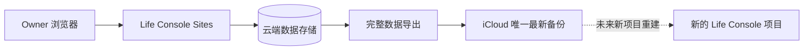

# 生活助手 - Life Console - 2.1.0 产品需求文档

> 文档类型：PRD / 简化备份与恢复版本
>
> 状态：需求评审已通过（Gate 1 已确认）
>
> 产品负责人（PO）：用户
>
> 起草与维护：PO 输入，Agent 结构化整理
>
> 版本：2.1.0-draft.5
>
> 前置版本：2.0.0 云端真相源方案与 Draft PR #38

## 1. 需求背景

1. 2.0.0 的备份、恢复、密钥和系统运维设计复杂度过高，不适配单用户个人工作平台，导致迭代周期和维护成本持续增加。
2. 阶段 C 的恢复包在正式 Sites 环境连续失败：请求到达服务端后停在 `recovery_pack_encryption_failed`，R2 未写入；继续在原方案上试错需要新的安全和技术评审。
3. 用户需要的核心不是复杂灾难恢复系统，而是：云端可以跨设备查看和管理生活数据，同时在 iCloud 中保留一份独立、可迁移、可重建的最新备份。

## 2. 产品定位

Life Console 2.1.0 是面向单用户、Owner-only 的云端生活工作台。云端负责跨设备访问、查看、创建、修改和删除；iCloud 负责保留一份用户可带走、与线上项目解耦的最新完整备份。

本版本以降低认知和运维负担为优先，不向用户展示不必要的密钥、R2、签名链接和审计实现细节。

## 3. 产品目标

### 3.1 核心目标

- 保留 Life Console 云端访问和完整数据管理方向。
- 将备份能力收敛为一个用户可理解的「备份到 iCloud」模块。
- 每次备份覆盖上一份成功备份；稳定状态只保留一份最新完整备份。
- 备份覆盖线上全部个人记录，并包含可验证、可迁移的版本与完整性信息。
- 备份不依赖当前 Sites 项目长期存在；未来重构项目时可基于备份恢复。
- 移除对普通用户无价值的恢复包和审计摘要前端展示。

### 3.2 成功标准

- 系统页只保留一个备份模块，用户可查看最近一次成功时间、范围、结果与失败重试入口。
- 手动触发后，线上全部个人数据被导出并原子替换 iCloud 中唯一的最新备份。
- 新备份完成前不得破坏上一份有效备份；只有完整性校验通过后才替换。
- 备份包含 schema 版本、导出时间、各资源数量和内容校验摘要，可在独立环境验证。
- 恢复包 UI/API、五分钟签名下载流程和审计事件摘要 UI 不再出现在 2.1.0 产品中。
- 2.0.0 阶段 C 的有效 Owner-only、D1、Sites API 能力可复用，不原样继承失败的恢复包验收范围。

## 4. 目标数据关系

- 云端：日常查看和数据管理入口。
- iCloud：单向、完整、最新、用户可带走的备份。
- 当前在线项目不从 iCloud 自动反向同步；未来恢复属于受控的新项目重建流程。

## 5. 功能需求

### FR-01 云端数据管理

- 保留云端 Owner-only 访问。
- 支持线上查看、创建、修改和删除日记、每日状态、周复盘、阶段复盘、目标和 Apple Health 相关记录。
- 云端仍为在线使用阶段的写入入口；iCloud 备份不得自动反向覆盖线上数据。

### FR-02 唯一完整 iCloud 备份

- 系统页仅提供一个「备份到 iCloud」模块。
- 支持手动触发；是否增加定期备份在设计与技术评审中确认。
- 备份范围至少包括：goals、journals 及必要 revision、daily_checkins、weekly_reviews、phase_reviews、health_days、health_segments，以及未来恢复需要的 schema/manifest。
- 每次成功备份覆盖上一份成功备份；稳定状态只保留一个当前备份文件或目录。
- 写入必须采用临时文件、完整性校验和原子替换，失败时继续保留上一份有效备份。

### FR-03 未来可恢复格式

- 备份使用公开、可解释、版本化的结构，不绑定当前部署资源标识。
- 备份必须包含 manifest、schema 版本、资源数量、导出时间和内容摘要。
- 2.1.0 是否提供「从 iCloud 恢复」在线入口，留在 Gate 1 决策；默认建议只保证格式可恢复，不在本版实现恢复 UI。

### FR-04 前端收敛

- 系统页删除恢复包的口令、生成、验证和限时下载交互。
- 系统页不再展示审计事件摘要。
- 备份、恢复和迁移相关信息合并为低认知负担的状态和操作，不重复展示底层资源概念。
- 工作台、记录和进展页的核心业务交互不因本需求重新设计。

### FR-05 迁移方案重评

- 2.0.0 阶段 C 停止继续验收恢复包。
- 2.1.0 重新评估首次 iCloud → 云端导入、核验和切换流程，保留必要的数据正确性门禁，但减少面向用户的技术状态和重复确认。
- 真实 iCloud 读取、上传、切源和删除继续需要 PO 当次明确确认。

### FR-06 后端审计边界

- 用户前端不展示审计事件摘要。
- 是否保留服务端最小审计记录由 Gate 1 决策；默认建议保留安全和故障排查所需的最小事件，不记录正文。

## 6. 非目标

- 不在需求评审阶段读取、上传或迁移真实 iCloud 数据。
- 不立即删除当前 D1、R2、Secret、恢复包代码或正式 Sites 资源。
- 不把 iCloud 改为在线业务的双向同步端。
- 不建设多用户、分享、公开访问或复杂灾难恢复中心。
- 不在本版本承诺历史多版本备份；稳定状态只保留一份最新完整备份。
- 不因方案调整削弱 Owner-only 身份门禁。

## 7. Gate 1 已确认产品决策

| 编号 | PO 已确认决策 | 实现约束 | 影响 |
|---|---|---|---|
| D1 | 保留云端 AES/KEK；取消恢复包 | 不移除字段级加密，不再要求用户生成、验证或保管恢复包 | 保持云端数据保护，同时显著简化用户交互 |
| D2 | 导出可重建的规范化明文 JSON/ZIP，由 iCloud 账户保护 | 备份不得依赖 Sites Secret；本地文件权限收敛，Git、日志和线上对象不保存该文件 | Sites Secret 丢失后仍可用最新 iCloud 备份重建 |
| D3 | 首版手动按钮；定时备份延后 | 不创建定时任务；先验证一次完整、可理解的人工链路 | 最小实现、失败更容易理解 |
| D4 | 复用受控本地同步代理，原子覆盖唯一文件；网页只发起/展示任务 | 正式实现前必须验证网页与本机回环代理的浏览器兼容和失败关闭；代理不得依赖复制 Owner Token | 浏览器不能直接稳定写入指定 iCloud 路径，需要本地代理在线 |
| D5 | 不实现在线恢复 UI；只保证备份格式与恢复工具契约 | 本版只提供校验与恢复计划能力，不执行真实恢复 | 避免重新引入复杂恢复流程 |
| D6 | 前端隐藏审计，后端保留最小事件 | 系统页不请求或展示审计摘要；事件仍不得包含正文、密文或查询参数 | 支持故障排查和高风险删除保护 |
| D7 | 2.1.0 不再依赖 R2 做恢复包；现有资源另设清理门禁 | 本轮不删除、解绑或清空现有 R2；新备份主链路不写 R2 | 避免误删未知对象并降低长期依赖 |
| D8 | PR #38 在 Gate 2 前保持 Draft；Gate 2 后提炼有效能力，由 2.1.0 唯一活动 PR #39 取代 | 不原样合并 #38；提炼验证后关闭并删除其 Git 分支/worktree | 避免原样合并失败方案，也避免两个迭代分支长期并存 |

## 8. 分阶段交付建议

1. Gate 1：确认本 PRD 与 D1-D8。
2. Gate 2：重新完成备份/迁移相关设计方案、技术方案和测试方案评审。
3. 阶段 A：后端完整导出、iCloud 原子覆盖与可恢复格式实现。
4. 阶段 B：系统页收敛，移除恢复包和审计摘要展示。
5. 阶段 C：合成数据联调；验证完整导出、失败保留旧备份和可重建性。
6. 阶段 D：PO 验收测试环境。
7. 阶段 E：PO 当次授权后部署正式 Sites；真实迁移、切源和资源清理分别设门禁。

## 8.1 Gate 2B 替代验收方案（PO 已确认）

Gate 2B 只调整阶段 A 的验收方式，不改写已确认的 D1-D8，也不改变正式产品架构：

| 编号 | 提案 | 产品影响 |
|---|---|---|
| B1 | Chrome 扩展只作为 Agent 自动化便利工具，不作为 Life Console 的安装、运行或备份依赖 | 用户不需要为了使用产品安装扩展 |
| B2 | Owner 可在普通 Chrome 中手工运行候选页的回环连接、合成 ZIP 转发和 Worker S/M/L 三项测试，并导出去敏验收回执 | 保留现有 D4 浏览器桥接方案，只把自动化验收改为人工可核验流程 |
| B3 | 只有普通 Chrome 也无法访问候选页或无法完成回环测试时，才重新评审“浏览器下载后由本机工具导入”的产品级降级方案 | 避免因测试工具不可用而提前引入双步骤备份、临时明文下载和状态分裂 |

Gate 2B 不包含候选或正式部署、Worker 正式导出实现、真实数据、资源删除、真相源切换或 PR 合并。PO 已确认 B1-B3，并仅授权阶段 2B-1 的通用代码和合成测试。

## 8.2 Vercel 合成展示授权

PO 于 2026-08-12 要求将网站部署到 Vercel并交付可访问 URL。该展示面只发布内置合成数据和只读交互，不属于“多用户、分享或真实数据公开访问”，也不替代 Owner-only 正式产品。若未来需要后端，PO 指定使用 Supabase；数据库、登录、真实 API 与迁移必须另行评审和授权。

## 9. PO 确认记录

- 当前状态：已确认，Gate 1 通过。
- 确认日期：2026-08-11。
- 确认对象：本 PRD draft.1、需求评审报告及 D1-D8；允许进入设计、技术和测试方案评审。
- PO 原话：`确认 Gate 1：同意 2.1.0 PRD draft.1、需求评审结论及 D1-D8，允许进入设计、技术和测试方案评审；PR #38 继续保持 Draft。`
- 需求来源：PO 于 2026-08-11 提交的「取消恢复包相关方案」。

## 10. 变更记录

| 日期 | 版本 | 变更 | 状态 |
|---|---|---|---|
| 2026-08-11 | 2.1.0-draft.1 | 将 PO 新方案结构化为独立 2.1.0 PRD，并列出 Gate 1 待确认取舍 | 待需求评审 |
| 2026-08-11 | 2.1.0-draft.2 | 记录 PO Gate 1 确认，将 D1-D8 转为实现约束并进入 Gate 2 方案评审 | 需求评审已通过 |
| 2026-08-11 | 2.1.0-draft.3 | 记录 Gate 2 通过；明确 PR #39 为唯一活动分支，#38 提炼验证后关闭；授权仅覆盖阶段 A-E 通用代码与合成测试 | 开发与联调 |
| 2026-08-12 | 2.1.0-draft.4 | 增加 Gate 2B 替代验收提案：普通 Chrome 人工合成验收优先，下载后本机导入仅作二级降级 | 待 PO 确认 Gate 2B |
| 2026-08-12 | 2.1.0-draft.5 | 记录 PO 确认 B1-B3；授权阶段 2B-1 去敏回执通用代码和合成测试，不扩大部署与数据权限 | 开发与联调 |
| 2026-08-12 | 2.1.0-draft.6 | 记录 Vercel 合成静态展示授权与 Supabase 后端指定；不改变 Owner-only 正式产品、真实数据和切源门禁 | 开发与联调 |
