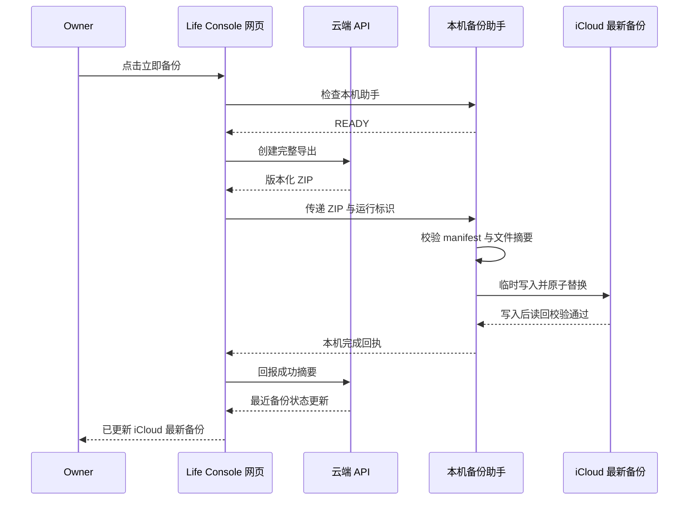

# 设计方案 - 生活助手 - Life Console - 2.1.0

> 状态：Gate 2 已确认 / 等待阶段 A POC 验证
>
> 设计范围：系统页备份能力收敛、恢复包与审计摘要移除、本机备份代理状态、迁移入口减负
>
> 继承范围：工作台、记录、进展、Owner-only、写入四态、revision 冲突和 7 天删除交互继续沿用 2.0.0

## 1. 设计目标

1. 用户只需要理解一个动作：**把当前云端生活数据备份到 iCloud**。
2. 不再要求用户理解或操作恢复包、口令、KEK、R2、签名下载和审计事件。
3. 每次操作都明确回答三个问题：本机助手是否连接、备份进行到哪一步、上一份有效备份是否仍安全。
4. 移动端可以查看备份状态，但首版只允许在已连接本机代理的桌面端执行备份。
5. 失败信息用可行动的自然语言表达，不向用户抛出底层错误堆栈或资源标识。

## 2. 信息架构变更

2.1.0 保留四页：**工作台 / 记录 / 进展 / 系统**。本次只重构系统页。

### 2.1 系统页最终分区

| 顺序 | 分区 | 用户看到的内容 | 相对 2.0.0 |
|---|---|---|---|
| 1 | 运行状态 | 版本、Owner-only、当前真相源、迁移阶段 | 保留并压缩 |
| 2 | 数据保护 | “云端数据已加密保存”与当前健康状态 | 保留结论，隐藏算法、kid 和轮换入口 |
| 3 | iCloud 最新备份 | 唯一主操作、最近成功时间、范围、结果、本机连接状态 | 替代完整备份、恢复包、冷备队列三块 |
| 4 | 迁移与恢复边界 | 进入迁移方案说明；提示恢复由未来受控工具完成 | 保留入口，移除步骤堆叠 |
| 5 | 系统信息 | 数据边界、隐私说明、版本知识库 | 保留 |

### 2.2 从前端完全移除

- 恢复包口令、二次输入、确认勾选、生成、验证和限时下载。
- R2、对象键、签名 URL、PBKDF2、KEK 版本等底层概念。
- 审计事件摘要、审计筛选、事件详情入口。
- 逐条备份队列、失败队列和同步代理内部标识。
- 普通用户可见的密钥轮换按钮；密钥轮换继续作为受控运维能力。

## 3. 单一备份模块

### 3.1 默认态线框

```text
┌─ iCloud 最新备份 ────────────────────────────────────────┐
│ 状态：本机备份助手已连接                                  │
│ 最近成功：2026-08-11 22:30 · 已校验 · 完整数据             │
│ 内容：目标、日记、状态、复盘、Apple Health                 │
│                                                          │
│ [立即备份]                                                │
│ 新备份校验完成前，上一份有效备份不会被覆盖。                 │
└──────────────────────────────────────────────────────────┘
```

时间、数量和示例均由运行时生成；Git 与测试只使用明确标注的合成数据。

### 3.2 状态模型

| 状态 | 主文案 | 操作 |
|---|---|---|
| `AGENT_UNAVAILABLE` | 本机备份助手未连接 | `查看连接方法`；不创建云端导出 |
| `READY` | 可以备份到 iCloud | `立即备份` |
| `PREPARING` | 正在整理云端数据 | 按钮禁用；允许关闭前提示 |
| `TRANSFERRING` | 正在交给本机备份助手 | 显示进度，不展示明文内容 |
| `VERIFYING` | 正在校验新备份 | 明确“上一份备份仍保留” |
| `SUCCESS` | 已更新 iCloud 最新备份 | 显示时间、数据范围和校验通过 |
| `FAILED_RETRYABLE` | 本次未完成，上一份备份未受影响 | `重试` |
| `FAILED_ACTION` | 需要启动本机助手或允许本地网络访问 | `查看处理方法` |

### 3.3 首次连接

1. 页面先探测仅监听回环地址的本机代理健康接口。
2. 浏览器需要本地网络权限时，页面先解释用途，再由用户触发系统权限提示。
3. 代理只接受正式 Sites Origin、JSON/ZIP 内容和明确的备份请求；不提供读取 iCloud 文件的网页接口。
4. 连接完成后只显示“本机备份助手已连接”，不展示端口、令牌或机器路径。
5. Safari、移动端或不支持回环连接的环境首版只展示状态和说明，不伪装为可执行。

## 4. 操作流程



若页面中途关闭，本机助手保留不含正文的本地回执；Owner 下次在桌面端打开系统页时完成状态对账。失败不得覆盖上一份有效备份。

## 5. 桌面端与移动端

| 场景 | 设计 |
|---|---|
| 已连接 Mac 的桌面浏览器 | 完整执行备份 |
| Mac 未启动本机助手 | 显示连接方法，不生成无处落盘的导出 |
| 手机或平板 | 查看最近成功状态；按钮显示“请在已连接的 Mac 上备份” |
| 浏览器拒绝本地网络权限 | 保持只读状态，提供系统设置指引 |
| 本机写入空间不足 | 显示“本次未完成，上一份备份仍保留” |

首版不承诺手机远程唤醒 Mac，也不创建自动定时备份。

## 6. 迁移与恢复页面减法

- 系统页只展示当前真相源、迁移阶段和“查看迁移说明”入口。
- 真实迁移计划、上传、校验、切源与回滚仍属于独立受控流程，默认不可操作。
- 2.1.0 不提供“从 iCloud 恢复”按钮；只展示“最新备份可供未来项目重建”的说明。
- 若未来启动恢复，必须先生成恢复计划、影响清单和 PO 当次门禁，不复用恢复包交互。
- 回滚前必须先通过同一备份模块生成一份包含当前全部云端数据的最新 iCloud 备份；不另建 R2 回滚包入口。

## 7. 文案与视觉原则

- 沿用 2.0.0 Apple 风格、卡片、色彩与 44px 顶栏，不重做设计系统。
- 状态只使用：蓝色进行中、绿色完成、橙色需处理、红色失败；不使用红色制造无依据紧迫感。
- 所有失败文案先说明数据安全结果，再说明下一步，例如：“本次未完成，上一份备份仍保留。请启动本机备份助手后重试。”
- 不显示“灾难”“密钥丢失即永久失效”等高压文案。
- 备份按钮与状态信息满足键盘操作、可见焦点和 `aria-live` 状态播报。

## 8. 多角色设计评审

| 角色 | 结论 | 意见 |
|---|---|---|
| PO | 待确认 | 确认单一备份模块、桌面执行/移动查看及迁移入口减法 |
| PMO | 建议通过 | 范围集中，不把本次演变成系统页全面重做 |
| 设计师 | 建议通过 | 六分区收敛为五分区，恢复包与审计摘要完全退出用户视野 |
| 前端 | 有条件通过 | 本机回环连接需先完成当前 in-app Browser/Chrome POC |
| 后端 | 建议通过 | 浏览器承担 Owner 会话和云端导出，本机代理无需持有 Owner Token |
| QA | 有条件通过 | 必须覆盖中途关闭、权限拒绝、空间不足与旧备份保留 |
| 安全/隐私 | 有条件通过 | 本机代理必须回环监听、Origin 白名单、无读取接口、失败关闭 |
| 数据仓库 | 不适用 | 单用户数据不引入独立数仓 |

## 9. Gate 2 设计确认项

| 编号 | 建议决策 |
|---|---|
| O1 | 系统页采用五分区，恢复包与审计摘要前端完全移除 |
| O2 | 首版仅已连接 Mac 的桌面端可执行；移动端只查看状态 |
| O3 | 首次连接允许出现一次浏览器本地网络权限说明和系统提示 |
| O4 | 迁移页只保留说明和阶段状态；真实迁移/恢复继续独立门禁 |
| O5 | 不新增定时备份、历史备份列表或远程唤醒本机功能 |

## 10. PO 确认记录

- 当前状态：PO 已确认 Gate 2。
- 确认对象：O1-O5 与本设计方案。
- 已授权：阶段 A-E 的通用代码、合成数据、回环与容量 POC 及测试。
- 未授权：正式部署、真实数据读取或备份、真相源切换、资源删除及 PR 合并。
