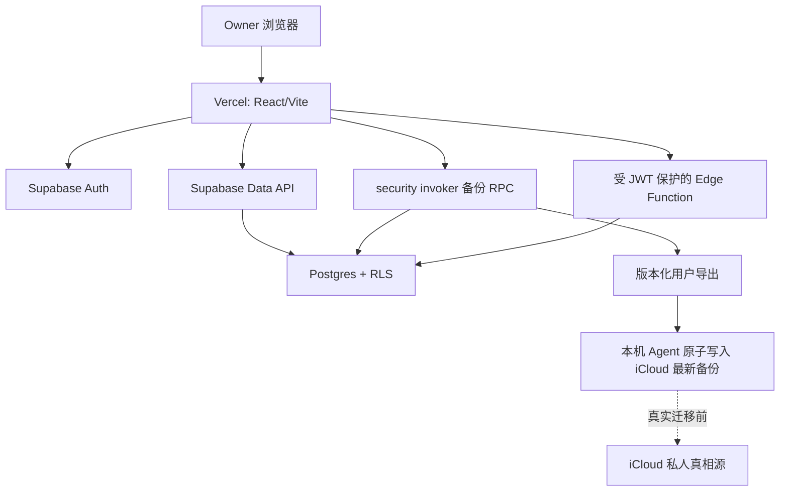

# 技术方案 - 生活助手 - Life Console - 2.2.0

> 状态：Gate 2 已确认 / 阶段 A-D 完成 / 阶段 E Owner 会话通过，单界面修复待新版 Preview 复验
> 范围：允许在独立东京测试项目执行纯合成 migration/seed、托管权限验证和 Vercel Preview；禁止真实数据、Production、切源和 PR 合并

## 1. 技术结论摘要

推荐保留 React 19 + Vite 7 + TypeScript 5 的 Vercel 前端，以 `@supabase/supabase-js` 接入 Supabase Auth 与 Data API。普通 CRUD 直接在 RLS 下运行，一致性快照使用 `security invoker` 数据库 RPC；只有隐藏第三方 secret 或服务端编排才进入受用户 JWT 保护的 Edge Function。浏览器只持有项目 URL 与 publishable key，任何 secret/service-role key 都不得进入 Vite 构建。

## 2. 总体架构

边界：Vercel 负责静态前端和安全响应头；Supabase 负责身份、数据库、Data API 和少量受保护函数；iCloud/Agent 负责用户可迁移备份及当前私人真相源。

## 3. 前端模块

| 模块 | 职责 |
|---|---|
| `auth` | OTP 请求、验证、会话恢复、登出、过期处理 |
| `supabase-client` | 只用 URL + publishable key 建立浏览器客户端 |
| `repository` | 将现有 `LifeConsoleClient` 映射到 Supabase 表/RPC，隔离页面与供应商细节 |
| `query-state` | loading/error/empty/refetch；不缓存正式个人数据到构建产物 |
| `draft-storage` | 仅短期失败保护，设大小/有效期并允许清除 |
| `backup-status` | 展示用户语义状态，不直接接触本机文件系统 |

Vercel Preview、Production 与本地开发使用独立环境变量。`VITE_` 变量会进入客户端包，因此只允许 URL、publishable key 和非敏感开关。环境值不进入 Git；变更只对新部署生效。

## 4. 数据模型草案

所有业务表包含 `id`、`user_id`、`created_at timestamptz`、`updated_at timestamptz`、`revision bigint`。首版单用户仍按 `user_id uuid references auth.users(id)` 隔离。

| 表 | 核心字段 | 约束/用途 |
|---|---|---|
| `profiles` | `user_id`, `display_name`, `status` | 每个 Auth 用户一行；不以邮箱作为业务主键 |
| `goals` | `title`, `domain`, `status`, `priority`, `start_date`, `target_date` | 长期/阶段目标；目标正文与状态分离 |
| `journals` | `event_date`, `title`, `content`, `tags`, `deleted_at` | 日记当前版本；敏感字段加密方案待 D3 |
| `journal_revisions` | `journal_id`, `revision`, `snapshot`, `reason` | 更正/撤回证据；append-only |
| `daily_checkins` | `date`, 四项主观分数, `anchors`, `notes` | `unique(user_id,date)`，未知字段为 null |
| `weekly_reviews` | `week_start`, `content`, `revision` | `unique(user_id,week_start)` |
| `phase_reviews` | `period_start`, `period_end`, `content` | 阶段复盘 |
| `health_days` | `date`, `summary`, `source_revision` | Apple Health 日级派生；真实导入另设门禁 |
| `health_segments` | `health_day_id`, `start_at`, `end_at`, `source` | 跨日睡眠明细；外键建索引 |
| `idempotency_keys` | `user_id`, `key`, `operation`, `result_ref`, `expires_at` | 唯一 `(user_id,key)`，防重复写 |
| `backup_runs` | `status`, `manifest_version`, `record_counts`, `content_digest` | 只存去敏运行状态，不存本机路径或正文 |
| `audit_events` | `action`, `entity_type`, `entity_id`, `result`, `created_at` | 最小审计；不复制敏感内容 |

主键策略在 POC 中比较 `bigint identity` 与时间有序 UUID；不为小规模首版引入非必要扩展。时间统一使用 `timestamptz`，业务日期使用 `date`。RLS 和常用排序采用复合索引，如 `(user_id, event_date desc, id desc)`；分页使用游标而非深 OFFSET。

## 5. 权限与 RLS

1. 暴露 schema 的每张表显式 `enable row level security`，迁移中同时声明最小 GRANT。
2. `anon` 对个人业务表没有权限；`authenticated` 仅获得所需 SELECT/INSERT/UPDATE，DELETE 默认不授予。
3. 每张表按 `(select auth.uid()) = user_id` 校验；UPDATE 同时有 `USING` 与 `WITH CHECK`，且需要 SELECT policy。
4. 所有 `user_id`、外键和高频过滤列建索引。
5. View 必须使用调用者权限（`security_invoker`）或放在不暴露 schema；避免 `security definer`。
6. 如确需 `security definer`，只能位于非暴露 schema、固定 `search_path`、函数内再次校验 `auth.uid()`，并撤销公开执行权限。
7. Owner 判定不使用可由用户修改的 `user_metadata`；首版以行所有权为主，需要角色时才评审 `app_metadata`。
8. service-role/secret key 仅可在受控服务端使用，并视为可绕过 RLS 的高风险凭据。

## 6. API 与写入语义

### 6.1 普通 CRUD

- 浏览器使用 Supabase Data API，在 RLS 下查询本人的行。
- 创建：客户端生成幂等键，服务端以唯一约束 + `on conflict` 原子处理。
- 更新：携带期望 `revision`，条件更新成功后 revision +1；0 行更新映射为冲突。
- 删除：首版只创建 `deleted_at`/删除计划，不开放物理 DELETE。
- 列表：Data API 默认最多返回 1,000 行，使用 `(event_date,id)` 或 `(created_at,id)` 游标分页。
- SDK：客户端显式设置 `db.retry=false`，由 repository 决定只读查询是否重试；写入依赖幂等键和 revision，不做不可见重试。

### 6.2 Edge Function

仅用于隐藏第三方 secret、服务端编排或未来受控批处理。函数保持 JWT 验证，使用调用者 JWT 创建受 RLS 限制的客户端；如需 admin 客户端，必须先验证用户身份和精确操作范围。公开 `auth:none` 不用于任何个人数据路由。跨表快照首选单条 `security invoker` 数据库 RPC，避免多次 Data API 请求产生非一致读。

## 7. Auth 方案

- 首选 Email OTP：`signInWithOtp` + `shouldCreateUser=false`。
- Supabase Site URL 和允许的 redirect URL 分环境配置；Preview 不复用 Production 白名单。
- 前端订阅会话变化并在过期时清理内存态；不要把 access/refresh token 写入日志或知识库。
- 合成验收至少准备 Owner 与非 Owner 两个测试用户：Owner 行可见；非 Owner SELECT 返回空结果、越权写入返回拒绝。未登录 401 不能替代已登录非 Owner 的行隔离证据，也不把 Data API 的空结果冒充为 403。
- 默认 SMTP 仅供演示且只发送到项目团队预授权邮箱；正式 OTP 必须配置自有 SMTP 并验证大陆邮箱到达率。

## 8. 备份与恢复

Supabase 平台备份是平台灾难恢复能力，不等于用户可迁移备份：免费项目需要主动逻辑导出；物理备份/PITR 可能不可下载，Storage 对象也不随数据库备份恢复。

2.2.0 延续版本化 `life-console-backup/1`：单条调用者权限 RPC 一致性读取 → 浏览器侧规范化 NDJSON/manifest → 计数与摘要 → ZIP 返回 → 本机 Agent 校验并原子替换 iCloud 最新备份。阶段 D 已用显式临时目录和纯合成数据证明 2.2.0 生成包可被既有 2.1.0 Agent 原样安装；未连接真实 iCloud。

兼容包固定包含 `goals`、`journals`、`journal_revisions`、`daily_checkins`、`weekly_reviews`、`phase_reviews`、`health_days`、`health_segments` 八类业务资源。`profiles`、`backup_runs`、审计、幂等、认证与会话状态不进入用户可迁移包。ZIP 成员路径由固定资源表生成，调用方不能注入归档路径。

## 9. Supabase 技术调研结论与实施约束

### 9.1 可行性结论

Supabase 可以继续作为 2.2.0 唯一新后端候选，但本地 POC 不能替代托管候选验收。当前没有发现必须放弃该方案的技术卡点；已用纯合成数据证明 PostgreSQL 所有权模型、RLS、调用者权限 View/RPC、同日原子 upsert 和浏览器 SDK 请求契约可行。

| 调研项 | 当前结论 | 实施约束 |
|---|---|---|
| 本地运行环境 | 本机没有 Docker、Supabase CLI 或 `psql`，无法运行完整 Auth/PostgREST/Postgres 栈 | 不在即将归还的工作电脑安装 Docker；用独立托管候选补齐验证 |
| RLS 与权限 | PGlite 合成测试已证明 Owner 隔离、非 Owner 空结果、anon 拒绝、禁止换绑和禁止物理删除 | 正式迁移仍需在 Supabase Postgres 重跑 anon/A/B 三身份矩阵和 Advisors |
| 一致性备份 | 多次 Data API 请求不共享单一事务；单条 `security invoker` RPC 可形成一致性快照 | RPC 固定空 `search_path`、撤销 PUBLIC 执行权、只授予 `authenticated`，不得改成 `security definer` |
| Auth 邮件 | 默认 SMTP 仅供演示，只向团队预授权邮箱发送且限流低、无 SLA | 候选可用合成团队邮箱；正式 OTP 前必须配置自有 SMTP 并验证大陆邮箱到达率 |
| 区域 | Supabase 项目创建后不能原地更换区域 | 创建资源前比较东京、新加坡、首尔等候选的大陆网络、成本和数据驻留 |
| Data API | 默认最多返回 1,000 行 | 所有列表使用游标分页；备份不得依赖一次普通列表请求 |
| SDK 重试 | `supabase-js >=2.102` 只自动重试 GET/HEAD 的部分瞬时错误，不自动重试写方法 | 客户端仍显式设置 `db.retry=false`，由 repository 区分只读重试、revision 冲突与幂等写入 |
| Vercel 集成 | Marketplace 处于 Public Alpha，并会同步数据库密码、secret key、JWT secret 等不必要变量 | 不使用 Marketplace；手工按环境只配置 URL 与 publishable key |
| CSP | 当前 `connect-src 'none'` 会阻止 Supabase | 接入时只放行候选/正式项目各自精确 HTTPS/WSS Origin，不使用通配符 |
| Edge Function | 普通 CRUD 和备份首版不需要 Edge Function；托管函数有内存、CPU 和时长限制 | 只用于隐藏第三方 secret 或服务端编排，不在函数内缓冲大型全量备份 |

### 9.2 已验证证据

本地 POC 固定使用 `@supabase/supabase-js 2.112.3` 与仅供测试的 `@electric-sql/pglite 0.5.4`。合成 SQL 不是生产 migration，未包含项目标识、真实邮箱或个人数据。

- PostgreSQL/RLS：7 项通过，包括复合索引、Owner/非 Owner/anon、UPDATE `WITH CHECK`、原子 upsert 和单事务导出 RPC。
- 浏览器 SDK：4 项通过，包括 `shouldCreateUser=false`、仅 publishable key、关闭 Data API 自动重试和 CSP 阻塞识别。
- 当前全量本地回归：Life Console 34 个 Vitest 文件、252 项测试通过；应用 Python 92 项测试通过。
- 尚未验证：大陆到真实项目端点的网络、真实 OTP、托管 RLS/GRANT、Vercel Preview CORS/CSP、1k/10k 容量、平台 Advisors/备份和第二个 Auth 用户端到端隔离。

详细可复现方法和远端待测矩阵见 [Supabase 可行性调研与 POC](Supabase可行性调研与POC-生活助手-LifeConsole-2.2.0.md)。

### 9.3 进入实现前的阻断条件

Gate 2 之外，创建独立 Supabase 候选资源前还需 PO 单独确认区域候选、套餐成本、测试邮箱和资源生命周期。正式个人数据前必须另行完成字段加密威胁模型、自有 SMTP、备份恢复演练、真实迁移和切源门禁。本节不构成资源创建、部署或真实数据授权。

### 9.4 阶段 A 生产 migration 草案

首个 Gate 2 开发块新增 `supabase/migrations/0001_life_console.sql`，生产 SQL 不包含测试角色、合成用户或平台资源标识。独立 `auth-shim.sql` 只为 PGlite 提供 Supabase 托管环境原本具有的 `auth.users`、`auth.uid()`、`anon` 和 `authenticated`；`seed.synthetic.sql` 只含两名无真实关联的测试用户和合成记录。

聚焦测试 9 项通过，覆盖 12 张表、RLS、所有权/外键索引、最小 GRANT、UPDATE `USING` + `WITH CHECK`、无物理 DELETE、Owner A/B 隔离、anon 拒绝、换绑拒绝、null 与小数保真、revision 冲突和 `security invoker` 导出 RPC。该证据只证明 PostgreSQL/PGlite 语义，不替代托管 Supabase 的 Auth、PostgREST、Advisors 或真实网络验证。

### 9.5 阶段 B Auth 与 Repository 合成实现

阶段 B 在未配置 Supabase URL、publishable key、SMTP 或远端资源的前提下新增以下通用边界：

- `supabase/client.ts`：浏览器配置只接受精确项目 Origin 与 publishable key；缺项、secret/service-role 变量或 `sb_secret_` key 均 fail closed；`db.retry=false`。
- `supabase/auth.ts`：使用窄 Auth port 请求 Email OTP，固定 `shouldCreateUser=false`；只向应用暴露 `userId`、`email` 与 `expiresAt`，不返回 access/refresh token。
- `SupabaseAuthGate.tsx`：可注入的 loading、OTP、6 位验证码、会话过期和登出状态机；发送反馈为中性文案和局部遮罩邮箱；未接入 `main.tsx`。
- `supabase/repository.ts`：只允许已批准表名/排序列，列表使用 `(event_date,id)` 或 `(created_at,id)` 降序游标；页长限制为 1-100；瞬时只读失败最多额外尝试一次；更新固定使用 `id + revision` 条件，零行映射 409；写入不做隐式重试。

聚焦合成测试 23/23 通过，其中 browser client 4 项、Auth 5 项、OTP Gate 6 项、Repository 8 项。Repository 测试使用真实 `supabase-js` 查询构造器与合成 fetch transport，证明本地请求契约、错误归一化和重试边界；它不证明托管 Auth、PostgREST、SMTP、CORS/CSP、RLS 或真实网络行为。正式启动入口、精确 CSP Origin、远端资源和部署仍需后续独立授权。

### 9.6 阶段 C 目标 CRUD 合成实现

阶段 C 首个独立模块选择目标，避免在日记修订原子性尚未单独实现前混合多个业务域：

- `create_goal` 是 `security invoker`、空 `search_path` 的 authenticated-only RPC；使用 `auth.uid()`、现有 `(user_id,key)` 唯一约束和请求指纹，在同一事务内创建目标、记录幂等结果和写入不含正文的最小审计事件。
- 目标列表固定使用 `(created_at,id)` 降序游标和 `deleted_at is null` 谓词，不接受调用方传入任意表、排序列或过滤片段。
- `GoalRepository` 负责输入归一化、幂等创建、revision 条件更新、归档和恢复；所有写调用只执行一次，网络失败不做不可见重试。
- `SupabaseGoalsPanel` 通过依赖注入展示 loading、真实空态、创建、修订、冲突、失败重试和归档；失败时保留输入及同一幂等键，未接入 `App.tsx` 或 `main.tsx`。
- TypeScript 配置显式限定全局 types，避免 iCloud 生成的重复 `@types/* 2` 目录被自动发现；不改变运行时依赖与产品行为。

目标模块聚焦测试 34/34 通过，其中 migration 13 项、Repository foundation 9 项、Goal Repository 6 项、Goals Panel 6 项；本轮新增 17 项目标相关断言。该证据只覆盖 PGlite、真实 `supabase-js` 查询构造器、合成 fetch 和注入 UI，不替代托管 Postgres/PostgREST、两用户 Auth、CSP 或网络验收。

### 9.7 阶段 C 每日状态 CRUD 合成实现

每日状态模块以已批准的 OpenAPI 和趋势 UI 为真相源，将 migration 中偏离的 `0–10 numeric` 修正为 nullable `1–5 smallint`；合成 seed 与 PGlite POC 同步改为 1–5 整数。当前数据模型只包含四项评分、批准的四个 anchors 与 160 字 notes，不扩展未进入 2.2 技术方案的睡眠时刻字段。

- `create_daily_checkin` 是 authenticated-only、invoker、空 `search_path` RPC；以 `(user_id,key)` 和请求指纹实现幂等创建，以 `(user_id,checkin_date)` 阻止同日重复，并只写去敏审计元数据。
- `DailyCheckinRepository` 提供单日查询、`(checkin_date,id)` 最近列表、幂等创建和 revision 条件更新；评分小数/越界、非法日期、未知 anchor、超长 notes 和空创建在发请求前拒绝。
- `LifeConsoleRepository.executeRead` 统一只读瞬时失败的一次受控重试；任何每日状态写入仍只调用一次。
- 每日状态由唯一 `RecordsPage` 表单接入 `DailyCheckinRepository`：只提交 dirty fields，未记录保持 null/未知，创建失败重试复用同一个 idempotency key，冲突和网络失败均保留输入；原独立 CRUD 面板已随第二套产品壳删除。

每日状态模块聚焦测试 49/49 通过，其中 migration 18 项、PGlite POC 7 项、Repository foundation 10 项、DailyCheckin Repository 7 项、Daily Check-in Panel 7 项；本轮新增 20 项状态相关断言。该证据不替代托管 RPC/PostgREST、两用户 Auth/RLS、CSP 或真实网络验证。

包含每日状态模块后的全量本地回归为 29 个 Vitest 文件、211/211，应用 Python 90/90，工具测试 333 项通过且 1 项跳过；公开 Registry 干净安装审计 0，生产构建通过。

### 9.8 阶段 C 日记 CRUD 合成实现

PO 已确认本轮只实现日记创建、读取、分页和修订，不实现撤回、恢复、删除计划或永久删除。D3 敏感字段加密仍是独立真实数据门禁；本模块只使用合成正文，不改变真实日记不得进入当前链路的约束。

- `journals` 保存当前版本；受限 `record_journal_revision` trigger 在每次 INSERT 或 revision +1 UPDATE 后，将写入后的完整版本追加到 `journal_revisions`。trigger 使用固定空 `search_path`，撤销 PUBLIC 执行权；authenticated 只有 revision SELECT 权限，不能直接伪造历史。
- `create_journal` 是 authenticated-only、invoker、空 `search_path` RPC；同一事务完成当前行创建、revision 1 自动快照、幂等回执与不含正文的最小审计。
- `JournalRepository` 固定使用 `(event_date,id)` 游标和 `deleted_at is null`，提供单条读取、revision 历史、幂等创建和 revision 条件更新；只读瞬时失败最多额外尝试一次，写入不隐式重试。
- `SupabaseJournalsPanel` 通过依赖注入展示真实 loading/empty、创建、编辑、冲突保留、同 key 重试和 revision 元数据；不渲染历史正文，不提供撤回/恢复/删除操作，也未接 `App.tsx`、`main.tsx` 或托管配置。

日记模块聚焦回归 45/45 通过，其中 production migration 22 项、Repository foundation 10 项、Journal Repository 7 项、Journals Panel 6 项。该证据不替代 D3、托管 trigger/RPC/PostgREST、两用户 Auth/RLS、CSP 或真实网络验证。

包含日记模块后的全量本地回归为 31 个 Vitest 文件、228/228，应用 Python 90/90，工具测试 333 项通过且 1 项跳过；公开 Registry 干净安装审计 0，生产构建通过。

### 9.9 阶段 C 复盘 CRUD 合成实现

周复盘与阶段复盘保持独立：周复盘沿用 `(user_id,week_start)` 唯一约束；阶段复盘只校验结束日期不早于开始日期，不新增重叠限制或自动汇总语义。

- `create_weekly_review` 与 `create_phase_review` 是 authenticated-only、invoker、空 `search_path` RPC；在同一事务内完成创建、幂等回执与不含正文的最小审计。
- `ReviewRepository` 只开放固定的 `weekly_reviews/week_start` 和 `phase_reviews/period_start` 日期游标，默认过滤 `deleted_at is null`；创建不隐式重试，更新使用 revision 条件。
- `SupabaseReviewsPanel` 将两类复盘分区展示，覆盖真实空态、创建、修订、冲突保留和同 key 重试；不自动生成内容、不提供删除，也未接正式入口。

复盘模块聚焦回归 46/46 通过，其中 production migration 25 项、Repository foundation 11 项、Review Repository 5 项、Reviews Panel 5 项。该证据不替代托管 RPC/PostgREST、两用户 Auth/RLS、CSP 或真实网络验证。

包含复盘模块后的全量本地回归为 33 个 Vitest 文件、242/242，应用 Python 90/90，工具测试 333 项通过且 1 项跳过；公开 Registry 干净安装审计 0，生产构建通过。

### 9.10 阶段 D 合成备份 POC

阶段 D 保持 `life-console-backup/1` 格式不变，没有新增恢复协议、口令、云端资源或真实路径：

- `BackupRepository` 只调用现有 authenticated-only `export_life_console_snapshot`，复用只读瞬时错误最多额外尝试一次的边界，并拒绝未知 schema 或缺失资源数组。
- `createBackupArchive` 对八类固定资源递归排序对象字段，生成 UTF-8、紧凑 JSON、LF 结尾 NDJSON；逐资源计算 SHA-256、计数与 Python Agent 兼容的 canonical content digest。
- 浏览器 ZIP 使用固定版本 `fflate 0.8.2` 和 STORE 模式，避免合法高重复正文被压缩到超过 Agent 的 100:1 防护阈值而误判为 zip bomb；锁文件只指向 npm 官方 Registry，公开 Registry 干净安装和审计 0。
- 跨语言测试由 TypeScript 生成纯合成 ZIP，再调用既有 Python `BackupStore` 在显式临时目录校验并原子安装；安装后字节与原 ZIP 完全一致，公开 receipt 不含正文或机器路径。
- 验证覆盖空资源、小规模、2,000 条合成记录、Unicode、嵌套字段、摘要/计数错误、截断、重复成员、路径穿越、符号链接、压缩比、并发锁、幂等和失败保留旧备份。

阶段 D 聚焦回归为备份与 production migration 35/35、Local Agent 9/9。包含该 POC 后的全量本地回归为 34 个 Vitest 文件、252/252，应用 Python 92/92，根工具测试 329/329；公开 Registry 干净安装审计 0，生产构建、项目验证、diff 与隐私检查通过。该证据不证明托管 Supabase RPC/PostgREST、Vercel 下载响应、真实 iCloud 写入、D3 字段加密或真实数据恢复。

### 9.11 阶段 E 远端候选实现与验证

PO 已于 2026-08-12 单独授权创建独立 Supabase 测试资源、执行纯合成 migration/seed，并部署 Vercel Preview。去敏实现与验证事实如下：

- 独立纯合成 Supabase 测试项目已在东京 `ap-northeast-1` 创建。当前文件树不记录资源显示名、项目 ID 或连接标识；但活动分支的一个早期已推送提交曾包含非秘密测试资源显示名，普通追加去敏提交不能从 Git 历史移除它。该历史处置须经 PO 单独确认，未处置前不声称分支历史已满足“无服务标识”。
- Data API 保持开启，“自动暴露新表”关闭；自动 RLS 事件触发器处于启用状态。数据库密码、项目 ID、publishable key、测试邮箱和连接串均未写入 Git 或知识库。
- 误建的空白悉尼测试项目已在 PO 当次明确授权后删除；既有暂停项目未修改。
- 已按顺序应用 `0001_life_console.sql`、自动 RLS helper 收权迁移和健康片段外键索引迁移；后两项分别消除 helper 可直接执行与外键缺索引问题。
- `auth-users.synthetic.sql` 只创建两个不可登录、无密码的 A/B 占位身份；`seed.synthetic.sql` 按元数据解析 Owner，并为两个 Owner 幂等生成纯合成记录。托管权限矩阵 13/13 通过，测试事务回滚后行数保持不变。
- Security Advisor 当前无 error，保留 1 条“泄露密码保护未开启”warning；候选只使用无密码邮件登录且不开放密码登录，因此阶段 E 记录为已知非阻断项。Performance Advisor 只有新建项目的 `unused_index` info，不删除契约要求的索引。
- 新增独立 `supabase-candidate` 入口和 `vercel.mjs` 动态配置；只接受精确 Supabase HTTPS Origin 与现代 publishable key，拒绝 secret key 和非 Preview 环境。CSP 只放行对应 HTTPS/WSS Origin，不使用通配符。
- Vercel 仅在 Preview 环境保存 URL 与 publishable key；候选部署已 READY，首页返回 200，并读回 CSP、`no-referrer`、`nosniff`、`DENY` 与 `noindex`。现有 Production 部署记录与 URL 未改变。
- 浏览器未登录态已显示 Auth Gate，PO 使用最新 Magic Link 后确认 Owner 会话建立成功。默认 SMTP 实际发送 `magic_link`，且托管控制台要求先配置自有 SMTP 才允许将模板改为 `{{ .Token }}` 六位 OTP；`SupabaseAuthGate` 默认仍保留 OTP 能力，只有 `supabase-candidate` 注入 `magic-link` 展示模式，发送后只提示打开最新邮件，429 `over_email_send_rate_limit` 映射为明确限额提示。六位 OTP 明确延期到自有 SMTP 评审，不得用 Magic Link 冒充 OTP 通过。邮箱、链接与验证码均不进入聊天或文档。
- 候选 Origin 校验收紧为单层 `*.supabase.co` 托管项目 hostname，并拒绝显式端口、嵌套子域、凭据、路径、查询和片段；`supabase-candidate` 不再初始化未使用的本地 API client。

本轮没有读取 iCloud、创建真实日记或健康记录、修改 Production、切换真相源或合并 PR。任何后续 Agent 都不得把浏览器、日志或平台输出中的凭据复制到聊天、文件、Git、PR 或长期记忆。

### 9.12 登录后单界面架构纠偏

Owner 首次成功登录后，PO 发现页面与 2.1.0 已验收设计稿及本地产品差异明显。代码审计确认 `supabase-candidate` 曾在入口处绕过 `App`，改为渲染独立 `SupabaseCandidateApp`，只把四类 CRUD 技术面板装进壳层。这与 PRD 的“复用既有四页界面”及设计方案的“不建立第二套产品”直接冲突，因此原 Preview 只能证明 Auth/Repository 技术链路，登录后产品 UI 验收记为失败，不能因处于测试阶段而忽略。

纠偏后的实现保持单一产品界面：

- `main.tsx` 在 Owner 会话建立后仍渲染同一个 `App`；Supabase 只作为数据适配器和认证上下文注入，独立 CRUD 产品壳已删除。
- 工作台、记录、进展、系统四页沿用 2.1.0 信息架构和视觉基线；技术 URL、publishable key 等实现细节不再出现在用户系统页。
- Dashboard adapter 只投影来源可证的数据；缺失评分保持空值，不伪造睡眠、目标进度、复盘或备份成功状态。
- 记录页按目标日期读取对应 revision；相同日记失败重试复用幂等键，并发重复提交合并；目标和日记写入成功后刷新四页共享 Dashboard。
- 上海日期改为动态获取，并在分钟定时器、窗口聚焦和页面重新可见时刷新，避免长开页面跨午夜仍写入前一天。
- 未保存表单草稿用当前会话用户隔离的浏览器端 AES-GCM 临时存储保护；切页/刷新可恢复，退出前明确确认，确认退出后清理。密钥只存当前 tab 的 `sessionStorage`，不进入 Git、日志或平台。
- 列表按游标分页，按 ID 去重，对重复游标失败关闭；首页重载使用 request generation 阻止旧的加载更多响应覆盖新数据。Today 判定目标真实空态前会遍历全部目标游标。
- 冲突前草稿与服务器最新内容同时纳入分用户加密会话草稿；载入最新后刷新仍可比较和恢复，不静默覆盖。所有会在成功后清草稿的写入表单，都在 pending 期间锁定输入控件。
- Today 锚点失败草稿携带原目标日期与期望 revision；跨夜重试不写入新日期，同日冲突载入最新后使用最新 revision 重试。
- `<=720px` 使用单列卡片、底部导航和安全区留白；静态四页基线已通过 390×844 浏览器检查，Supabase 单界面候选仍以新版 HTTPS Preview 实机复验为最终证据。

首次单界面纠偏基线的本地证据为 39 个 Vitest 文件 279/279、应用 Python 92/92、静态四页基线 390×844 Playwright 1/1、`supabase-candidate` 构建和 `git diff --check` 通过；该 Playwright 用例不冒充 Supabase 候选页实机证据。随后多轮代码审查关闭历史日期 revision、跨视图刷新、幂等重试、跨午夜、分用户加密草稿、冲突比较、分页竞态、乱序刷新、退出确认、失败空态和 pending 写入锁定等一致性缺口，并删除不再接入生产树的旧每日状态面板。最新全量门禁为 Vitest 38 文件 307/307、应用 Python 92/92、候选专项 20 文件 175/175、常规与候选构建和差异检查通过；自动凭据/私人数据扫描也通过，但它不识别人类可读的服务显示名，因此不能代替上述活动分支历史处置。候选包仅保留约 565 kB 的非阻断分包警告。上述证据证明合成数据下的单界面代码，不替代新版 HTTPS Preview 的 Owner 与移动端复验。新版 Preview 文件树上传被部署连接器的自动安全审查中止，未产生部署、未修改 Production；需在 PO 获知原因后重新明确授权才可重试。

## 10. 近期兼容性检查

- 当前项目 Node `>=22.13`、TypeScript `5.9`，满足 Supabase JS 近期要求。
- 新表不假设自动暴露到 Data API；迁移显式配置 exposed schema、GRANT 与 RLS。
- 不依赖 GraphQL、Realtime schema 修改或扩展版本固定，规避 2026 年相关破坏性变更。
- Vercel 的 Vite 客户端变量会进入构建，禁止把 secret key 放入 `VITE_*`。
- 不使用 Public Alpha 的 Vercel Marketplace 自动集成；它会同步数据库密码和 secret 等本项目不需要的服务端变量。手工只配置 URL 与 publishable key。
- `supabase-candidate` 已把原静态候选的 `connect-src 'none'` 改为仅放行目标项目精确 HTTPS/WSS Origin；其他构建模式保持原行为。
- Supabase 项目区域创建后不能原地变更；区域必须在资源创建前通过网络和数据驻留评审。

## 11. 技术评审结论与 Gate 2 决策

| 编号 | 建议 |
|---|---|
| Q1 | 保留 Vercel React/Vite，Supabase 作为唯一新后端候选 |
| Q2 | Email OTP + 禁止自动注册；数据按 `user_id` 隔离 |
| Q3 | 普通 CRUD 使用 Data API + RLS；一致性导出使用调用者权限 RPC；隐藏 secret 或服务端编排才用 Edge Function |
| Q4 | 显式 GRANT、RLS、索引、revision 和幂等键进入同一版本化迁移 |
| Q5 | 真实敏感数据前另做字段加密威胁模型，不在本轮默认弱化或沿用旧 KEK |
| Q6 | 用户可迁移备份与平台备份分层，合成 round-trip 先行 |
| Q7 | 先本地/合成实现，再申请独立 Supabase 测试资源和 Vercel Preview；每步单独门禁 |

PO 已于 2026-08-12 确认 Q1-Q7，允许从生产 migration 草案与合成 RLS/权限测试开始通用实现。Supabase/Vercel 资源、部署、真实数据、切源、资源删除和 PR 合并仍需分别取得当次授权。

## 12. 官方依据

- Supabase RLS：<https://supabase.com/docs/guides/database/postgres/row-level-security>
- Supabase Data API 安全：<https://supabase.com/docs/guides/api/securing-your-api>
- Supabase 无密码邮件登录：<https://supabase.com/docs/guides/auth/auth-email-passwordless>
- Supabase Edge Function 鉴权：<https://supabase.com/docs/guides/functions/auth>
- Supabase 数据库备份：<https://supabase.com/docs/guides/platform/backups>
- Supabase 自定义 SMTP：<https://supabase.com/docs/guides/auth/auth-smtp>
- Supabase Edge Function 限制：<https://supabase.com/docs/guides/functions/limits>
- Supabase Vercel Marketplace：<https://supabase.com/docs/guides/integrations/vercel-marketplace>
- Supabase 项目区域变更：<https://supabase.com/docs/guides/troubleshooting/change-project-region-eWJo5Z>
- Vercel 环境变量：<https://vercel.com/docs/environment-variables>
- Vercel Vite：<https://vercel.com/docs/frameworks/frontend/vite>
- [本版本 Supabase 可行性调研与 POC](Supabase可行性调研与POC-生活助手-LifeConsole-2.2.0.md)
