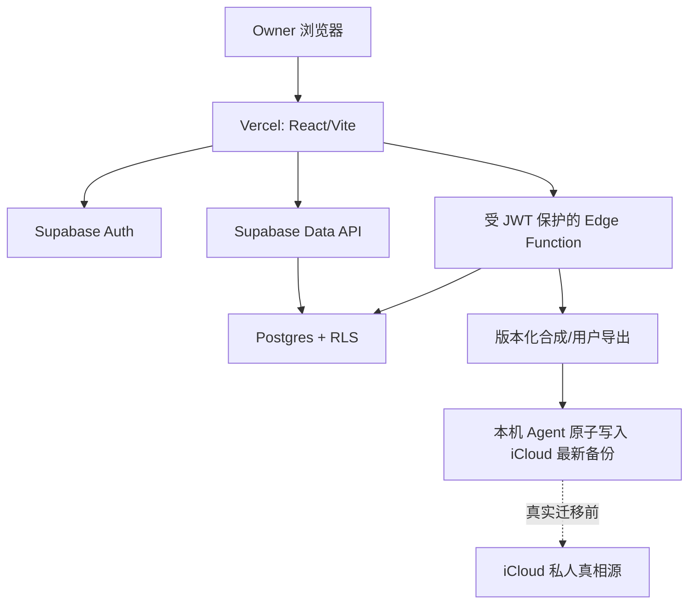

# 技术方案 - 生活助手 - Life Console - 2.2.0

> 状态：预评审完成 / 待 Gate 2
> 范围：架构与契约，不创建 Supabase/Vercel 资源，不写迁移脚本，不连接真实项目

## 1. 技术结论摘要

推荐保留 React 19 + Vite 7 + TypeScript 5 的 Vercel 前端，以 `@supabase/supabase-js` 接入 Supabase Auth 与 Data API。普通用户 CRUD 直接在 RLS 下运行；只有需要一致性快照或高权限的备份/批处理才进入受用户 JWT 保护的 Edge Function。浏览器只持有项目 URL 与 publishable key，任何 secret/service-role key 都不得进入 Vite 构建。

## 2. 总体架构

边界：Vercel 负责静态前端和安全响应头；Supabase 负责身份、数据库、Data API 和少量受保护函数；iCloud/Agent 负责用户可迁移备份及当前私人真相源。

## 3. 前端模块

| 模块 | 职责 |
|---|---|
| `auth` | OTP 请求、验证、会话恢复、登出、过期处理 |
| `supabase-client` | 只用 URL + publishable key 建立浏览器客户端 |
| `repository` | 将现有 `LifeConsoleClient` 映射到 Supabase 表/RPC，隔离页面与供应商细节 |
| `query-state` | loading/error/empty/refetch；不缓存正式个人数据到构建产物 |
| `draft-storage` | 仅短期失败保护，设大小/有效期并允许清除 |
| `backup-status` | 展示用户语义状态，不直接接触本机文件系统 |

Vercel Preview、Production 与本地开发使用独立环境变量。`VITE_` 变量会进入客户端包，因此只允许 URL、publishable key 和非敏感开关。环境值不进入 Git；变更只对新部署生效。

## 4. 数据模型草案

所有业务表包含 `id`、`user_id`、`created_at timestamptz`、`updated_at timestamptz`、`revision bigint`。首版单用户仍按 `user_id uuid references auth.users(id)` 隔离。

| 表 | 核心字段 | 约束/用途 |
|---|---|---|
| `profiles` | `user_id`, `display_name`, `status` | 每个 Auth 用户一行；不以邮箱作为业务主键 |
| `goals` | `title`, `domain`, `status`, `priority`, `start_date`, `target_date` | 长期/阶段目标；目标正文与状态分离 |
| `journals` | `event_date`, `title`, `content`, `tags`, `deleted_at` | 日记当前版本；敏感字段加密方案待 D3 |
| `journal_revisions` | `journal_id`, `revision`, `snapshot`, `reason` | 更正/撤回证据；append-only |
| `daily_checkins` | `date`, 四项主观分数, `anchors`, `notes` | `unique(user_id,date)`，未知字段为 null |
| `weekly_reviews` | `week_start`, `content`, `revision` | `unique(user_id,week_start)` |
| `phase_reviews` | `period_start`, `period_end`, `content` | 阶段复盘 |
| `health_days` | `date`, `summary`, `source_revision` | Apple Health 日级派生；真实导入另设门禁 |
| `health_segments` | `health_day_id`, `start_at`, `end_at`, `source` | 跨日睡眠明细；外键建索引 |
| `idempotency_keys` | `user_id`, `key`, `operation`, `result_ref`, `expires_at` | 唯一 `(user_id,key)`，防重复写 |
| `backup_runs` | `status`, `manifest_version`, `record_counts`, `content_digest` | 只存去敏运行状态，不存本机路径或正文 |
| `audit_events` | `action`, `entity_type`, `entity_id`, `result`, `created_at` | 最小审计；不复制敏感内容 |

主键策略在 POC 中比较 `bigint identity` 与时间有序 UUID；不为小规模首版引入非必要扩展。时间统一使用 `timestamptz`，业务日期使用 `date`。RLS 和常用排序采用复合索引，如 `(user_id, event_date desc, id desc)`；分页使用游标而非深 OFFSET。

## 5. 权限与 RLS

1. 暴露 schema 的每张表显式 `enable row level security`，迁移中同时声明最小 GRANT。
2. `anon` 对个人业务表没有权限；`authenticated` 仅获得所需 SELECT/INSERT/UPDATE，DELETE 默认不授予。
3. 每张表按 `(select auth.uid()) = user_id` 校验；UPDATE 同时有 `USING` 与 `WITH CHECK`，且需要 SELECT policy。
4. 所有 `user_id`、外键和高频过滤列建索引。
5. View 必须使用调用者权限（`security_invoker`）或放在不暴露 schema；避免 `security definer`。
6. 如确需 `security definer`，只能位于非暴露 schema、固定 `search_path`、函数内再次校验 `auth.uid()`，并撤销公开执行权限。
7. Owner 判定不使用可由用户修改的 `user_metadata`；首版以行所有权为主，需要角色时才评审 `app_metadata`。
8. service-role/secret key 仅可在受控服务端使用，并视为可绕过 RLS 的高风险凭据。

## 6. API 与写入语义

### 6.1 普通 CRUD

- 浏览器使用 Supabase Data API，在 RLS 下查询本人的行。
- 创建：客户端生成幂等键，服务端以唯一约束 + `on conflict` 原子处理。
- 更新：携带期望 `revision`，条件更新成功后 revision +1；0 行更新映射为冲突。
- 删除：首版只创建 `deleted_at`/删除计划，不开放物理 DELETE。
- 列表：使用 `(event_date,id)` 或 `(created_at,id)` 游标分页。

### 6.2 Edge Function

仅用于跨表一致性快照、备份清单生成或未来受控批处理。函数保持 JWT 验证，使用调用者 JWT 创建受 RLS 限制的客户端；如需 admin 客户端，必须先验证用户身份和精确操作范围。公开 `auth:none` 不用于任何个人数据路由。

## 7. Auth 方案

- 首选 Email OTP：`signInWithOtp` + `shouldCreateUser=false`。
- Supabase Site URL 和允许的 redirect URL 分环境配置；Preview 不复用 Production 白名单。
- 前端订阅会话变化并在过期时清理内存态；不要把 access/refresh token 写入日志或知识库。
- 合成验收至少准备 Owner 与非 Owner 两个测试用户：Owner 行可见；非 Owner SELECT 返回空结果、越权写入返回拒绝。未登录 401 不能替代已登录非 Owner 的行隔离证据，也不把 Data API 的空结果冒充为 403。

## 8. 备份与恢复

Supabase 平台备份是平台灾难恢复能力，不等于用户可迁移备份：免费项目需要主动逻辑导出；物理备份/PITR 可能不可下载，Storage 对象也不随数据库备份恢复。

2.2.0 延续版本化 `life-console-backup`：一致性读取 → 规范化 NDJSON/manifest → 计数与摘要 → 浏览器或受控函数返回 → 本机 Agent 校验并原子替换 iCloud 最新备份。首轮只用合成数据验证，不接触真实 iCloud。

## 9. 近期兼容性检查

- 当前项目 Node `>=22.13`、TypeScript `5.9`，满足 Supabase JS 近期要求。
- 新表不假设自动暴露到 Data API；迁移显式配置 exposed schema、GRANT 与 RLS。
- 不依赖 GraphQL、Realtime schema 修改或扩展版本固定，规避 2026 年相关破坏性变更。
- Vercel 的 Vite 客户端变量会进入构建，禁止把 secret key 放入 `VITE_*`。

## 10. 技术评审结论与 Gate 2 决策

| 编号 | 建议 |
|---|---|
| Q1 | 保留 Vercel React/Vite，Supabase 作为唯一新后端候选 |
| Q2 | Email OTP + 禁止自动注册；数据按 `user_id` 隔离 |
| Q3 | 普通 CRUD 使用 Data API + RLS，高权限流程才用 Edge Function |
| Q4 | 显式 GRANT、RLS、索引、revision 和幂等键进入同一版本化迁移 |
| Q5 | 真实敏感数据前另做字段加密威胁模型，不在本轮默认弱化或沿用旧 KEK |
| Q6 | 用户可迁移备份与平台备份分层，合成 round-trip 先行 |
| Q7 | 先本地/合成实现，再申请独立 Supabase 测试资源和 Vercel Preview；每步单独门禁 |

PO 未确认 Q1-Q7 前，不进入实现。

## 11. 官方依据

- Supabase RLS：<https://supabase.com/docs/guides/database/postgres/row-level-security>
- Supabase Data API 安全：<https://supabase.com/docs/guides/api/securing-your-api>
- Supabase 无密码邮件登录：<https://supabase.com/docs/guides/auth/auth-email-passwordless>
- Supabase Edge Function 鉴权：<https://supabase.com/docs/guides/functions/auth>
- Supabase 数据库备份：<https://supabase.com/docs/guides/platform/backups>
- Vercel 环境变量：<https://vercel.com/docs/environment-variables>
- Vercel Vite：<https://vercel.com/docs/frameworks/frontend/vite>
