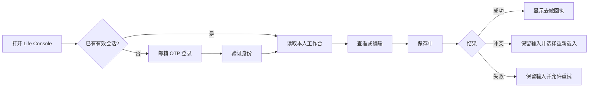

# 设计方案 - 生活助手 - Life Console - 2.2.0

> 状态：Gate 2 已确认
> 基线：复用 2.1.0 已验收四页与移动端视觉，不新增第二套界面

## 1. 设计目标

- 用户先感知“今天要做什么”和“刚才是否保存成功”，而不是后端结构。
- 登录、同步、冲突和失败状态可理解、可恢复、不制造技术焦虑。
- iCloud 最新备份仍是系统页唯一恢复相关模块；不恢复“迁移与恢复中心”。
- 手机单手操作优先，桌面端保持信息密度但不增加并行入口。

## 2. 信息架构

| 页面 | 主任务 | 2.2.0 增量 |
|---|---|---|
| 今日 | 看状态、快速记录、完成当日行动 | 云端加载、保存状态、离线/冲突提示 |
| 进展 | 查看阶段目标与趋势 | 从权限保护的数据读取，空数据不伪造趋势 |
| 记录 | 回顾日记、回访、周/阶段复盘 | 分页、筛选、修订与删除计划状态 |
| 系统 | 查看服务与最新备份状态 | 登录身份、同步状态、iCloud 最新备份；隐藏底层资源 |

## 3. 核心流程

## 4. 状态设计

| 场景 | 页面反馈 | 禁止行为 |
|---|---|---|
| 未登录 | 只显示产品名、隐私说明和邮箱 OTP 登录 | 不渲染合成或缓存的个人工作台 |
| 登录邮件已发送 | 显示目标邮箱的局部遮罩、重发倒计时 | 不暴露账号是否存在 |
| 首次加载 | 骨架屏 + “正在读取你的工作台” | 不用旧合成数据冒充真实数据 |
| 保存中 | 禁用重复提交，保留表单内容 | 不提前显示成功 |
| 保存成功 | 短回执 + 最新更新时间 | 不展示数据库 ID 或策略细节 |
| 版本冲突 | 显示“记录已在其他页面更新”，允许复制草稿或重新载入 | 不静默覆盖 |
| 网络失败 | 保留本页草稿，明确“尚未保存” | 不把浏览器草稿当真相源 |
| 会话过期 | 返回登录页；本地未提交草稿保留到当前浏览器会话 | 不无限刷新或循环登录 |
| 无记录 | 真实空态和创建入口 | 不用示例内容填充正式页 |

## 5. 登录体验建议

- 首选 6 位 Email OTP，移动端不需要切换邮件链接后再跳回页面。
- 阶段 E 使用 Supabase 内置 SMTP 时，候选环境单独显示 Magic Link 流程；发送成功后不再展示 6 位验证码输入框。该候选降级不改写 O1，不能作为正式 OTP 验收。
- 邮件额度触发 429 时明确提示“额度暂时用完、稍后再试、不要重复点击”，不再用泛化的“发送失败”诱导重试。
- 首版不开放注册；未知邮箱收到与已存在账号相同的中性提示。
- 登录页说明“仅本人使用；数据不会公开展示”。
- 登出放在系统页，执行前不需要二次确认；有未保存草稿时先提醒。

## 6. iCloud 最新备份模块

继续保留 2.1.0 的单卡片结构：上次成功时间、数据范围、校验状态、失败是否保留旧备份、Agent 恢复说明。网页不直接选择本机路径，不展示复杂迁移阶段，也不把 Supabase 平台备份等同于 iCloud 用户备份。

## 7. 设计评审结论

| 评审方 | 结论 | 条件 |
|---|---|---|
| 设计 | 通过 | 复用四页，新增状态而非新增模块 |
| 前端 | 通过 | 需要统一 Auth/Loading/Error 边界和移动端键盘测试 |
| 后端 | 通过 | UI 回执只使用稳定业务字段，不暴露资源标识 |
| QA | 有条件通过 | 必须覆盖会话过期、冲突、重复提交和真实空态 |
| 隐私 | 有条件通过 | 正式页不得回落到合成个人内容或持久化敏感草稿 |
| PO | 待确认 | 请确认 O1-O5 |

## 8. Gate 2 设计决策

- O1：首版 Email OTP，禁用未知用户自动注册。
- O2：保持四页信息架构，不新增迁移/恢复页面。
- O3：所有写操作采用“保存中—成功/冲突/失败”显式状态。
- O4：浏览器草稿只用于失败保护，不是真相源，不跨设备同步。
- O5：系统页只展示登录、同步和 iCloud 最新备份的用户语义。

## 9. PO Gate 2 确认记录

- 确认日期：2026-08-12。
- PO 结论：确认 O1-O5。
- 授权范围：按已确认设计进入不含远端资源的通用合成实现。
- 未授权范围：Supabase/Vercel 资源创建、候选部署、真实数据、切源、资源删除和 PR 合并。
